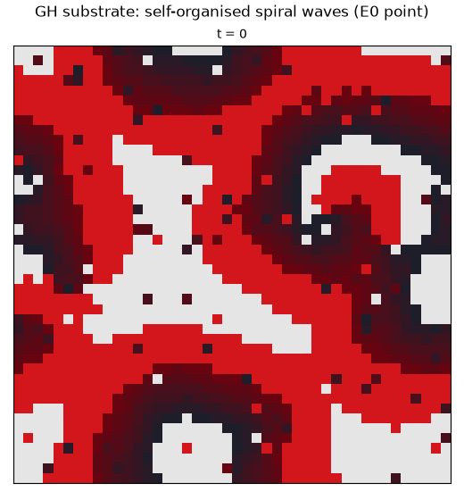
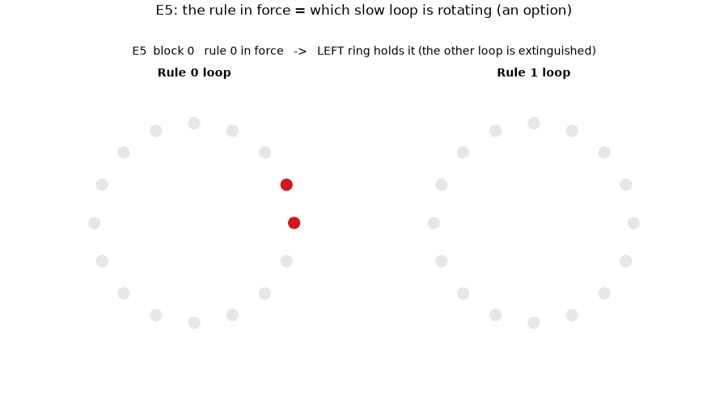
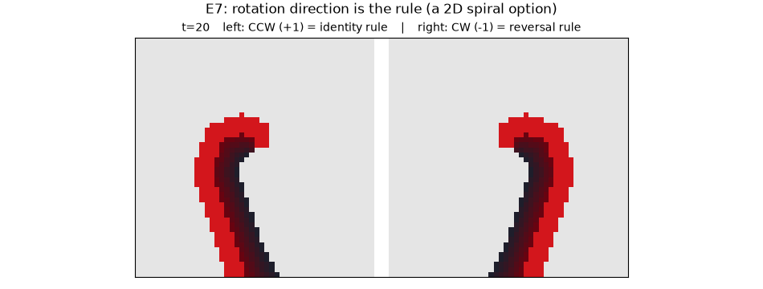
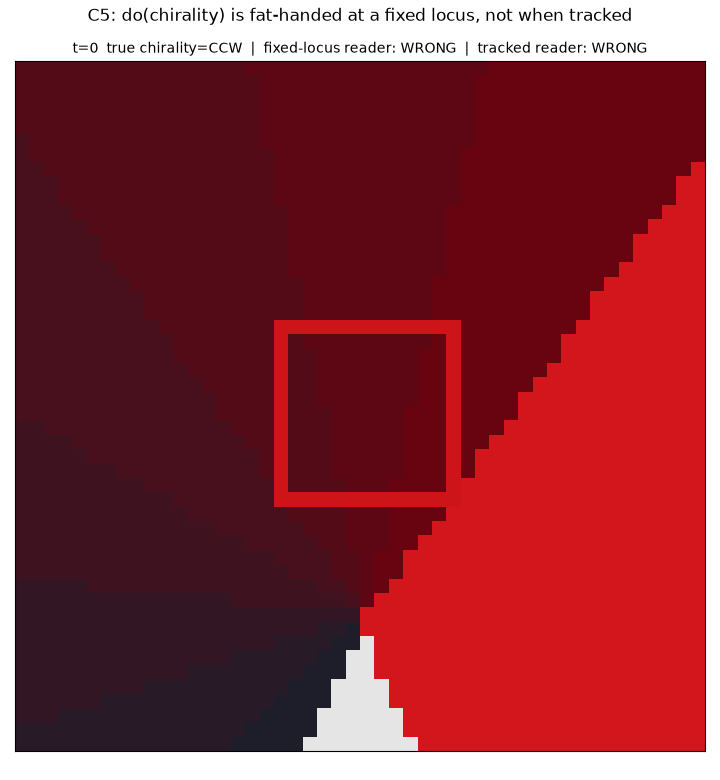
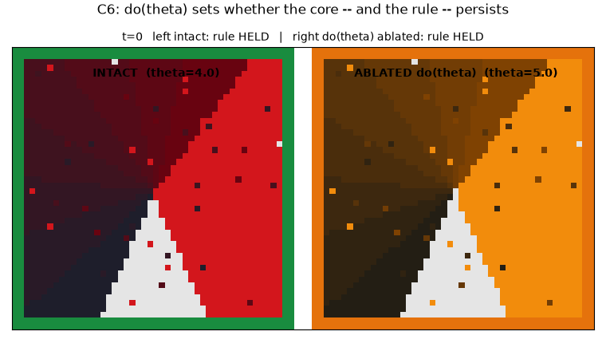

# Watch the substrate — a narrated animation gallery

The E- and C-series results are reported as static plots (learning curves, bar
charts, phase diagrams). But the whole premise is about *dynamics*: one
homogeneous excitable medium that "generates its own repertoire of patterns,"
from which reward selects useful ones and an observer reads out faculties. This
page lets you **watch** that medium — the same Greenberg–Hastings substrate,
animated for each mechanism.

All animations are rendered by `ghca_net_viz.py` from a
recorded phase rollout (`Network.run(...)["phi"]`). Colour = GH state: light grey
rested, bright active crest, darkening refractory tail.

---

## 0. The raw substrate — self-organised spiral waves

At the E0 operating point (`r=2, a=6, θ≈4`) the medium neither dies nor
saturates: it settles into organised, self-sustaining spiral waves. Nothing is
driving it — this is the "repertoire" the later experiments shape and read.



*(`python3 ghca_net_viz.py`)*

---

## 1. Memory — a τ-tuned reentrant loop (E2)

Two identical directed rings are ignited the same way; they differ **only** in
the local timescale `τ`. Left (`τ=20 < L=24`) sustains its rotating pulse
indefinitely — the stimulus is *held*. Right (`τ=28 ≥ L`) dies within ~`L` steps,
its refractory tail wrapping round to block reentry — the memory is *lost*.
Memory is not a module; it is a loop the substrate has tuned to forget slowly.


*(`python3 experiments/e2_animation.py`; see [e2_results.md](e2_results.md))*

---

## 2. Attention — biased winner-take-all by wave annihilation (E4)

Two waves ignite opposite ends of an excitable chain (blue = attended left,
orange = right), travel inward, collide, and **annihilate in each other's
refractory wake**. A top-down bias gives the attended stream a head start, so the
collision lands off-centre and the attended wave captures the centre node. This
is winner-take-all with **no inhibitory machinery** — refractoriness *is* the
competition.


*(`python3 experiments/e4_animation.py`; see [e4_results.md](e4_results.md))*

---

## 3. Executive control — a slow loop as an option (E5)

The rule in force is literally **which slow loop is rotating**. At each block
start the active rule's context ring is ignited and persists (the E2 mechanism,
`τ < L`); the other ring stays dark. At the next block they flip. This standing
rotation is the held context that gates the fast stimulus→response routing —
executive control as an *option*, not a dedicated controller.



*(`python3 experiments/e5_animation.py`; see [e5_results.md](e5_results.md))*

---

## 4. Executive control in 2-D — a spiral whose spin is the rule (E7)

E5's option was a hand-built 1-D ring. E7 lifts it onto the substrate's **native
2-D medium**: a genuine spiral wave with a phase-singularity core, on the E0
organised-band lattice (no-flux boundaries). Two cores of opposite handedness are
seeded — left **counter-clockwise** (net charge +1), right **clockwise** (−1) —
and each persists for hundreds of steps. In E7 Phase B these two handednesses
*are* the two task rules (CCW → identity, CW → reversal): the rule in force is
literally **which way the spiral turns**. This is the substrate's answer to the
rotating-wave neuroscience (Xu/Gong 2023; Ye/Steinmetz 2026), where cortical
rotation direction is task-relevant.



*(`python3 experiments/e7_animation.py`; see [e7_results.md](e7_results.md))*

---

## 5. Is the spin causal, or just where you're looking? (C5)

E7 showed the spiral's rotation direction *is* the rule. C5 asks the harder
question: is that rotation direction **causal**, or does a naive reader only
*think* it is? One spiral is nucleated with its core displaced from the lattice
centre — the true chirality never changes — while two probes read it live: a
**fixed-locus** reader (green/crimson) parked at the lattice centre, and a
**tracked** reader (teal/orange) that follows the actual core. The fixed reader
never recovers the true rotation (it's watching the outer wave, not the core);
the tracked reader stays locked on throughout. Same rotation, opposite verdict —
depending only on where you look. This is the concrete form of the C-series
caution: a wave variable is a well-posed handle only for a matched reader.



*(`python3 experiments/c5_animation.py`; see [c5_results.md](c5_results.md))*

---

## 6. The fix — drive the parameters, not the wave (C6)

C5 showed reading the wave at the wrong spot loses the rotation. C6 shows the
fix: intervene on the **generative parameter** instead — the nucleation seed —
which sidesteps the reader problem entirely (well-posed for *every* reader, C6
Result A). But that generative handle only matters if the core it creates
*persists*. Two spirals are nucleated with the **same** true chirality, differing
only in the lattice threshold `θ`: intact (left) holds the rule for the whole
run; ablated (right, `θ` raised) loses it almost immediately and goes fully
quiescent — same nucleation, only the threshold differs, and that alone decides
whether the context survives to be used. This is why switching collapses under
ablation (0.85 → 0.52) while the re-nucleated single-rule control is spared
(0.90 vs 0.89): the persistent core is *necessary*, not just sufficient.



*(`python3 experiments/c6_animation.py`; see [c6_results.md](c6_results.md))*

---

## The point of the gallery

Memory (a sustaining loop), attention (annihilating waves), executive control (a
gating loop) are **three readouts of one excitable medium** — the same
`Network`, the same `(active, refractory, rested)` state, the same colour key.
No mechanism above adds a bespoke module; each is a different question asked of
one substrate. That is the Buzsáki inside-out thesis made watchable, and it is
the E6 "emergent categories" result seen as motion rather than as a table.

## A note on E3 (timed response)

E3 is deliberately **not** given a headline "mechanism" animation. Its solid
finding — response latency tracks the gate timescale — is a one-line relationship
better shown as the static `latency = τ − a` plot. Its *interesting* result is
the **fragility** of composing timing with identity, which is a per-seed scatter,
not a dynamic (see the [core series review](core_review.md), E3
deep-dive). Animating a clean E3 "composition" would misrepresent a result that
is genuinely bimodal and seed-dependent — so it isn't done here.

## Reproduce all

The animator (`ghca_net_viz.py`) and the `e*_animation.py` scripts live in the
repository on the `main` branch. From a `main` checkout (`pip install
mkdocs-material` pulls in matplotlib + Pillow for GIF rendering), regenerate
every GIF:

```
python3 ghca_net_viz.py                     # docs/figures/demo_lattice.gif
python3 experiments/e2_animation.py         # docs/figures/e2_ring_memory.gif
python3 experiments/e4_animation.py         # docs/figures/e4_annihilation.gif
python3 experiments/e5_animation.py         # docs/figures/e5_options.gif
python3 experiments/e7_animation.py         # docs/figures/e7_spiral_rule.gif
python3 experiments/c5_animation.py         # docs/figures/c5_fixed_vs_tracked.gif
python3 experiments/c6_animation.py         # docs/figures/c6_necessity.gif
```

*(This `deploy-viz-page` branch carries only the site — Markdown + rendered GIFs
+ MkDocs config; the animation source is not duplicated here.)*

## Future scope / backlog

- **Interactive HTML explorer.** A self-contained web page with live sliders for
  `τ`, `θ`, bias, ring length `L`, etc., re-rendering the substrate in the browser
  — turning these fixed GIFs into something you can drive. Needs either a small JS
  reimplementation of the GH update rule or a pre-rendered parameter sweep. Deferred.
- **Scrollytelling narration.** The same walkthrough as a single scrolling page
  where each animation plays alongside the claim it supports.
- **C-series causal animation.** `do(θ) → W → B` vs the fat-handed `do(W)` as a
  side-by-side dynamic, to give the causal argument the same watchable treatment.
