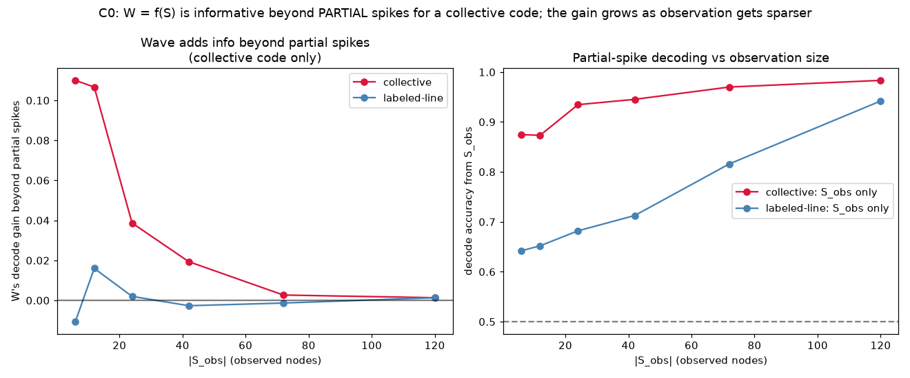

# C0 Results — Instrumenting the Constitution

*Run of `experiments/c0_instrumentation.py` on the `ghca_causal` instrumentation.
Gate for the C-series (see `docs/causal_experiments.md`): confirm the variables
`S / W / B` and establish the paper's partial-observation premise on a substrate
where `W = f(S)` is explicit.*

## Setup

A recurrent small-world GH medium of `N_H = 120` hidden nodes with spontaneous
firing gives variable trajectories across 1500 trials. Two behaviours, each a
median-split (balanced) linear readout over **all** hidden nodes:

- **`B_collective`** — near-uniform weights (≈ total activity): a *collective*
  code the wave can capture.
- **`B_labeled`** — structured zero-mean weights: a *labeled-line* code that
  depends on *which* nodes fire.

Waves `W = (coherence, active_fraction)` are deterministic coarse-grainings of
the full node state. "Predictive information" is measured operationally as
5-fold cross-validated logistic-decoder accuracy; `W`'s **gain beyond partial
spikes** is `acc(S_obs + W) − acc(S_obs)`.

## Results

**1. `W = f(S)` is confirmed deterministic.** Given the *full* node state, adding
`W` changes decode accuracy by `+0.001` for both behaviours — the wave carries
nothing the full spike state doesn't already contain. Constitution is explicit.

**2. Under partial observation, the wave is informative beyond spikes — but only
for a collective code, and more so the sparser the observation:**

| `|S_obs|` / 120 | `W` gain, collective | `W` gain, labeled-line |
|-----------------|----------------------|------------------------|
| 6   | **+0.110** | −0.011 |
| 12  | **+0.107** | +0.016 |
| 24  | **+0.039** | +0.002 |
| 42  | **+0.019** | −0.003 |
| 72  | +0.003 | −0.001 |
| 120 | +0.001 | +0.001 |



- For the **collective** code, `W`'s advantage over partial spikes grows
  monotonically as fewer nodes are observed (up to `+0.11` at 6/120) and vanishes
  as observation approaches full — exactly the paper's Eq. (1) regime
  (`P(B|S_obs,W) ≠ P(B|S_obs)`), driven by `W` summarising the *unobserved*
  spikes.
- For the **labeled-line** code, `W`'s gain sits at ~0 (±0.016) at every
  observation size: a global scalar cannot recover *which* nodes fired, so the
  wave is **predictively epiphenomenal** for this code regardless of how little
  is observed.

## Interpretation (why this is the right gate)

C0 establishes the two facts the rest of the series needs, and one that was not
assumed going in:

1. The substrate makes `W = f(S)` literal and verifiable (fact 1) — the
   controllable-constitution premise holds.
2. It hosts the paper's partial-observation regime (fact 2): waves can carry
   behavioural information beyond observed spikes.
3. **Whether they do is structure-dependent** — collective vs labeled-line — and
   this is decided by *how behaviour reads the population*, not by the wave
   itself. This foreshadows the series' thesis: the causal status of the wave
   will likewise depend on the assumed structure (the paper's central message),
   and here we can dial that structure explicitly.

Note this is *predictive* (observational) information only — by the Causal
Hierarchy Theorem it cannot settle causation, which is precisely why C1–C3 move
to interventions (`do(W)`, `do(θ)`).

## Caveats

- Decoding gain is a lower bound on information (a linear decoder; ceiling
  effects when `S_obs` already decodes well). The qualitative contrast
  (collective ≫ labeled-line, growing with sparsity) is the robust result.
- `B_collective` is close to a threshold on total activity, so `W`-alone decodes
  it near-perfectly; that is by design (a collective code *is* a wave readout),
  not circularity to hide — it is the cleanest instance of "behaviour reads the
  wave."

## Reproduce

```
python3 experiments/c0_instrumentation.py
```

Writes `docs/figures/c0_predictive_info.png` and `result/c0/c0_data.npz`.
