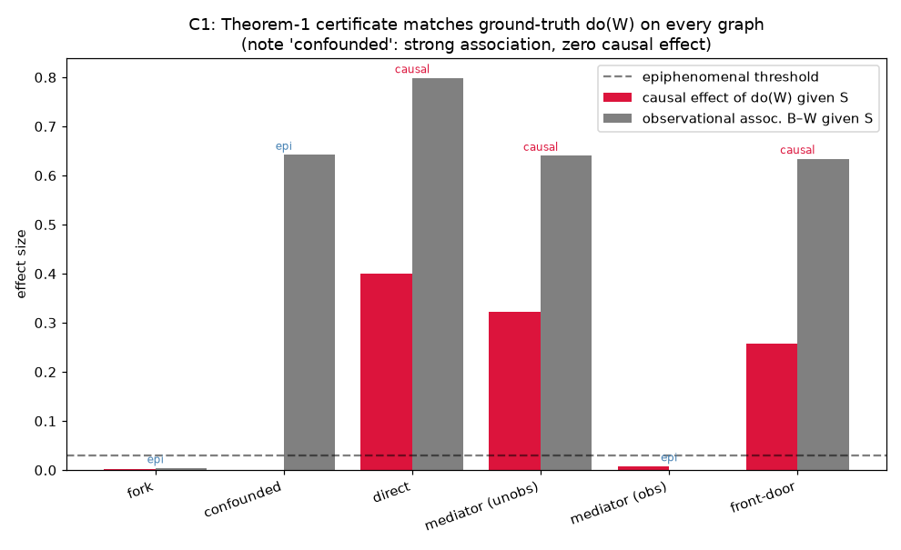

# C1 Results — Validating the Certificate on Ground Truth

*Run of `experiments/c1_graph_certificates.py`. Builds the paper's canonical
spike–wave graphs as explicit SCMs (where we know the truth) and checks that
Theorem 1's graphical epiphenomenality certificate agrees with the actual
`do(W)` intervention. See `docs/causal_experiments.md`, C1. Here `W` is a
designated autonomous node — the constitution `W=f(S)` twist is C2.*

## Method

For each graph we sample the SCM (200k draws), run the real intervention, and
compute:

- **causal effect** = `max_s max_w | E[B | S=s; do(W=w)] − E_obs[B | S=s] |`
  — the ground-truth reading of Definition 1: `W` is epiphenomenal iff the
  interventional `P(B|S; do(W=w))` equals the *observational* `P(B|S)` for all
  `w`. (Comparing `do(W=1)` vs `do(W=0)` is **not** enough — it misses the
  front-door case, where intervening breaks `W`-confounding without varying
  with `w`.)
- **observational association** = `max_s |E[B|S=s,W=1] − E[B|S=s,W=0]|`
  — for contrast (correlation, not causation).
- **certificate** = Theorem 1: `W ⊥d B | S` in `G_{W(S)}` (arrows into the
  non-`S`-ancestor part of `W` removed), via `networkx`.

## Result — certificate == intervention == ground truth, on every graph

| graph | `do(W)` causal effect | obs. association | certificate | verdict |
|-------|-----------------------|------------------|-------------|---------|
| fork (`S→W`, `S→B`) | 0.001 | 0.004 | epiphenomenal | ✓ epi |
| **confounded** (`U→W`, `U→B`, `U` latent) | **0.001** | **0.642** | epiphenomenal | ✓ epi |
| direct (`W→B`) | 0.400 | 0.799 | causal | ✓ causal |
| mediator, unobserved (`W→M→B`, `M∉S`) | 0.322 | 0.640 | causal | ✓ causal |
| mediator, observed (`W→M→B`, `M∈S`) | 0.008 | 0.001 | epiphenomenal | ✓ epi |
| **front-door** (`C→W`, `C→B`, `W→M→B`, `M∈S`, `C` latent) | **0.258** | 0.634 | causal | ✓ causal |

**All six agree.** The two instructive cases:

- **`confounded`** is the textbook correlation-≠-causation case: a *strong*
  observational association (0.642) with *zero* causal effect (0.001). The
  certificate correctly calls it epiphenomenal — exactly the trap the paper
  warns decoding studies fall into (`P(B|W) ≠ P(B)` does not imply causal `W`).
- **`front-door`** is the subtle Prop-2 case: even though we observe and
  condition on the full mediator `M`, `W` is still causal (0.258). Conditioning
  on the mediator blocks the `W→M→B` path, so `do(W=w)` doesn't vary `B` given
  `M` — but intervening severs the latent confounder `C→W`, which shifts
  `P(B|M; do(W))` away from the observational `P(B|M)`. Observing the mediator
  is **not** a licence to declare the wave epiphenomenal.



## Why this matters for the series

This is the step that is impossible in vivo: because we *built* the SCM, we can
confirm the certificate is not just internally consistent but actually predicts
the outcome of the physical intervention. Two takeaways carry forward:

1. The framework is correctly instantiated in our testbed — Theorem 1,
   Proposition 1 (unblocked path → causal), and Proposition 2 (front-door →
   causal) all reproduce.
2. The verdict is **structure-dependent** (same `W`, opposite verdicts across
   graphs) and **observational data alone cannot recover it** (see the
   `confounded` vs `direct` rows: near-identical associations, opposite causal
   truth) — the Causal Hierarchy Theorem, made concrete.

The load-bearing assumption throughout C1 is that **`W` is a manipulable node
distinct from `S`**. C2 removes exactly that assumption — making `W = f(S)` a
genuine constituted aggregate — and asks whether `do(W)` even remains
well-defined.

## Note on operationalizing Definition 1

Getting this right required care (the first pass mis-scored front-door): the
correct test compares each interventional stratum mean to the **observational**
stratum mean, not interventional-vs-interventional. `do(W=1)` vs `do(W=0)`
detects only effects that *vary with the set value* (Prop 1 paths); it is blind
to the confounding-breaking effect that makes the front-door causal. This is a
small but real subtlety in applying the paper's Definition 1 empirically.

## Reproduce

```
python3 experiments/c1_graph_certificates.py
```

Writes `docs/figures/c1_certificates.png` and `result/c1/c1_data.npz`.
