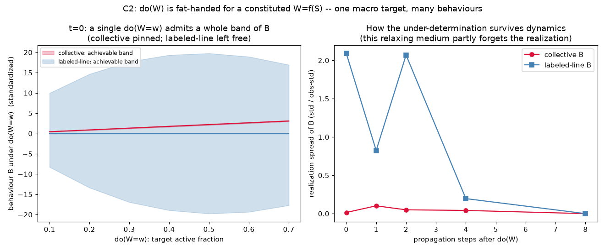

# C2 Results — `do(W)` is Fat-Handed when `W = f(S)` (headline)

*Run of `experiments/c2_fat_handed.py`. C1 validated the paper's certificates
treating `W` as a manipulable node distinct from `S`. C2 removes that
assumption: `W = f(S)` is the genuine constituted aggregate (active fraction of
the hidden GH population). See `docs/causal_experiments.md`, C2.*

## The problem, made concrete

Many micro-states `S` satisfy `f(S) = w`, so `do(W = w)` is **not a unique
intervention** — it must pick a realization. We measure the **achievable band**
of behaviour `B` under a single `do(W=w)`: the range of `B` reachable by
choosing which micro-state realizes the target. At the moment of intervention
(`t=0`) this band is exact — activate the `k = w·N` nodes with the smallest /
largest readout weight for the edges. Two behaviours: a **collective** readout
(near-uniform weights) and a **labeled-line** readout (structured weights).

## Result — one macro target, many behaviours

**At `t = 0` (pure constitution), band width / observational-std, averaged over `w`:**

| behaviour | achievable band of `B` under `do(W=w)` |
|-----------|----------------------------------------|
| collective | **0.24 σ** — the macro value pins it |
| labeled-line | **33.1 σ** — `do(W=w)` leaves it essentially free |

A ~140× ratio. Random (rather than extremal) realizations show the same:
typical realization spread at `t=0` is `0.015 σ` (collective) vs `2.09 σ`
(labeled-line).



- **Left:** a single `do(W=w)` admits a whole band of `B`. For the labeled-line
  code the band spans ±~18 σ at every target `w` — you can realize `do(W=w)` to
  drive `B` high, low, or anywhere between. The collective code is a tight line:
  the macro value determines it.
- **Right:** the under-determination is largest immediately after the
  intervention and, in this relaxing medium, is partly forgotten as activity
  propagates (the attractor is realization-independent), washing out by `t≈8`.
  The collective readout stays pinned throughout.

## Interpretation — the constitution soft spot, demonstrated

This is the concrete form of the critique of the paper's framework. `do(W)`
requires `W` to be an autonomous, settable variable. But when `W = f(S)` is a
constituted aggregate, "set `W = w`" is a **fat-handed** instruction: it does not
determine the micro-state, and therefore does not determine any behaviour that
reads micro-structure. The causal verdict you would draw from `do(W)` —
"`W` drives `B` up / down / not at all" — is **whatever the realization policy
makes it**. `P(B ; do(W=w))` is not well-defined without also specifying how the
aggregate is realized, which is exactly the modularity an SCM needs and which
constitution denies.

The collective code delimits the safe case: when behaviour reads *only* the
aggregate, `do(W)` is well-defined (band ≈ 0). But that is the degenerate case
where `W` and the behaviourally-relevant part of `S` coincide — precisely where
the spike/wave distinction collapses.

## Honest caveats

- **The washout is substrate-specific.** This GH medium relaxes to a
  realization-independent regime, so the fat-handedness bites hardest on fast
  readouts and is erased at long propagation. In a critical/chaotic medium the
  band could instead *grow*. Either way, `do(W)` is ill-posed *at the moment of
  intervention*; what dynamics do with the ambiguity is a separate,
  substrate-dependent question. (The right-panel `t=1` dip is dynamics noise, not
  signal.)
- **`t=0` is a static readout.** The rigorous point (macro doesn't pin micro) is
  partly definitional — that is the intended message: constitution *guarantees*
  under-determination whenever behaviour is not purely collective, and real
  behaviour generically is not.

## What it motivates (C3)

The fix is to intervene on the **generating parameters** `θ` (timescales,
couplings) rather than the constituted aggregate. `do(θ)` has **no realization
degree of freedom** — setting `τ` is modular and unique — so it yields a
well-defined causal verdict. C3 tests this and connects back to E3 (`do(τ)`
moves response timing, not identity).

## Reproduce

```
python3 experiments/c2_fat_handed.py
```

Writes `docs/figures/c2_fat_handed.png` and `result/c2/c2_data.npz`.
