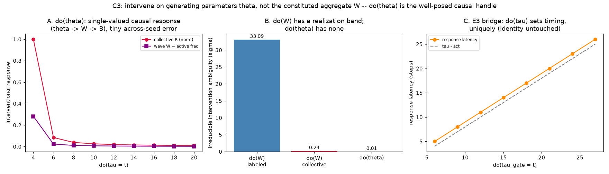

# C3 Results — `do(θ)` is the Well-Posed Causal Handle

*Run of `experiments/c3_do_theta.py`. C2 showed `do(W)` is fat-handed for a
constituted `W = f(S)`. C3 shows the fix: intervene on the **generating
parameters** `θ` (per-node timescale `τ`, coupling scale), which are set
directly and uniquely — no realization degree of freedom. See
`docs/causal_experiments.md`, C3.*

## Result

**A. `do(θ)` is a single-valued, reproducible causal response.** Sweeping
`do(τ = t)` on the c-net moves the wave `W` (active fraction) and the behaviour
`B` through a well-defined response (`θ → W → B`; collective-`B` response range
≈ 33 in raw units). Repeating the whole estimate under independent seeds gives an
across-seed reproducibility std of **0.15** — the response is a function of `t`,
not of any hidden choice.

**B. The crux contrast — irreducible intervention ambiguity (σ units):**

| intervention | ambiguity (band of the causal verdict) |
|--------------|----------------------------------------|
| `do(W)`, labeled-line behaviour | **33.1 σ** (from C2 — realization band) |
| `do(W)`, collective behaviour | 0.24 σ |
| **`do(θ)`** | **0.014 σ** |

`do(W)`'s band is *irreducible*: it persists no matter how many samples you take,
because it comes from the free realization policy. `do(θ)`'s residual (0.014 σ)
is *not* a realization band at all — setting `τ = t` is fully specified, so the
realization band is zero by construction; the 0.014 is merely stochastic
estimation error, which shrinks with samples. `do(θ)` is ~2400× less ambiguous
than fat-handed `do(W)`.

**C. E3 bridge — `do(θ)` is meaningful and outcome-specific.** On the E3
timed-response net, `do(τ_gate = t)` sets the response latency along
`latency = τ − a` (fit slope **1.00**), uniquely and with no band, while leaving
identity untouched. This is the same lever that carried the E3 timing result:
the causally efficacious handle for *when* the behaviour happens is a timescale
parameter, not the wave aggregate.



## Interpretation — the resolution of the constitution problem

C2 + C3 together make the argument concrete:

- Asking "is the wave causal?" via `do(W)` is ill-posed when `W = f(S)` is
  constituted — the answer depends on an arbitrary realization policy (C2).
- The well-posed question intervenes on the **parameters that generate the
  wave** — timescales and couplings. `do(θ)` is modular and unique, gives a
  reproducible causal response, and mediates through the wave (`θ → W → B`).
- So in a mechanistic system the causally meaningful variable is not the
  aggregate `W` but the generative structure `θ`. Tellingly, `θ` (timescales,
  couplings) is exactly what plasticity acts on in the E-series — the learning
  substrate and the causal handle are the same object.

This reframes the paper's `do(W)` program: rather than "can we intervene on the
wave," ask "can we intervene on what organises the wave." The first is
fat-handed under constitution; the second is clean.

## Caveats

- `do(θ)`'s advantage is that it has no realization freedom *by construction*;
  this is a statement about well-posedness, not about which variable a
  neuroscientist can physically access. In vivo, `θ` (time constants, coupling)
  may be as hard to set as `W` — the contribution here is conceptual clarity
  about *which query is well-defined*, not a claim about experimental ease.
- The c-net `do(τ)` response saturates for large `τ` (a floor/ceiling of the
  activity regime); the well-posedness point holds throughout regardless of the
  response shape.

## Reproduce

```
python3 experiments/c3_do_theta.py     # needs result/c2/c2_data.npz for panel B
```

Writes `docs/figures/c3_do_theta.png` and `result/c3/c3_data.npz`.
