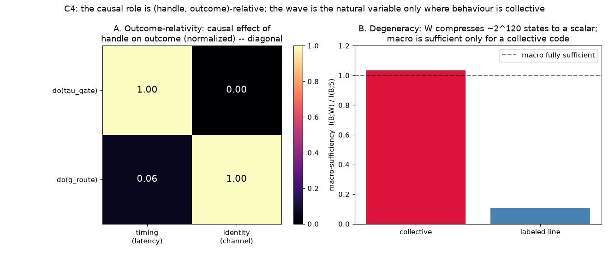

# C4 Results — Outcome-Relativity & Degeneracy (synthesis cap)

*Run of `experiments/c4_outcome_relativity.py`. Closes the C-series. See
`docs/causal_experiments.md`, C4.*

## A. The causal role is (handle, outcome)-relative

On the E3 timed-response net we run two well-posed `do(θ)` interventions and
measure two outcomes. The causal-effect matrix (range of each outcome over the
intervention sweep, normalized per outcome) is **diagonal**:

|              | timing (latency) | identity (channel) |
|--------------|:----------------:|:------------------:|
| **do(τ_gate)**  | **1.00** | 0.00 |
| **do(g_route)** | 0.06 | **1.00** |

`do(τ_gate)` moves response latency by 18 steps but does not touch which channel
fires; `do(g_route)` flips the channel but leaves latency unchanged. So "is the
timescale (or the routing) causal?" has **no answer without naming the
outcome** — the same variable is causal for one behaviour and epiphenomenal for
another. This is the causal grounding of the E3 double dissociation: identity is
a spatial/routing outcome, timing is a temporal/rhythm outcome, and each has its
own well-posed causal handle.

## B. Degeneracy: the wave is the natural variable only where behaviour is collective

`W = f(S)` compresses ~`2^120` micro-states onto a single scalar — an enormous
many-to-one map. How much behaviourally-relevant information survives at the
macro level? Macro-sufficiency `I(B;W) / I(B;S)` (info as decode-accuracy above
chance):

| behaviour | macro-sufficiency |
|-----------|:-----------------:|
| collective | **1.03** (macro fully sufficient) |
| labeled-line | **0.11** (macro nearly useless) |



For a **collective** code the macro variable retains essentially all the
behaviourally-relevant information despite the astronomical `S→W` degeneracy —
`W` *screens off* `S`, and the coarse-graining is a genuine causal-emergence:
the macro is the natural, sufficient causal variable (Hoel). For a
**labeled-line** code the macro discards what matters; the micro is
irreducible. This is the deep reason C0's structure-dependence and C2's
fat-handedness track the same axis: the wave is a legitimate causal variable
exactly when behaviour reads the aggregate, and exactly then `do(W)` is also
well-posed (its band collapses).

## Interpretation — closing the arc

- **Outcome-relativity** (A) dissolves the "spike vs wave" question a second way:
  not only is it structure-dependent (C0–C2), it is *outcome*-dependent. There is
  no context-free fact about whether a variable is causal.
- **Degeneracy** (B) says *when* the macro is the right variable: high `S→W`
  degeneracy plus macro-sufficiency = causal emergence, and that is precisely the
  collective-code regime. Where behaviour is labeled-line, the wave is neither
  informative (C0), well-defined to intervene on (C2), nor sufficient (here).

Together C0–C4 give a coherent picture: **the wave's causal status is real but
contingent** — on the observation model (C0), the assumed graph (C1), the
constitution of the intervention (C2), the generating parameters actually
manipulable (C3), and the outcome and its coding (C4). The one context-free,
well-posed handle throughout is `θ`, the generative structure — which is also
what the learning system adapts.

## Caveats

- Panel A uses the untrained E3 mechanism net; identity is measured as the
  integrated-activity channel winner (routing-determined, timing-robust) rather
  than the first-spike winner (which would leak timing into identity — an
  artifact we corrected).
- Macro-sufficiency uses linear decoders (a lower bound on information); the
  qualitative gap (1.03 vs 0.11) is the robust result.

## Reproduce

```
python3 experiments/c4_outcome_relativity.py
```

Writes `docs/figures/c4_outcome_relativity.png` and `result/c4/c4_data.npz`.
