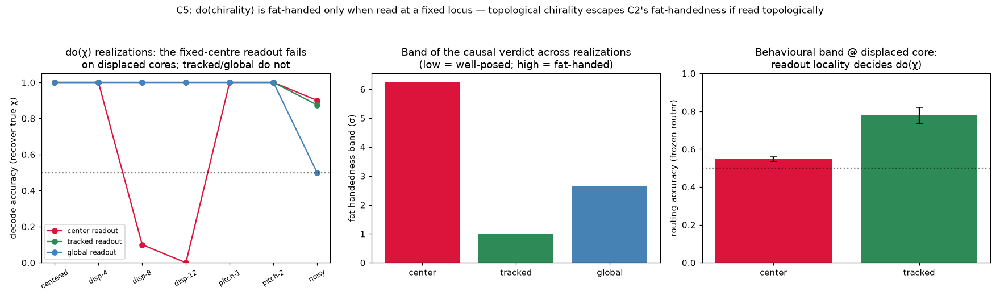

# C5 Results — Is `do(chirality)` Fat-Handed? (topological invariant vs realization)

*Run of `experiments/c5_do_chirality.py`. The first of the C-series spiral
extension (see [`causal_spiral_experiments.md`](causal_spiral_experiments.md)). C2
showed that intervening on a constituted scalar aggregate `W = f(S)` is fat-handed
(a 33σ realization band). C5 asks the same of the E7 spiral's **rotation direction
(chirality)** — which is different in kind, a **topological invariant** (a winding
number), realization-invariant by construction. Does `do(χ)` escape C2's
fat-handedness, or does the way behaviour *reads* the chirality re-introduce it?*

## Setup

Force the phase field to a target winding `χ = ±1` under a family of realization
policies — the **same topological charge, different micro-states**: `centered`,
`displaced-d` (core shifted by `d` nodes), `pitch` (an added radial phase gradient —
same winding, looser/tighter arm), `noisy` (phase jitter on a fraction of nodes).
Read chirality back three ways: **center** (local winding on a fixed loop at the
lattice centre — what the E7 router uses), **tracked** (local winding around the
*tracked* core), **global** (sign of the net topological charge). Behaviour proxy
`B` = whether the readout recovers the true `χ` (the E7 router routes
deterministically on that bit), reported as the achievable **band across
realizations** in σ units (as in C2/C3), plus a routing confirmation on a frozen
E7 router.

## Result — chirality is fat-handed *only when read at a fixed locus*

Decode accuracy (recover true `χ`) by policy:

| readout | centered | disp-4 | disp-8 | disp-12 | pitch | noisy | **band (σ)** |
|---------|:--------:|:------:|:------:|:-------:|:-----:|:-----:|:------------:|
| **center** (fixed locus) | 1.00 | 1.00 | 0.10 | 0.00 | 1.00 | 0.90 | **6.2** |
| **tracked** (topology-aware) | 1.00 | 1.00 | 1.00 | 1.00 | 1.00 | 0.88 | **1.0** |
| **global** (net charge) | 1.00 | 1.00 | 1.00 | 1.00 | 1.00 | 0.50 | **2.6** |

**Behavioural confirmation** (frozen E7 router trained on the centred spiral, then
routed on displaced-core realizations of `χ`): routing accuracy is
**0.55 with the center readout vs 0.78 with the tracked readout** — the behavioural
band tracks the decode band.



- **Topological chirality escapes C2's fat-handedness — if read topologically.**
  The tracked-core readout recovers `χ` across *every* realization (band **1.0σ**,
  vs C2's **33σ** for a scalar aggregate). A winding number genuinely is a
  better-posed wave variable than an active-fraction: it is invariant to the
  micro-state so long as the reader is invariant too.
- **A fixed-locus readout re-introduces fat-handedness.** The center readout
  conflates "winding" with "winding *here*": displace the core past the readout loop
  and it reads 0/wrong (disp-8: 0.10, disp-12: 0.00), giving a **6.2σ** band. This
  is exactly why the frozen router — which reads at the centre — collapses to 0.55 on
  displaced realizations.
- **Different readouts fail on different realization axes.** Center fails on
  displacement; global fails on micro-noise (jitter nucleates spurious ± defects, so
  net charge → 0.50); tracked is robust to both (mild 0.88 under heavy noise). No
  readout is unconditionally well-posed, but the tracked (topology-aware) one is the
  least fat-handed.

## Interpretation

C5 refines C2 rather than merely repeating it. C2's lesson was "a constituted
aggregate is fat-handed." C5's is sharper: **well-posedness is a property of the
(variable, reader) pair, not the variable alone.** A topological invariant carries
its value robustly across realizations, so `do(χ)` *can* be well-posed — but only
for a reader that harvests it topologically. The E7 router's biologically-motivated
choice (read the wave at a fixed cortical locus) is precisely the fat-handed reader,
which is why a spiral of the "right" chirality but the "wrong" core position fails to
drive behaviour. This is the concrete, spiral-specific form of the C-series caution:
*a wave variable is a legitimate handle only under a matched observation model.* It
sets up C6 (the generative `do(θ_χ)` handle, which sidesteps the reader entirely) and
feeds the E-series predictive extension
([`predictive_dynamics_experiments.md`](predictive_dynamics_experiments.md)): a
predictive readout should integrate the medium's state, not snapshot a fixed locus.

## Caveats / open items

- The "band in σ" normalises the across-policy range by the pooled within-policy
  trial std; it is a relative fat-handedness measure (like C2/C3), not an absolute
  effect size. The qualitative ordering (center ≫ global > tracked) is the robust
  result.
- Realizations are constructed to share the winding by construction (single core of
  the target sign); a genuinely adversarial realization family (multiple cores
  summing to the target net charge) would stress the global readout further —
  deferred to C6/C7's discussion.
- `do(χ)` here injects a phase field (a `do(S)` onto a winding level-set); as in the
  C-series, this is about which *query* is well-posed, not biological accessibility.

## Reproduce

```
python3 experiments/c5_do_chirality.py
```

Writes `docs/figures/c5_do_chirality.png` and `result/c5/c5_data.npz`.
