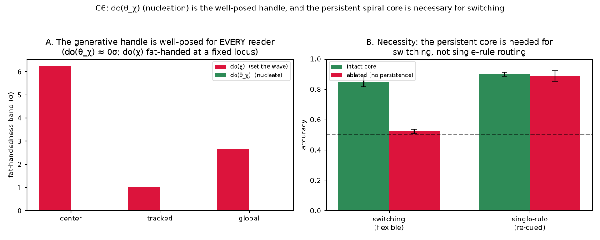

# C6 Results — `do(θ_χ)` is the Well-Posed Handle; the Persistent Core is Necessary

*Run of `experiments/c6_do_theta_chi.py`. Second of the C-series spiral extension
(see [`causal_spiral_experiments.md`](causal_spiral_experiments.md)). [C5](c5_results.md)
showed `do(χ)` is fat-handed when the wave is read at a fixed locus. C6 is the
C3-analog: intervene on the **generating parameter** — the nucleation seed — instead
of the wave.*

## Result A — the generative handle is well-posed for every reader

The spiral's rotation direction is set by the **nucleation seed sign** — a `do(θ)`
with no realization freedom: it always produces the canonical centred core. Decoded
across 40 seeds via each readout:

| readout | `do(θ_χ)` band | `do(χ)` band (C5) |
|---------|:--------------:|:-----------------:|
| center (fixed locus) | **0.0 σ** | 6.2 σ |
| tracked-core | **0.0 σ** | 1.0 σ |
| global charge | **0.0 σ** | 2.6 σ |

Decode accuracy is 1.00 for every reader. Because the generative handle never
exercises the realization freedom that broke C5's readers (it does not displace the
core or nucleate spurious defects), `do(θ_χ)` is well-posed **even for the fat-handed
fixed-centre reader**. This is the spiral form of C3's lesson: *drive the parameters
(nucleate), don't set the wave (inject a `χ` realization).*

## Result B — necessity: the persistent core is needed for switching, not routing

An explicit `do`-ablation of the core's **persistence** (raise the lattice threshold
so the seeded core dies ~`L` steps after nucleation), 5 seeds:

| condition | intact core | ablated (no persistence) |
|-----------|:-----------:|:------------------------:|
| **switching** (flexible) | **0.85** | **0.52** |
| **single-rule** (re-cued each trial) | 0.90 | 0.89 |



**Animation of the necessity result.** Two spirals nucleated with the *same* true
chirality, differing only in the lattice threshold `θ`. Intact (left) forms a
persistent spiral that holds the rule for the whole run; ablated (right) loses it
almost immediately and goes fully quiescent for the rest of the block — the same
nucleation, only the threshold parameter differs, and that alone determines
whether the context survives to be used later.


Ablating persistence collapses switching to chance (0.85 → 0.52) while sparing the
single-rule control (0.90 vs 0.89) — the persistent spiral is necessary for *holding*
the rule across a block, not for the routing itself. This is the E7 mechanism recast
as a causal necessity test: the rotation-direction option is causally required for
flexible switching specifically.

## Interpretation

C5 + C6 complete the spiral version of the C2 → C3 argument. C5: intervening
*directly on the wave* (`do(χ)`) is fat-handed at a fixed reader — well-posed only if
read topologically. C6: intervening on the *generating parameter* (`do(θ_χ)`,
nucleation) is well-posed for **any** reader, because it lives on the canonical
realization the reader expects — and the persistent core it creates is causally
necessary for the behaviour. Together: the causally meaningful, reader-robust handle
on the spiral is the **generative nucleation**, not the wave aggregate — exactly the
"drive the parameters `θ`" conclusion of the scalar C-series, now for a genuine 2-D
spiral, and the same handle E7's learning actually uses.

## Caveats / open items

- `do(θ_χ)`'s 0σ band is well-posedness *by construction* (a seed sign sets `χ`
  uniquely and centrally), the direct analog of C3's realization-band-is-zero point;
  the contribution is which query is well-defined, not biological accessibility.
- The necessity ablation raises the lattice threshold (kills persistence) rather than
  deleting the core nodes, so the re-cued single-rule control still reads a
  briefly-alive core each trial — which is exactly why it is spared. A structural
  deletion would confound persistence with routing (see the C5/spiral-ext caveats).
- C7 completes the arc with outcome-relativity and the `θ→χ→B` mediation/screening.

## Reproduce

```
python3 experiments/c6_do_theta_chi.py     # needs result/c5/c5_data.npz for the band contrast
```

Writes `docs/figures/c6_do_theta_chi.png` and `result/c6/c6_data.npz`.
