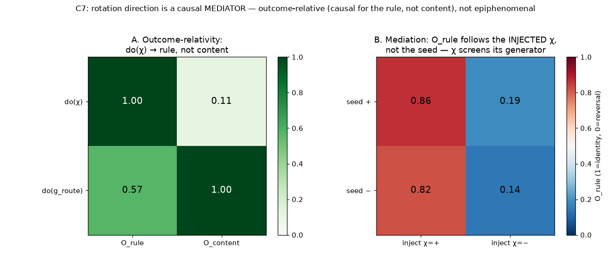

# C7 Results — Outcome-Relativity, Mediation, Synthesis (spiral cap)

*Run of `experiments/c7_outcome_relativity.py`. The C4-analog for the spiral,
closing the C-series spiral extension
([`causal_spiral_experiments.md`](causal_spiral_experiments.md)). Two results on a
frozen E7 router trained on the intact spiral, with outcomes measured as action
statistics over stimuli: `O_rule = mean_x P(action == x)` (1 = identity applied,
0 = reversal) and `O_content = |P(a=1|x=1) − P(a=1|x=0)|` (1 = stimulus recoverable).*

## Result A — the causal role is (handle, outcome)-relative

Normalized range of each outcome as each handle is swept (as in [C4](c4_results.md)):

|              | O_rule | O_content |
|--------------|:------:|:---------:|
| **do(χ)**       | **1.00** | 0.11 |
| **do(g_route)** | 0.57 | **1.00** |

`do(χ)` (flip rotation direction) moves the **rule** outcome fully (1.00) and the
stimulus-**content** outcome essentially not at all (0.11): flipping chirality
switches identity↔reversal but the stimulus remains equally recoverable from the
action either way. `do(g_route)` (the routing weights) controls **content** (1.00)
— erase it and the action no longer carries the stimulus — and secondarily disturbs
the parity (0.57, since a parity is undefined once routing is destroyed). So *"is
rotation direction causal?"* has **no answer without naming the outcome**: `χ` is
causal for the rule and epiphenomenal for stimulus content. This is the spiral form
of C4's diagonal `do(θ)` matrix — the same variable is causal for one behaviour and
inert for another.

## Result B — mediation: chirality screens its own generator

`O_rule` when the nucleation seed is set to `si` and then `do(χ = cj)` re-sets the
chirality mid-way (rows = seed, columns = injected χ):

|         | inject χ=+ | inject χ=− |
|---------|:----------:|:----------:|
| **seed +** | 0.86 | 0.19 |
| **seed −** | 0.82 | 0.14 |



`O_rule` tracks the **injected** chirality (columns: + → ~0.84, − → ~0.16) and is
**independent of the nucleation seed** (rows are nearly identical). So the seed acts
on behaviour *only through* the chirality: intercepting and re-setting `χ` overrides
the generator. Chirality is a genuine **mediator** on the `θ_seed → χ → B` path —
not a side-effect that behaviour ignores.

## Synthesis — closing the spiral causal arc

C5–C7 answer, for a genuine 2-D spiral, the question the rotating-wave neuroscience
is fighting over — *is the wave causal or epiphenomenal?* — and the answer is the
C-series' answer, sharpened:

- **Not epiphenomenal.** Behaviour reads the rotation direction (E7 decode 1.00);
  it *mediates* the generator→behaviour path (C7-B); and the persistent core is
  *necessary* for switching (C6-B). A rotating wave here does causal work.
- **But its causal status is contingent** — on the reader (C5: fat-handed at a fixed
  locus, well-posed only read topologically) and on the outcome (C7-A: causal for
  the rule, inert for content).
- **The clean, reader-robust handle is the generative nucleation** `do(θ_χ)` (C6-A:
  0σ for every reader), not the wave aggregate — the "drive the parameters `θ`,
  read the wave" thesis of the scalar C-series, now instantiated for a real spiral.

So rotation direction is best understood as a causal **mediator** in a `θ → χ → B`
chain: informative and efficacious as read by the behaviour, controllable cleanly
only through the parameters that generate it. See [`synthesis.md`](synthesis.md).

## Caveats / open items

- `O_content`'s small `do(χ)` response (0.11) and the `do(g_route)`→`O_rule`
  off-diagonal (0.57) are honest, not artifacts: erasing routing destroys the parity
  too, so the matrix is diagonal-*dominant* rather than perfectly diagonal (contrast
  C4's cleaner E3 latency/channel split, where the two outcomes were fully
  independent behavioural dimensions).
- Screening injects `do(χ)` by re-nucleating the field (a `do(S)` onto the winding
  level-set); as throughout the C-series this concerns which query is well-posed,
  not biological accessibility.
- Outcomes are action statistics over `n` trials with the router's masked-`p_s`
  exploration; the qualitative pattern (do(χ)→rule, mediation) is the robust result.

## Reproduce

```
python3 experiments/c7_outcome_relativity.py
```

Writes `docs/figures/c7_outcome_relativity.png` and `result/c7/c7_data.npz`.
