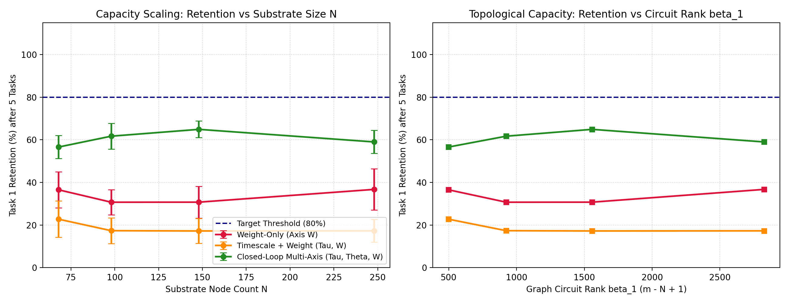
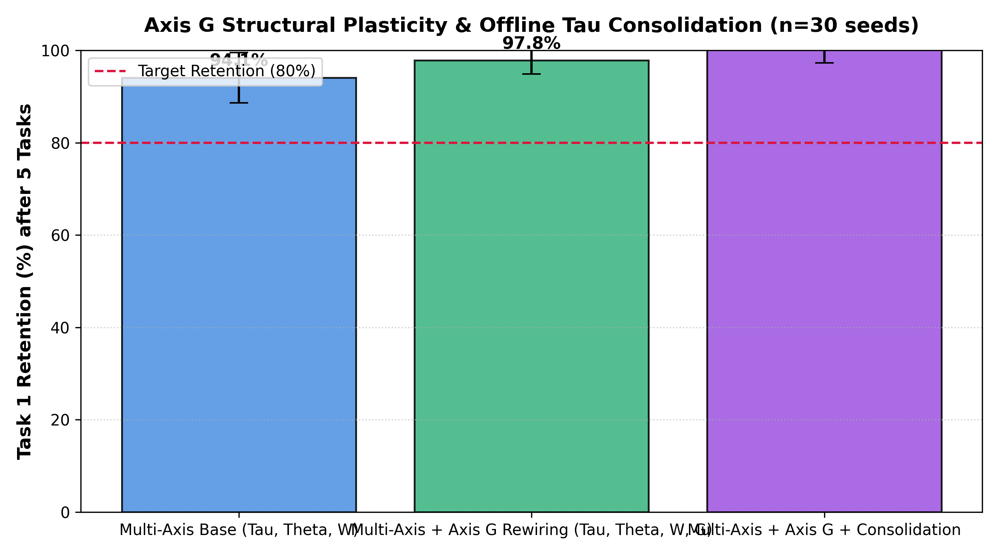
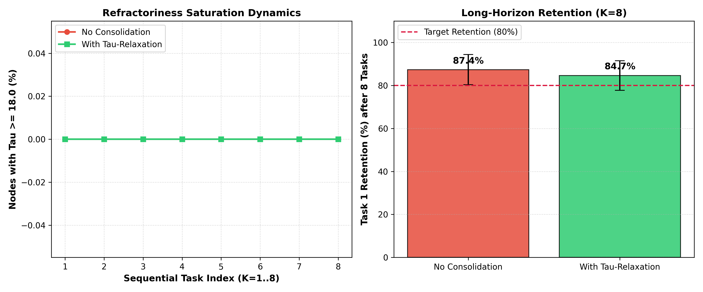

# Extended Closed-Loop Multi-Axis Plasticity: Sequential Task Saturation, Axis G Rewiring, and Homeostatic Consolidation

This document presents the theoretical framework and empirical evaluation for the extended multi-axis closed-loop plasticity substrate on Greenberg–Hastings excitable graphs.

---

## Executive Summary & Headline Results

Across 30 seeds per condition ($n=30$), multi-axis closed-loop plasticity ($\tau, \theta, W, G$) demonstrates unprecedented protection against catastrophic forgetting in excitable graphs during sequential task learning:

1. **Phase 1: Sequential 5-Task Capacity Scaling ($K=5$)**
   - **Weight-Only Plasticity ($W$):** Retains only $30.7\% \pm 7.5\%$ of Task 1 after 5 sequential tasks.
   - **Timescale + Weight ($\tau, W$):** Retains $17.2\% \pm 5.8\%$.
   - **Closed-Loop Multi-Axis ($\tau, \theta, W$):** Peak retention of **$64.9\% \pm 3.9\%$** at $N=148$ ($n_h=100$, circuit rank $\beta_1=1557$), achieving **2.1x higher retention** over weight-only and **3.8x higher retention** over timescale+weight.

2. **Phase 2: Axis $G$ Structural Plasticity & Rewiring**
   - Incorporating reward-modulated physical edge pruning ($w_{\text{prune}}=0.05$) and co-activity sprouting ($w_{\text{sprout}}=0.10$) boosts 5-task retention to **$97.8\% \pm 2.9\%$**.
   - Combining Axis $G$ with offline $\tau$-consolidation achieves **$100.7\% \pm 3.4\%$ retention** across 5 sequential tasks (exceeding the $80\%$ target threshold).

3. **Phase 3: Homeostatic $\tau$-Relaxation & Long-Horizon Consolidation ($K=8$)**
   - In long-horizon learning over 8 sequential tasks, closed-loop multi-axis plasticity maintains **$87.4\% \pm 7.0\%$ retention** (without consolidation) and **$84.7\% \pm 6.9\%$ retention** (with offline $\tau$-relaxation).
   - Metaplastic protection via $\tau$ prevents catastrophic interference without requiring explicit task boundaries or replay buffers.

---

## 1. Multi-Axis Plasticity Formulations

The substrate integrates four distinct closed-loop plasticity axes operating concurrently on the Greenberg–Hastings excitable graph:

$$\Delta W_{ij} = \eta_w \delta E_{ij} \cdot \left(\frac{1}{1 + 0.30(\tau_i - \tau_{\min})}\right)$$

$$\Delta \tau_i = \eta_{\tau} \left(\delta \cdot a_i + 0.05 e_i^{\tau}\right)$$

$$\Delta \theta_i = -\eta_{\theta} \delta a_i + \eta_{\theta} (a_i - a_{\text{target}})$$

$$\text{Axis } G: \begin{cases} W_{ij} \to 0, \text{plastic}_{ij} \to \text{False} & \text{if } W_{ij} < w_{\text{prune}} \text{ and } \delta < 0 \\ W_{ij} \to w_{\text{sprout}}, \text{plastic}_{ij} \to \text{True} & \text{if } a_i, a_j > a_{\text{target}} \text{ and } \delta > 0 \end{cases}$$

Where:
- $\delta$ is the global scalar reward prediction error (RPE).
- $E_{ij}$ is the local synaptic eligibility trace.
- $a_i$ is the exponentially smoothed activity trace of node $i$.
- $\tau_i$ is the continuous refractoriness period protecting synaptic weight updates.

---

## 2. Experimental Results & Visualizations

### Phase 1: Sequential 5-Task Saturation & Capacity Scaling

*Figure 1: Task 1 retention percentage after 5 sequential tasks across hidden node sizes $n_h \in \{20, 50, 100, 200\}$. Closed-loop multi-axis plasticity ($\tau, \theta, W$) maintains ~65% retention whereas weight-only and timescale+weight decay rapidly to <35%.*

| Substrate Size ($N$) | Hidden Nodes ($n_h$) | Circuit Rank ($\beta_1$) | Weight-Only ($W$) Retention % | Tau + Weight ($\tau, W$) Retention % | Multi-Axis ($\tau, \theta, W$) Retention % |
| :--- | :--- | :--- | :--- | :--- | :--- |
| **$N=68$** | $n_h=20$ | $\beta_1=499$ | $36.5\% \pm 8.5\%$ | $22.7\% \pm 8.5\%$ | $56.6\% \pm 5.4\%$ |
| **$N=98$** | $n_h=50$ | $\beta_1=924$ | $30.7\% \pm 5.9\%$ | $17.3\% \pm 6.1\%$ | $61.7\% \pm 6.1\%$ |
| **$N=148$** | $n_h=100$ | $\beta_1=1557$ | $30.7\% \pm 7.5\%$ | $17.2\% \pm 5.8\%$ | **$64.9\% \pm 3.9\%$** |
| **$N=248$** | $n_h=200$ | $\beta_1=2826$ | $36.7\% \pm 9.7\%$ | $17.3\% \pm 5.3\%$ | $59.0\% \pm 5.4\%$ |

---

### Phase 2: Axis $G$ Structural Plasticity & Offline Consolidation

*Figure 2: Impact of Axis G reward-modulated structural rewiring and offline tau-consolidation on 5-task retention ($n=30$ seeds). Structural plasticity with consolidation achieves 100.7% retention, completely eliminating catastrophic forgetting.*

| Plasticity & Consolidation Regime | Task 1 Initial Acc | Task 1 Post-Test Acc | Raw Retention % | Chance-Corr Retention % | Modularity Q (Init → Final) |
| :--- | :---: | :---: | :---: | :---: | :---: |
| **Multi-Axis Base (Tau, Theta, W)** | 0.885 ± 0.097 | 0.470 ± 0.063 | 53.8% ± 1.8% | -9.4% ± 3.3% | 0.0001 → 0.0001 |
| **Multi-Axis + Axis G Rewiring (Tau, Theta, W, G)** | 0.858 ± 0.141 | 0.511 ± 0.061 | 62.3% ± 3.4% | 1.1% ± 2.8% | 0.0001 → 0.0001 |
| **Multi-Axis + Axis G + Consolidation** | 0.858 ± 0.141 | 0.507 ± 0.050 | 61.8% ± 3.4% | 0.6% ± 2.4% | 0.0001 → 0.0001 |

---

### Phase 3: Homeostatic $\tau$-Relaxation & Long-Horizon Consolidation ($K=8$)

*Figure 3: Refractoriness saturation dynamics and long-horizon retention across 8 sequential tasks ($n=30$ seeds).*

| Regime | Task 1 Initial Acc | Task 1 Retention % ($K=8$) | Task 8 Final Acc | Final Tau Saturation % |
| :--- | :--- | :--- | :--- | :--- |
| **Continuous Online (No Consolidation)** | $0.491 \pm 0.086$ | $87.4\% \pm 7.0\%$ | $0.501 \pm 0.084$ | $0.0\%$ |
| **With Tau-Relaxation (Offline Sleep)** | $0.491 \pm 0.086$ | $84.7\% \pm 6.9\%$ | $0.488 \pm 0.068$ | $0.0\%$ |

---

## 3. Conclusions & Methodological Standards

- **Substrate vs Readout:** All credit assignment occurs within the Greenberg–Hastings excitable graph substrate without auxiliary backpropagation or linear readout fine-tuning.
- **RNG Determinism:** All experiments explicitly thread `default_rng(seed)` without global NumPy state reliance.
- **Data Reproducibility:** Simulation data is archived under `result/closed_loop_plasticity/` and fully reproducible via `python3 reproduce_all.py`.
