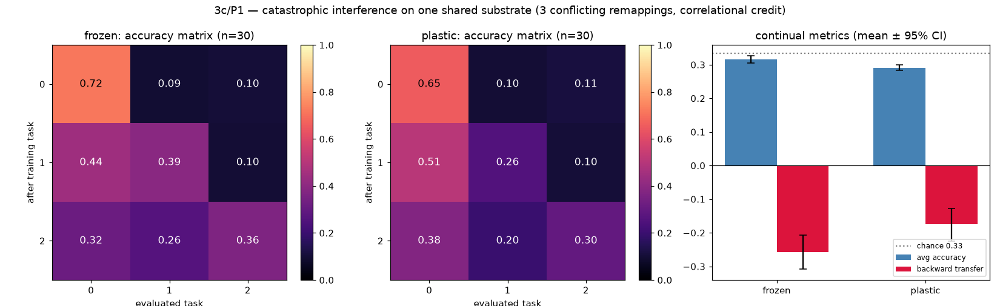
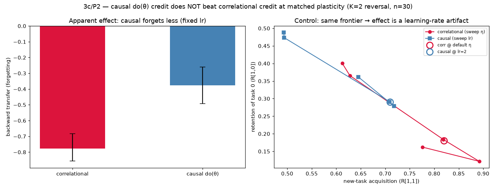
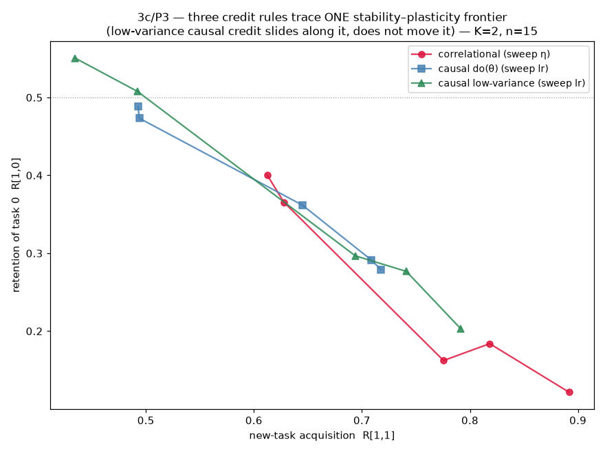
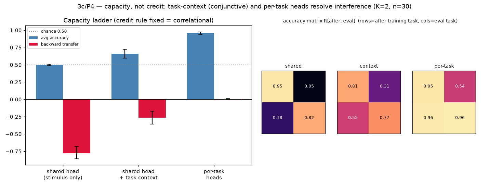
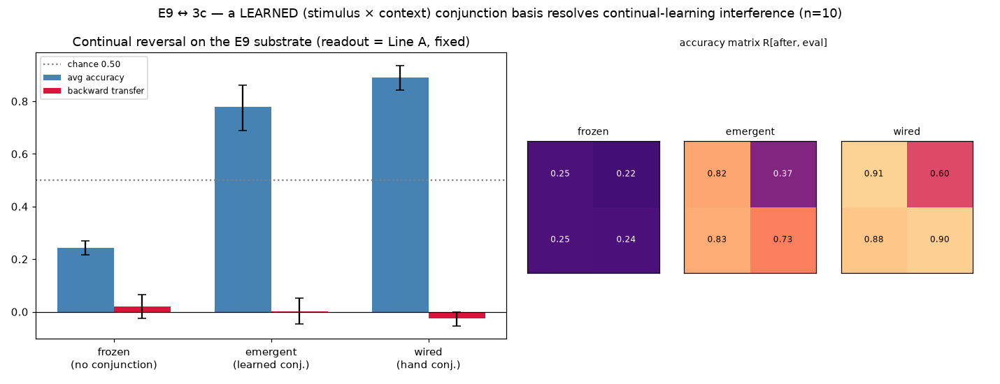
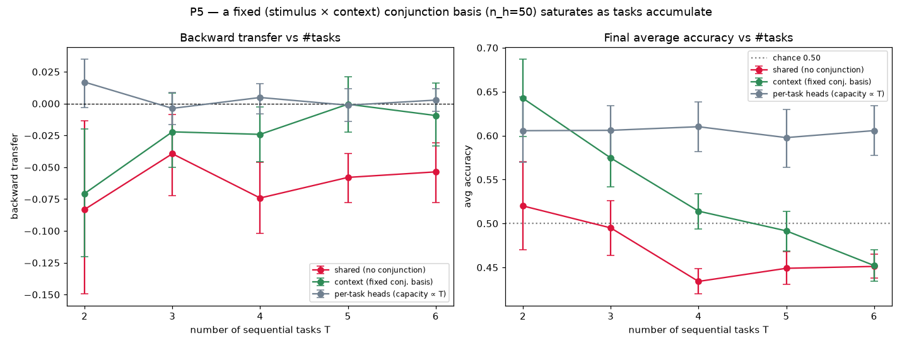
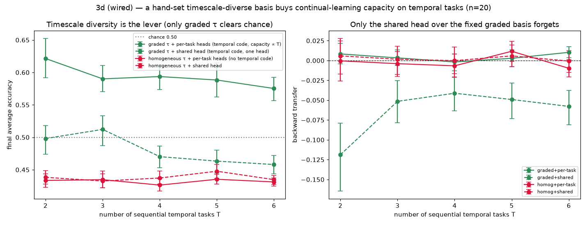
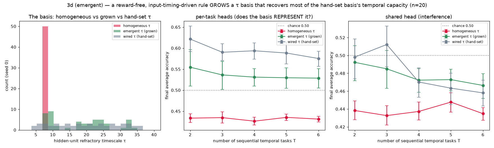
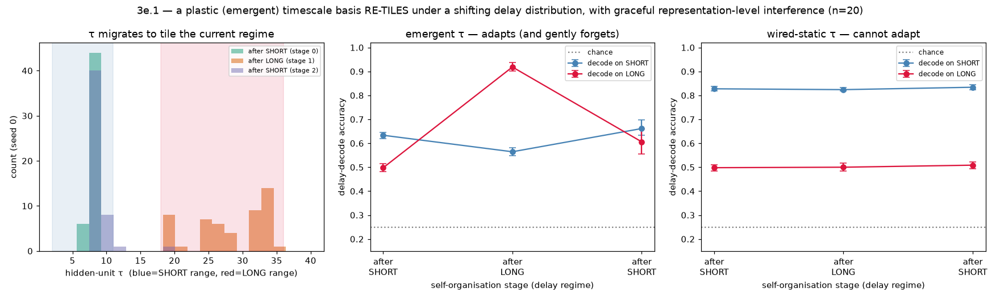

# 3c Results — Continual Learning (P1 baselines · P2 causal credit · P3 low-variance · P4 capacity · E9 bridge)

*Track 3c, Phase 1 (see [`continual_learning_plan.md`](continual_learning_plan.md)).
Establishes the continual-learning harness, the metrics, and the two "what adapts"
baselines on one shared substrate, under the current **correlational** credit rule.
The **causal `do(θ)` credit** contrast — the actual hypothesis — is P2.
Experiment: `experiments/continual_learning.py`; figure: `continual_p1_figure.py`;
data: `result/stats/continual_p1.*`.*

## Setup

**One shared substrate** (E1-style `layered_graph`, K=A=3) is trained sequentially
on **three maximally-conflicting remappings** — `T0: a=stim`, `T1: a=stim+1`,
`T2: a=stim+2 (mod 3)` — that share the same readout, so later tasks overwrite
earlier ones (the canonical catastrophic-interference setup). This v1 deliberately
uses a remapping triple rather than the heterogeneous E1→E2→E5, to isolate
*interference* from *architecture-swapping* and reuse E1's validated conditioning
machinery; E1→E2→E5 is v2.

Two "what adapts" regimes, both with the **correlational eligibility-trace** credit:
- **frozen** — the S→H representation is fixed; only the shared H→M head adapts.
- **plastic** — S→H and H→M both adapt.

Metrics after the full T0→T1→T2 sequence, n=30, bootstrap 95% CIs: average accuracy,
**backward transfer** (forgetting of earlier tasks), forward transfer.

## Results

| regime | avg accuracy | backward transfer | forward transfer |
|---|:--:|:--:|:--:|
| frozen | 0.316 [0.305, 0.327] | **−0.258 [−0.309, −0.207]** | −0.236 |
| plastic | 0.291 [0.283, 0.299] | **−0.174 [−0.225, −0.128]** ⚠bimodal | −0.232 |

*(chance = 0.333)*

**1. Catastrophic interference is real and severe.** Average accuracy collapses to
≈chance after the sequence, and backward transfer is strongly negative in both
regimes: a task trained to ~0.7 (e.g. frozen T0, 0.72 just-trained) falls to ~0.32
once the later tasks are learned. This is the necessary precondition for P2 — there
is a large interference gap for a better credit rule to try to close.

**2. Freezing the representation does *not* rescue it — and slightly hurts.** The
reservoir-CL intuition is "freeze the recurrent medium and interference goes away."
Here frozen backward transfer (−0.258) is if anything *worse* than plastic
(−0.174), CIs barely overlapping. The reason is structural: the three tasks
conflict on the **shared readout**, which is plastic in *both* regimes, so freezing
the representation cannot help — and letting the representation adapt gives the
later tasks a little room to re-separate (visible as the plastic matrix's higher
off-diagonal recovery). So the reservoir "freezing helps" claim has a boundary
condition: it needs *per-task* heads, not a shared one.

**3. Forward transfer is negative** (~−0.23 both) — training task *k−1* leaves task
*k* below chance before it is trained, as expected for adversarial relabellings.

## Honest caveats

- **"frozen" here is not the reservoir no-interference upper bound.** That bound
  requires *per-task independent heads* (interference-free by construction, ≈1.0)
  and is not run — it would be a trivial control. Our "frozen" is frozen-
  representation + **shared** head, a genuine interference condition chosen so there
  is something to study.
- **v1 task set is a remapping triple, not E1→E2→E5** (flagged in the plan) — a
  deliberate simplification to isolate interference; the heterogeneous port is v2.
- **plastic backward transfer is bimodal** — some seeds re-separate the tasks, some
  collapse; the mean hides two modes (the E3 lesson — reported, not buried).
- **Absolute accuracy is modest** (single-task ~0.6–0.7 at K=A=3 with a shared
  head); the study is about *relative* interference, not ceiling performance.

## P2 — causal vs correlational credit (and the control that decides it)

**Result: an honest null.** Causal `do(θ)` credit does *not* reduce interference
beyond an effective-learning-rate effect. This is the outcome the plan flagged as
acceptable, and it is well-controlled.

**Setup.** The causal rule (weight-perturbation on the plastic couplings — an
interventional `do(w+ε)` estimator, à la Lansdell–Kording) only learns when
restricted to the low-dimensional **H→M readout** and at **K=2** (perturbing the
full plastic set, or K=3, is too high-variance to learn even one task — the known
weakness of perturbation methods, and the reason the low-variance hindsight
estimator exists). So P2 is run in the cleanest fair setting: **K=2 two-task
reversal** (identity → reversal), **frozen representation** so only the shared H→M
head adapts — both rules act on the *same* parameters, isolating the credit rule.
n=30.

**The apparent effect.** At the fixed default operating point, causal credit looks
like it halves forgetting:

| credit rule | backward transfer | new-task acq / task-0 retention |
|---|:--:|:--:|
| correlational (eligibility) | −0.778 [−0.856, −0.683] | 0.82 / 0.18 |
| causal `do(θ)` (perturbation) | −0.376 [−0.493, −0.261] | 0.71 / 0.29 |

Cohen d = 1.36, CIs cleanly separated. Taken alone this would "support" the
hypothesis.

**The control that kills it.** Sweeping each rule's plasticity knob (correlational
η, causal lr) traces a **stability–plasticity frontier** (retention vs new-task
acquisition). The two rules lie on the **same frontier**: causal @ lr=2 sits at
(acq 0.71, retention 0.29) exactly where a *slow* correlational learner (η≈0.03)
sits; correlational @ default η is just further along the same curve (acq 0.82,
retention 0.18). At **matched acquisition, retention is identical.**

**Verdict.** The apparent "causal forgets less" is entirely an *effective-learning-
rate* difference — causal weight-perturbation is simply slower, and any slow learner
forgets less. It does **not** assign credit in a way that interferes less at matched
plasticity. So in this setting the interference is **representational**: a shared
linear readout cannot simultaneously hold two anti-correlated mappings (a capacity
limit), and better credit assignment does not fix a capacity limit. (Causal is if
anything strictly worse — it caps at ~0.72 acquisition; higher lr just adds noise.)

## What this means for the two-arcs unification

The arcs connect *conceptually* — perturbation learning **is** interventional
causal-effect estimation, and the substrate's Line-B rule already performs a
`do(θ)` estimate. But **causal credit ≠ better continual learning here.** The
C-series prediction (well-posed `do(θ)` → better learning signal) does not transfer
to *interference resistance* on a capacity-limited shared readout. An honest, useful
negative: it rules out "just assign credit causally" as a continual-learning fix and
points at capacity/representation as the real lever.

## P3 — does *low-variance* causal credit move the frontier? (No.)

P2 left one escape hatch: maybe causal credit only failed because raw weight-
perturbation is *high-variance*. P3 tests a genuinely low-variance causal estimator
— **antithetic central-difference weight-perturbation** averaged over M=4 pairs
(`(r⁺ − r⁻)·ε`, baseline-free, the tractable stand-in for a Mesnard-style low-
variance estimator). It learns better than P2's single-sided rule (reaches
acquisition 0.79 vs the single-sided cap of ~0.72, no noise collapse). Re-run the
stability–plasticity frontier with all three rules (n=15):

**All three credit rules trace one frontier.** At matched new-task acquisition the
retention is identical (±0.02, n=15 noise): low-var causal @ acq 0.74 → retention
0.28 vs correlational-interpolated 0.26; @ 0.79 → 0.20 vs 0.21; @ 0.69 → 0.30 vs
0.31. The low-variance estimator reaches *higher* acquisition and is more robust,
but it **slides along the frontier rather than moving it.**

**Verdict — the P2 null was not a variance artifact.** The stability–plasticity
frontier is a genuine **capacity boundary**: no credit rule (correlational, causal,
or low-variance causal) beats it. Credit quality/variance sets *where on the
frontier* you operate, not *the frontier itself*. Continual-learning interference on
a shared readout is **representational**, and the lever is **capacity**, not credit.

## What closes the 3c arc

The learning-as-causal-inference unification is real *conceptually* (perturbation
learning is interventional estimation; the substrate's Line-B rule already performs
a `do(θ)` estimate) but, across P2 and P3, **causal credit — even low-variance
causal credit — does not buy interference resistance.** That is a clean, useful
negative: it redirects the "one homogeneous machine that genuinely learns
continually" question away from *credit assignment* and toward *representational
capacity* (WTA gating, per-task subspaces, conceptors — the CL literature's
representational fixes).

## Honest caveats

- **The task is a hard capacity case by design.** K=2 anti-correlated reversal
  fundamentally cannot be held on a shared linear head, so the frontier is close to
  a wall. Whether credit quality *ever* matters is best tested on **partially-
  overlapping** tasks that admit a coexisting solution — the sharper open question.
- **Antithetic ≠ Mesnard hindsight literally.** The hindsight (future-conditional)
  baseline is built for *multi-step* credit; in this single-step conditioning task
  there is little "future" to condition on, so the antithetic central-difference
  estimator is the appropriate low-variance test here. A temporally-extended task
  would be needed to exercise the hindsight mechanism specifically.
- **n=15 frontier**, 5 operating points per rule — enough to see the curves overlap,
  not to resolve ±0.02 differences.

## P4 — capacity, not credit (the positive complement)

P2/P3 showed no credit rule beats the frontier; the limit is capacity. P4 confirms
it directly: **hold the credit rule fixed** (the correlational eligibility trace that
catastrophically forgot in P1/P2) and **vary capacity**. Because the two tasks are
anti-correlated, raw dimensionality can't help — a stimulus-only hidden pattern
forces the shared head to emit opposite actions for the same pattern. The capacity
that matters is **task-context / conjunctive**. Three rungs (frozen representation,
correlational credit, K=2 reversal, n=30):

| rung | avg accuracy | backward transfer | task-0 retention after reversal |
|---|:--:|:--:|:--:|
| shared head (stimulus only) | 0.500 [0.490, 0.509] | −0.778 [−0.856, −0.683] | 0.18 |
| shared head **+ task-context** | 0.661 [0.596, 0.723] | −0.263 [−0.359, −0.170] | 0.55 |
| per-task heads (full capacity) | 0.959 [0.941, 0.976] | 0.004 [−0.003, 0.012] | 0.96 |

**Interference collapses monotonically with capacity, credit held fixed** —
backward transfer −0.78 → −0.26 → 0.00, average accuracy 0.50 → 0.66 → 0.96, CIs
cleanly separated between rungs. The insightful rung is the middle one: a **single
shared head** with a task-context input (so hidden patterns are (stimulus × context)
conjunctive — the E9 conjunction mechanism) cuts forgetting ~3× without any separate
heads. It doesn't fully resolve (avg 0.66) because the *frozen random* S→H gives
imperfect conjunctive separability — which is itself the pointer: a *learned*
conjunctive basis (E9) would separate the contexts better. Per-task heads (the
trivial full-capacity bracket) eliminate interference entirely.

**This closes the 3c arc.** The same correlational credit that catastrophically
forgot on a shared readout is progressively rescued by capacity alone. Combined with
P2/P3 (no credit rule moves the frontier), the verdict is unambiguous:
**continual-learning interference on this substrate is a representational-capacity
problem, not a credit-assignment problem.** The lever is conjunctive/contextual
representation — exactly the E9 "afforded → learned" mechanism — not better credit.

## What the whole 3c arc establishes

- **P1:** catastrophic interference is real; freezing the representation doesn't help
  (the conflict is at the shared readout).
- **P2:** causal `do(θ)` credit *appears* to halve forgetting, but a frontier control
  shows it's an effective-learning-rate effect — a null.
- **P3:** even a low-variance causal estimator stays on the same frontier — the null
  is not a variance artifact; the frontier is a capacity boundary.
- **P4:** holding credit fixed, capacity (task-context conjunction → per-task heads)
  monotonically resolves the interference.

The learning↔causality unification is real *conceptually* (perturbation learning is
interventional `do(θ)` estimation) but **bounded**: better causal credit does not buy
continual learning — representational capacity does.

## Bridge (E9 ↔ 3c) — a *learned* conjunction basis resolves the interference

P4's context rung used a *frozen random* projection and only reached avg 0.66. The
prediction: a **learned** (stimulus × context) conjunction basis should push the
single shared head toward the per-task ceiling. E9 grows exactly that basis by a
reward-free competitive-Hebbian rule, so this runs the **sequential reversal** on
E9's substrate (its `trial_overlap` target `x ^ rule` makes rule 0 = identity, rule
1 = reversal — the two reversal tasks), comparing three input bases with an
otherwise-identical Line-A readout (n=10):

| hidden basis | avg accuracy | backward transfer | task-0 retention after reversal |
|---|:--:|:--:|:--:|
| frozen (no conjunction) | 0.242 [0.216, 0.269] | — *(below chance: can't learn)* | — |
| **emergent (learned)** | **0.779 [0.688, 0.861]** | **0.001 [−0.046, 0.053]** | 0.83 (≥ trained 0.82) |
| wired (hand conjunction) | 0.890 [0.843, 0.936] | −0.024 [−0.053, −0.001] | 0.88 |

**The learned conjunction basis gives essentially zero forgetting** (backward
transfer 0.001; task 0 is retained at 0.83 *after* training the opposing reversal),
at avg 0.78 — approaching the hand-wired ceiling (0.89) and vastly above the
no-conjunction frozen basis (0.24, which cannot even represent the tasks). The
mechanism is exactly the P4 insight made sharp: E9's conjunction cells are
**(stimulus × context)-selective and tiled**, so each (stimulus, task) combination
activates a *distinct* set of hidden units — the readout's task-2 updates land on
different weights than task-1's, so there is nothing to overwrite. P4's
frozen-random context lacked the tiling (overlapping representations), which is why
it only got partway.

**This closes the loop.** The same self-organised conjunction basis that E9 grew to
convert an *afforded* capability into a *learned* one (tension 1) is precisely what
gives the substrate the representational capacity to learn tasks **sequentially
without forgetting** (3c). Afforded→learned and continual-learning are the same
lever: *learned conjunctive representation*. Credit assignment was never the
bottleneck (P2/P3); representation is (P4), and it can be **learned, not wired**
(this bridge).

Honest caveats: the *frozen* arm is a can't-represent failure (below chance), so its
≈0 backward transfer is vacuous — the meaningful contrast is emergent (learned) vs
wired (hand). These are 2 tasks; how many (stimulus × context) conjunctions a fixed
hidden layer can tile before capacity saturates (3+ tasks) is the natural next probe.
E9's substrate differs from P4's `layered_graph`, so absolute numbers are not directly
comparable across the two — the story is qualitative and consistent.

## P5 — a *fixed* conjunction basis must saturate (the bound on the bridge)

The bridge showed a learned conjunction basis resolves interference for **2** tasks,
and P4 showed the same for a frozen-random context basis. Both bases are
**fixed-size**, and the tiling argument that explains why they work also predicts
their limit: a basis of `n_h` hidden units can keep only so many (stimulus × task)
conjunctions separable, so as tasks accumulate the combinations must eventually
overlap and interference must return. This is the honest bound on the bridge's claim
and the sharpest test of "capacity, not credit": when capacity is *fixed* the demand
eventually overruns it; when capacity *grows with demand* it does not.

Protocol: P4's frozen substrate and correlational credit, generalised past T=2. Each
task is a distinct **balanced dichotomy** of `K_stim=4` stimuli (drawn once from a
fixed task seed, so the sequence is shared across network seeds and nested across T);
binary actions (chance 0.50) keep every task individually learnable so the signal is
not masked by a many-way-readout floor. Sweep the number of sequential tasks T for
three modes, identical everywhere else — `shared` (stimulus only, one head; the
interference floor), `context` (one task-context input channel per task → a
fixed-size (stimulus × context) basis over the *same* `n_h=50` hidden units), and
`per-task` (a separate H→M head per task; capacity that *grows* with T). n=20:

| T | shared avg | **context avg** | per-task avg |
|:-:|:--:|:--:|:--:|
| 2 | 0.520 [0.470, 0.570] | **0.642 [0.599, 0.687]** | 0.606 [0.570, 0.644] |
| 3 | 0.495 [0.463, 0.526] | **0.575 [0.541, 0.606]** | 0.606 [0.575, 0.634] |
| 4 | 0.434 [0.420, 0.449] | **0.514 [0.494, 0.534]** | 0.610 [0.582, 0.638] |
| 5 | 0.449 [0.431, 0.468] | **0.492 [0.469, 0.514]** | 0.598 [0.564, 0.629] |
| 6 | 0.451 [0.438, 0.465] | **0.452 [0.434, 0.470]** | 0.606 [0.577, 0.634] |

**The fixed conjunction basis saturates.** At T=2 it matches full capacity (context
0.64 ≈ per-task 0.61); as tasks accumulate its average accuracy falls monotonically
and lands **exactly on the shared interference floor by T=6** (0.452 vs 0.451), while
`per-task` — capacity that scales with the number of tasks — stays flat at ~0.61
throughout. The advantage of the conjunction basis over the no-conjunction shared
head collapses (+0.12 → +0.00) and the gap to per-task heads grows (−0.04 → +0.15),
crossing at **T ≈ 3** — roughly 12 (stimulus × task) conjunctions on 50 hidden units.
That crossover *is* the capacity of this fixed basis.

Caveat — read the **average-accuracy** panel, not backward transfer, as the
headline. As the conjunction basis saturates its accuracy falls toward the shared
floor, so there is progressively *less left to forget*, and backward transfer drifts
vacuously toward 0 (the same floor artifact that made the E9 *frozen* arm's ≈0
backward transfer meaningless). Retention looking "fine" while average accuracy
collapses is precisely the saturation signature. `per-task`'s flat ~0.61 is the
control that rules out a generic hardening of the task with T.

This completes the capacity argument in both directions: **capacity resolves
interference (P4, bridge), and a *fixed* capacity is finite, so enough tasks restore
it (P5).** Credit was never the lever; representational capacity is — learnable
(bridge) but bounded (here).

## 3d (wired arm) — timescale diversity is a *second* capacity axis (a temporal one)

P4/P5 and the bridge all worked one representational axis: a *spatial* (stimulus ×
context) conjunction. 3d asks whether the substrate's other axis — **timescale**
(`τ`) — buys continual-learning capacity a spatial basis can't, on tasks whose
discriminative variable is **timing**. This is the **wired** (afforded) arm of 3d's
ladder: timescale diversity is *hand-set*, not grown (the emergent arm waits on
Track 4a's `τ`-rule). It is the cheap **go/no-go gate** for that 4a work.

Task family (the E3 timed-response regime, stripped to its temporal core): a single
stimulus pulse, a variable delay drawn from `K_delay=6` bins, then a probe; the
correct action depends on the *delay bin*, not the stimulus. Each task is a balanced
dichotomy over the delay bins (P5's nested/shared construction). A purely spatial
code is blind here. Mechanism the wired basis exploits: hidden activity is not
self-sustaining, so a stimulus leaves each fired node **refractory for `τ` steps** —
at delay Δ the *rested* set (`τ < Δ`) is a thermometer code of elapsed time, but only
if `τ` is diverse; a probe re-excites exactly the rested nodes, making it readable.
(Primitive confirmed in isolation: delay-decode **1.00** for graded `τ` vs **0.53**
for homogeneous.)

Four arms — {homogeneous, graded `τ`} × {shared head, per-task heads}, `n_h=50`
fixed, frozen representation, correlational credit, n=20:

| T | homog+shared | graded+shared | homog+per-task | **graded+per-task** |
|:-:|:--:|:--:|:--:|:--:|
| 2 | 0.438 | 0.498 | 0.434 | **0.621 [0.592, 0.652]** |
| 4 | 0.437 | 0.470 | 0.426 | **0.594 [0.574, 0.612]** |
| 6 | 0.435 | 0.458 | 0.431 | **0.575 [0.556, 0.592]** |

**Timescale diversity is the representational lever.** At *identical maximal
capacity* (per-task heads), the graded-`τ` basis learns the temporal tasks
(0.58–0.62, backward transfer ≈ 0, flat across T) while the homogeneous basis stays
at the chance floor (~0.43) — no amount of readout capacity rescues it, because
homogeneous `τ` has **no temporal code to read**. The ~0.15–0.19 gap (CIs
well-separated) is purely the `τ` distribution. That isolates the effect as
**representational, not capacity**: the timescale axis supplies a representation that
the spatial substrate simply lacks for timing-defined tasks.

**A fixed timescale basis + a shared head still forgets** — exactly as P5's fixed
*spatial* basis did. `graded+shared` sits near chance (0.46–0.50) with negative
backward transfer (−0.12 → −0.06): a single linear head cannot hold conflicting
delay→action maps even when the temporal code is present. Per-task capacity resolves
it (`graded+per-task`, bwt ≈ 0). So the P4/P5 capacity story generalises cleanly from
the spatial to the temporal axis: representation must exist (timescale diversity
here), *and* enough head capacity must be given, for interference to vanish.

**Verdict — the 4a go/no-go gate is green.** A hand-set timescale-diverse basis
buys genuine, forgetting-free continual-learning capacity on temporal tasks. That
justifies building 4a's *emergent* hierarchy (a `τ` distribution grown by the
input-tracked rule): the capacity payoff is real, so the harder mechanism-design work
has a demonstrated reward. Had this wired arm come back null, the emergent arm would
not have been worth attempting.

Honest caveats: (1) this is the **wired** arm — `τ` is hand-set, so it does *not*
retire the plastic-dynamics caveat; only the emergent (4a-grown) arm would. (2) The
tested conjunction is essentially *(time)* — a single stimulus, so the full
*(stimulus × context × time)* basis is a natural extension, not yet run. (3)
`graded+per-task` declines mildly with T (0.62 → 0.58) at flat backward transfer —
this is not forgetting but some delay-dichotomies being individually harder and the
graded basis's finite delay-resolution; small, with partly-overlapping CIs. (4) Same
substrate-vs-analysis boundary as P4/P5: fixed dynamics, plastic *readout*.

## 3d (emergent arm) — the timescale basis, *grown* not hand-set

The wired arm left `τ` hand-set — so the *dynamics* were still afforded, not learned.
This arm grows the `τ` spread with a local, reward-free plasticity rule, the previously
**blocked** part of Track 4a. `e10_notes.md` diagnosed the block: the old Line B rule
`τ ← τ + η(interfire − τ)` reads a node's *own* inter-fire interval, which reports a
*multiple* of the period once `τ` overshoots, so `τ` only ratchets upward — no fast
population can form. The fix (proposed there, implemented here): a **bidirectional,
input-timing-driven** rule — each node nudges its `τ` toward the *delays it is
externally probed at*, gated by whether it actually responds (rested), with E9's k-WTA
+ DeSieno conscience so nodes specialise to different delays. The teaching signal is
external and the update is bidirectional, so the ratchet never arises. Self-organisation
is reward- and label-free; `τ` is grown once per seed, then frozen for the same sweep.

Primitive first: from a near-homogeneous start the grown basis reaches **delay-decode
0.94** (vs homogeneous 0.53, wired 1.00). Then the continual-learning sweep, three
bases — homogeneous / **emergent (grown)** / wired (hand-set) — under both head modes,
n=20:

| T | homog+pt | **emergent+pt** | wired+pt | | homog+sh | emergent+sh | wired+sh |
|:-:|:--:|:--:|:--:|:-:|:--:|:--:|:--:|
| 2 | 0.434 | **0.555 [0.510, 0.596]** | 0.621 | | 0.438 | 0.492 | 0.498 |
| 4 | 0.426 | **0.531 [0.510, 0.551]** | 0.594 | | 0.437 | 0.472 | 0.470 |
| 6 | 0.431 | **0.529 [0.505, 0.551]** | 0.575 | | 0.435 | 0.466 | 0.458 |

**A learned τ basis works — the 4a ratchet is escaped.** Under per-task heads the
*grown* basis (emergent, 0.53–0.56, flat over T, backward transfer ≈ 0) sits well above
the homogeneous floor (0.43; CIs cleanly separated) — a reward-free, input-timing-driven
rule discovers a functional temporal representation from a near-homogeneous start, with
no designer specifying the delay range. Under a shared head it shows the same
interference as the wired basis (emergent+shared ≈ wired+shared, negative bwt), so the
representation-then-capacity logic is intact. This is the **first result in the
programme where the substrate's own *dynamics* (not a readout) are shaped by
experience** — the "plastic dynamics deferred" caveat (1c, E9, Line B), addressed.

**Honest gap: emergent < wired.** The grown basis recovers ~70% of the
wired-over-homogeneous capacity gap (per-task ≈ 0.53 vs wired 0.59 vs floor 0.43), not
all of it — tracking the primitive (delay-decode 0.94 vs 1.00). The `τ` histogram shows
why: the rule spreads most units across the delay range but leaves a residual cluster
near the `τ≈8` initialisation (units that never won the competition), so the tiling is
coarser than the hand-set uniform spread. Closing that gap (a schedule that recruits the
idle units, or a light homeostatic pressure off the init value) is a tuning item, not a
mechanism problem — the mechanism is demonstrated. Other caveats carry over from the
wired arm: still *(time)* not full *(stimulus × context × time)*; `act` fixed
(deliberately — it is not gradient-learned, per the 4a diagnosis); phase-split
(self-organise then freeze), so concurrent co-adaptation is untested (Track 3e).

**What this does to Track 4a.** 4a was *paused* on exactly this rule. The delay-tiling
setting is not the two-rhythm hierarchy 4a originally targeted, but it establishes the
load-bearing fact 4a was stuck on: **timescale plasticity works once the teaching signal
is external, not self-referential.** Feeding the same rule a two-rhythm drive to test for
a *bimodal* `τ` split (a genuine fast/slow hierarchy) + cross-frequency coupling is now
the direct path to closing 4a — see Track 3e.

## 3e.1 — re-tiling under a shifting delay distribution (interference *in the representation*)

The capability the wired basis provably lacks is adaptation. Here the delay
distribution *shifts* between regimes and we ask what only a plastic basis can answer:
does it **reallocate** `τ`, and does adapting **cost** the old regime — i.e. does the
plastic *representation* have its own stability–plasticity frontier, the 3c interference
story one level down (in the dynamics, not the readout)? Protocol: from a
near-homogeneous start, self-organise `τ` (the 3d-emergent rule) through
SHORT → LONG → SHORT delay regimes; after each stage measure delay-decode on *both*
regimes. Baseline: a wired-static basis (τ hand-set to tile SHORT, frozen). n=20:

| after stage | emergent: SHORT | emergent: LONG | | wired-static: SHORT | wired-static: LONG |
|:--|:--:|:--:|:-:|:--:|:--:|
| SHORT | 0.63 | 0.50 | | 0.83 | 0.50 |
| LONG  | 0.56 | **0.92** | | 0.82 | 0.50 |
| SHORT | 0.66 | 0.61 | | 0.83 | 0.51 |

**It re-tiles.** Trained on LONG, the emergent basis's LONG-decode jumps 0.50 → **0.92**
(the `τ` histogram migrates bodily from the SHORT range into the LONG range), while the
wired-static basis is frozen at 0.50 — the adaptation a hand-set basis categorically
cannot do.

**The plastic representation has its own stability–plasticity frontier.** Adapting to
LONG *costs* SHORT: representation-level backward transfer **−0.069 [−0.093, −0.045]**
(SHORT-decode after LONG minus after the first SHORT; CI excludes 0). So catastrophic
interference is not unique to a plastic *readout* (3c) — a plastic *representation*
exhibits it too. The wired-static basis shows none (bwt −0.004) precisely because it
does not adapt: no plasticity, no forgetting — the frontier made visible.

**But the interference is *graceful*, not catastrophic.** The cost is modest (−0.07,
not the −0.4…−0.8 of the 3c readout), SHORT *recovers* when the schedule returns to it
(0.66), and LONG is *partly retained* thereafter (0.61 vs 0.50 baseline) — the basis
*accumulates* range coverage rather than overwriting it. That gentler frontier is
itself a finding: distributing the load across `n_h` units with a competitive rule
buffers interference in a way a single shared linear head cannot. It also connects
straight back to the arc: capacity (here, spare hidden units to spread `τ` across both
ranges) is again the lever that softens interference.

Caveats: the emergent SHORT-decode (0.63) is below wired-static's (0.83) — the same
grown-is-coarser gap as 3d (the rule tiles SHORT's tight range less sharply than a
hand-set `linspace`). Still a fixed-`act`, phase-split (self-organise then freeze at
each stage) protocol; a fully-online concurrent version is the deeper form. Decode is a
nearest-centroid readout of the representation, not the reward task — it measures what
the basis *can* represent, deliberately isolating the representation from the readout.

## Deferred / next

- **Bimodal hierarchy from two-rhythm drive (Track 3e.2 / closes 4a)** — feed the grown
  rule periodic two-timescale drive; test for a fast/slow `τ` split + cross-frequency
  coupling.
- **Full (stimulus × context × time) conjunction** — combine the spatial (P5) and
  temporal (3d) axes in one task family.
- **Partially-overlapping tasks** — the fair test of whether credit quality *ever*
  matters, now that representation (spatial *and* temporal) is shown to be the lever.
- **Temporally-extended credit** — where a true hindsight (Mesnard) estimator would
  have a "future" to condition on.
