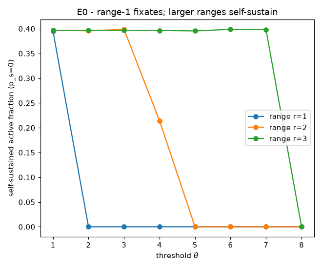
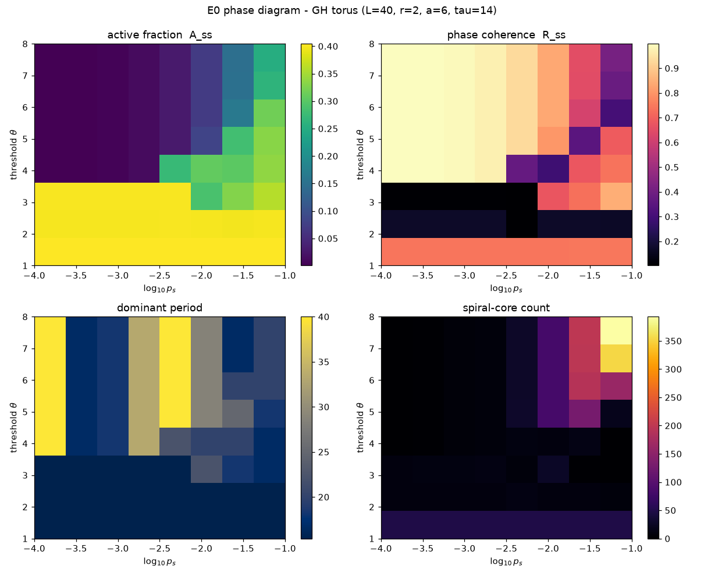
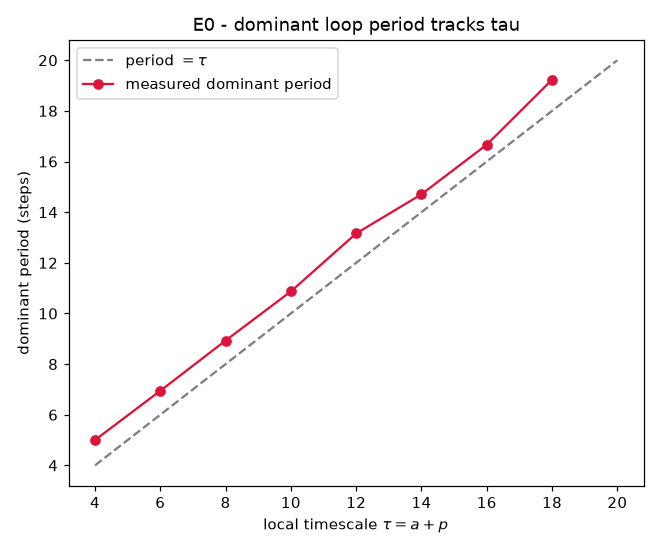

# E0 Results — Substrate Characterisation

*Run of `experiments/e0_characterization.py` on the graph substrate
(`ghca_net.py`). Purpose: locate the self-sustaining "spiral band" and confirm
that the dominant loop period tracks the local timescale τ. See
`docs/learning_experiments.md` §5, experiment E0.*

## Summary of findings

1. **Range-1 fixates; the live threshold band widens with range.** With a
   von Neumann neighbourhood (r=1, 4 neighbours) the medium self-sustains only
   at threshold θ=1 and dies for θ≥2 (p_s=0). Increasing the interaction range
   widens the band of thresholds that support self-sustained activity — r=2
   lives up to θ=4, r=3 up to θ=7. This is the Fisch–Gravner–Griffeath
   threshold-range scaling behaviour: larger range supports proportionally
   higher thresholds.

2. **A genuine intermediate band exists at r≥2.** At r=2, a=6 (τ=14): θ≤3 is
   turbulent/saturated (active fraction ≈ 0.4, many defect cores); **θ≈4 is the
   organised regime** (active fraction ≈ 0.2, only a handful of stable spiral
   cores); θ≥5 dies (p_s=0). This θ≈4 point has threshold headroom below the
   maximum input (12), which is what later experiments need for a homeostatic
   threshold and for plastic conduction weights to modulate.

3. **Dominant loop period tracks τ almost exactly.** In the self-sustaining
   turbulent regime, sweeping τ (via the refractory length) gives a dominant
   global period of `period = 1.00·τ + 0.95` (correlation r = 0.9992, τ ≤ 18).
   Learning τ therefore controls the loop period directly — validating Line B's
   choice of control variable.

4. **Activity at r=1 was noise-sustained, not self-organised.** The first pass
   (r=1) showed apparent activity across the phase diagram; the p_s=0 test
   revealed it was entirely driven by spontaneous firing. This is why E0's
   discriminator ("if no band supports both persistence and non-saturation,
   revisit topology/degree before proceeding") mattered — it redirected the
   operating point from r=1 to r≥2 before any learning was built.

## Chosen operating point (input to E1+)

| Parameter | Value | Rationale |
|-----------|-------|-----------|
| topology | `lattice2d`, torus | continuity with existing lattice results |
| range `r` | 2 (12 neighbours) | smallest range with a usable θ band |
| `act` (a) | 6 | thick active band → threshold headroom |
| `pas` (init) | 8 → `τ = 14` | mid-range timescale |
| `θ` | ≈ 4 | organised spirals, few cores, non-saturated |
| `p_s` | 5e-3 (small) | exploration + inside-out drive, below the noise-dominated regime |
| `ρ*` | ≈ 0.15–0.20 | homeostatic target near the organised-band activity level |

At r=2 the organised band is narrow (θ≈4 only); for later experiments that want
a wider, more forgiving band, r=3 is the fallback (self-sustains for θ up to 7).

## Figures

### Range determines the self-sustaining threshold band


Self-sustained active fraction (p_s=0, seeded then free-run) vs threshold θ, for
ranges r=1,2,3. r=1 collapses immediately above θ=1; the live band widens with
range.

### Phase diagram over (θ, p_s) at r=2, a=6, τ=14


Active fraction saturates for θ≤3 and falls to an intermediate level at θ=4
before dying at θ≥5 (low p_s). Coherence is high both in the low-θ ordered-wave
regime and (spuriously) in the frozen/dead high-θ / low-p_s corner. Dominant
period sits near τ=14 across the live turbulent region. Spiral-core count is low
except in the high-θ / high-p_s corner, where large numbers of *noise-induced*
transient defects appear (not organised spirals).

### Dominant period tracks τ


In the self-sustaining regime the measured dominant global period follows the
identity line `period = τ` (fit slope 1.00, offset +0.95, r = 0.9992).

## Caveats / open items

- The spiral-core metric (`count_phase_singularities`) counts *all* phase
  singularities, so in dense/turbulent regimes it reports the total defect
  population rather than a small number of organised spiral cores. A
  persistence-filtered core count (defects that survive many steps) would
  cleanly separate "organised spiral" from "turbulent debris"; deferred.
- The exact FGG θ/ρ² band constant was not fitted (only three ranges sampled);
  the range-death curve is consistent with the scaling but a finer sweep would
  pin the constant.
- Only the 2D torus was characterised here. `smallworld` / `rgg` topologies
  (available in `ghca_net.py`) should be characterised before running graph
  variants of the learning experiments.

## Reproduce

```
python3 experiments/e0_characterization.py
```

Writes figures to `docs/figures/e0_*.png` and raw arrays to
`result/e0/e0_data.npz`.
