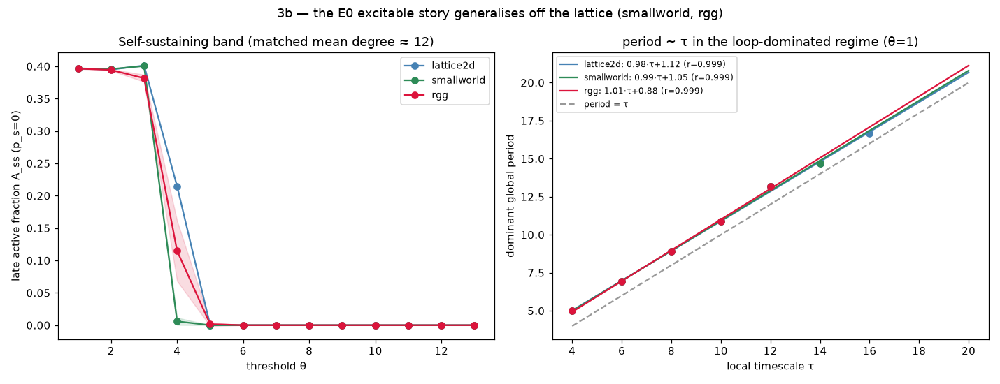
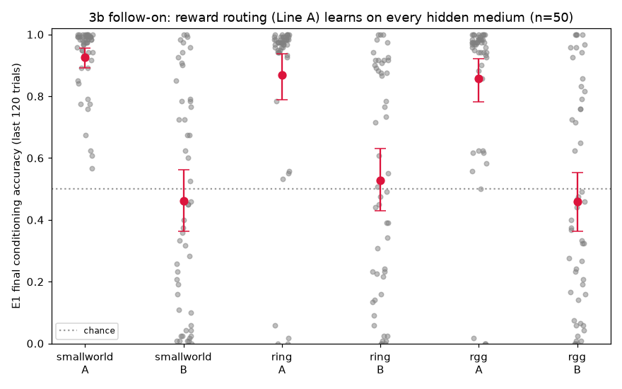

# 3b Results — Does the E0 Excitable Story Generalise Off the Lattice?

*Track 3b of [`next_steps.md`](next_steps.md). E0 characterised the substrate on
`lattice2d` only; the design doc's `smallworld` default was never exercised. This
re-runs the two **topology-agnostic** E0 observables on `lattice2d` (reference),
`smallworld`, and `rgg`, matched on node count (N=1600) and mean degree (≈12), to
test whether the excitable dynamics the whole programme sits on are a lattice
artifact or a general property. Experiment: `experiments/e0_topologies.py`;
figure: `experiments/e0_topologies_figure.py`; data: `result/e0_topo/`.*

## Method

`lattice2d` (L=40, r=2), `smallworld` (Watts–Strogatz, k=12, β=0.1), and `rgg`
(random geometric graph, radius=0.05) all built at N=1600 with **mean degree
12.0** (measured), so the excitation threshold θ is compared on equal footing.
Random topologies are run over 8 graph seeds (CIs); `lattice2d` is deterministic.
Two observables, each reduced exactly as E0 does:

1. **Self-sustaining band** — late active fraction `A_ss` (last-200 mean, `p_s=0`,
   seeded initial activity) vs θ: is there a live excitable band, and where?
2. **period ~ τ** — in the loop-dominated regime (θ=1, act=2, pas=τ−2, as
   `E0.period_vs_tau`): does the dominant global period track the local timescale?

## Results — both E0 headlines generalise

**A self-sustaining band exists on all three topologies**, in the same place
(because degree is matched): `A_ss ≈ 0.40` for θ=1–3, a sharp collapse to death by
θ=4–5.

| topology | mean degree | live band (θ) | death |
|---|:--:|:--:|:--:|
| lattice2d | 12.0 | 1–4 (0.40→0.21) | θ≥5 |
| smallworld | 12.0 | 1–3 (0.40) | θ≥4 |
| rgg | 12.0 | 1–3 (0.40→0.11 at 4) | θ≥5 |

**The period ~ τ law (Line B's control variable) holds off-lattice**, essentially
identically:

| topology | period ~ τ fit | r |
|---|:--:|:--:|
| lattice2d | 0.978·τ + 1.12 | 0.9995 |
| smallworld | 0.987·τ + 1.05 | 0.9993 |
| rgg | 1.012·τ + 0.88 | 0.9995 |

All three collapse onto `period ≈ τ + 1` with r ≈ 0.999. The dominant period is
set by the local timescale, not the wiring — so **Line B's `τ → period` handle,
which every timing/memory result (E2, E3, E5's loop) depends on, is a general
property of the excitable medium**, not a lattice accident.

## Verdict

The substrate's two load-bearing E0 properties — a self-sustaining excitable band
and `τ`-controlled global period — **generalise cleanly to `smallworld` and `rgg`
at matched degree.** This is the substrate-generality half of the audit's
narrow-evidence tension (single-substrate `lattice2d`), addressed with evidence.

## Honest caveats

1. **This tests the *dynamics*, not the 2-D spiral.** E7's spiral core and the
   C5–C7 chirality story are inherently 2-D-geometric (a rotating phase
   singularity needs the plane); they have no `smallworld`/`rgg` analogue and are
   out of scope. 3b establishes that the *excitable substrate* generalises, not
   that the spiral option does.
2. **Substrate, not the full learning task.** E1/E2/E5 run on task-structured
   `layered_graph`s whose *sensory/motor* wiring is fixed; porting their internal
   recurrent substrate to `smallworld`/`rgg` connectivity (and re-confirming the
   routing/timing dissociations there) is the next step, deferred. What generalises
   here is the medium the learning sits on, shown at its own operating points.
3. **The band's θ location is degree-set.** Matching mean degree to 12 fixes the
   band near θ≈1–4; a different degree shifts it. The *existence and shape* of the
   band generalise; its absolute θ does not (nor should it).
4. **Small graphs, one size.** N=1600, one degree, 8 seeds. Robust at this point;
   a degree/size sweep is a further generalisation not attempted here.

## Follow-on — does the *learned* result generalise, not just the dynamics?

The above tests the raw excitable medium. The E-series learning already runs on a
**small-world** hidden reservoir (`layered_graph`, `hh_topo='smallworld'`), so the
sharper question is whether reward-driven routing survives swapping that medium.
A non-breaking `hh_topo` knob (default unchanged; E1–E6 reproduce bit-identically)
adds an **ordered ring** and a **random-geometric** hidden medium at matched mean
degree ≈ 6; E1 conditioning is re-run on each at n=50 (`experiments/e1_topology_port.py`).

| hidden medium | degree | Line A (routing) | Line B (control) | A-vs-B (Cohen d) |
|---|:--:|:--:|:--:|:--:|
| smallworld *(default)* | 6.0 | 0.926 [0.893, 0.955] | 0.461 | 1.75 |
| ring (ordered) | 6.0 | 0.869 [0.788, 0.937] | 0.529 | 1.06 |
| rgg (random-geometric) | 5.1 | 0.857 [0.781, 0.921] | 0.459 | 1.30 |

**Reward-driven routing learns on every medium** (Line A 0.86–0.93, all well above
the Line-B control and chance), and the A-vs-B dissociation holds throughout
(d = 1.06–1.75). The small-world default is modestly best; the ordered ring and
random-geometric media cost ~0.06 but do not break the result. The `smallworld`
arm reproduces E1's committed A=0.926 exactly — a cross-check that the port only
changed the topology. (All arms are ceiling-with-tail, as E1 is at n=50; see
[`stats_sweeps_results.md`](stats_sweeps_results.md).)

**So both halves generalise:** the excitable *dynamics* (band, `period~τ`) and the
*learned routing* dissociation are properties of a broad class of recurrent media,
not the specific wiring. What remains substrate-specific is the 2-D **spiral**
(E7/C5–C7), which is geometry-bound by construction.
