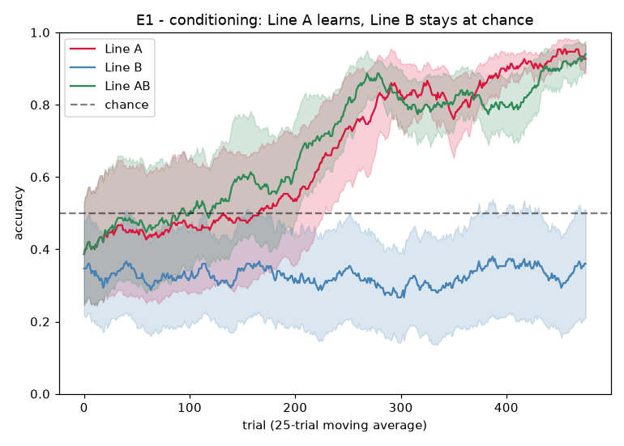

# E1 Results — Stimulus→Response Conditioning

*Run of `experiments/e1_conditioning.py` on the reward-modulated learner
(`ghca_learn.py`) over the GH network substrate. Purpose: show that a strict
scalar reward can carve a stimulus→action mapping, and dissociate the two
plasticity lines. See `docs/learning_experiments.md` §5, experiment E1.*

## Task

Two stimuli, two motor channels, no delay. Each trial: settle → read the critic
baseline `V` from the medium's order parameters → present a population-coded cue
on sensory channel `x` for 3 steps → 6-step response window → action =
`argmax` motor-channel activity → **strict scalar reward** `r = 1[action == x]`
→ broadcast `δ = r − V` to plasticity (eligibility-gated) and to the critic.
Nothing per-node is ever taught; the only environmental signal is the scalar
`r`.

## Result — the predicted A-vs-B dissociation holds

| Line | early acc (first 60) | final acc (last 120) | per-seed final (n=6) |
|------|----------------------|----------------------|----------------------|
| **A** (conduction weights) | 0.42 | **0.91** | 0.98, 0.89, 0.99, 0.85, 0.78, 0.98 |
| **B** (timescales) | 0.34 | **0.35** | 0.45, 0.01, 0.68, 0.01, 0.02, 0.92 |
| **A+B** (both) | 0.43 | **0.86** | 0.66, 0.69, 0.99, 0.86, 0.98, 0.98 |



- **Line A learns the mapping**, rising from chance to ~0.91 over ~300 trials —
  reward-modulated conduction plasticity strengthens the
  `sensory(x) → hidden → motor(x)` pathway and weakens the competitor. This is
  the core E1 claim: a strict scalar reward suffices to carve a
  stimulus→action mapping into the substrate.
- **Line B stays at/below chance (0.35)**, as predicted. Timescale plasticity
  cannot create the spatial selectivity an identity mapping requires; gated by
  the same reward it merely perturbs loop periods, and often destabilises the
  weakly-committed readout into a fixed (frequently wrong) response — hence the
  bimodal per-seed spread and sub-chance mean. This is a stronger form of the
  predicted "near chance": B does not just fail to help, it has no lever on
  identity routing at all.
- **A+B ≈ A** (0.86 vs 0.91), slightly lower and noisier: B's timescale churn
  adds variance without contributing to identity routing, consistent with A
  carrying the task.

## Discriminator check

The design doc's E1 discriminator was "A ≫ B; if B alone succeeds, the readout
is leaking spatial information through timing." Observed: **A ≫ B** with B at or
below chance. The discriminator passes — no evidence of a timing leak.

## Critic

The order-parameter critic (value read from global active fraction and phase
coherence, updated on a fast timescale) served as a variance-reducing baseline.
Its correlation with realised reward over the second half of training was weak
and seed-dependent (mean r ≈ 0.15; per-seed −0.06 … 0.43). This is expected for
E1: with immediate reward and a near-deterministic policy the baseline mostly
tracks mean accuracy rather than trial-specific outcome, and learning still
proceeds via `δ = r − V`. A more expressive medium-intrinsic value signal is a
target for E2 (where a persistent loop gives the medium state genuine
predictive content across the delay).

## Notes on what made it work

- **Stimulus-selective hidden representations.** With fully overlapping hidden
  patterns, reward-modulated updates to shared `hidden→motor` edges cancel
  across stimuli and the net collapses to one channel (early tuning showed this
  — accuracy stuck at/again 0.5). Channel-biased `sensory→hidden` wiring gives
  the two stimuli partly-separable hidden patterns, which reward then binds to
  actions. This is on-thesis (inside-out): pre-existing distinct dynamical
  patterns that initially mean nothing acquire meaning through rewarded action.
- **Subcritical medium + weak jittered readout.** The hidden recurrence is kept
  subcritical (`w_hh` small) so the cue is transmitted rather than drowned by
  autonomous activity, and the plastic `hidden→motor` readout starts weak and
  jittered so the winning channel is not pre-determined and there is variance
  for exploration (supplied by spontaneous firing `p_s` and weight noise).

## Operating point

```
substrate : act=3, pas=5 (tau=8), theta=4.0, p_s=3e-3
graph     : layered S->H->M, n_s=12, n_h=150, n_m=12, channel_bias=0.85,
            w_sh=1.0, w_hm=0.6, w_hh=0.25
learning  : eta_w=0.05, eta_tau=0.12, lambda=0.9, gamma=0.95, alpha_v=0.1
trial     : settle=20, cue=3, response window=6; 500 trials, 6 seeds
```

## Caveats / open items

- Success required stimulus-selective hidden wiring (`channel_bias`); a harder,
  more convincing version would let the network *discover* selective hidden
  representations rather than start with them. Deferred (would fold plastic
  `H→H` into Line A).
- The critic's medium-intrinsic value signal is weak here; E2 is the proper test
  of the order-parameter critic.
- Two stimuli / two actions only; scaling `K, A` is a straightforward stress
  test not yet run.

## Reproduce

```
python3 experiments/e1_conditioning.py
```

Writes `docs/figures/e1_learning_curves.png`, `docs/figures/e1_summary.png`,
and `result/e1/e1_data.npz`.
