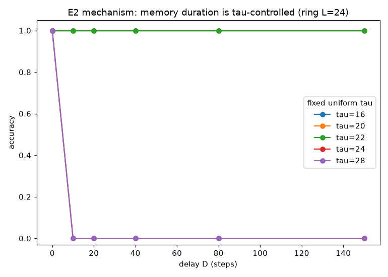
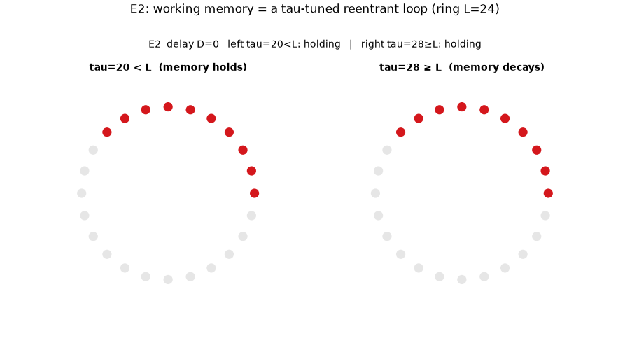
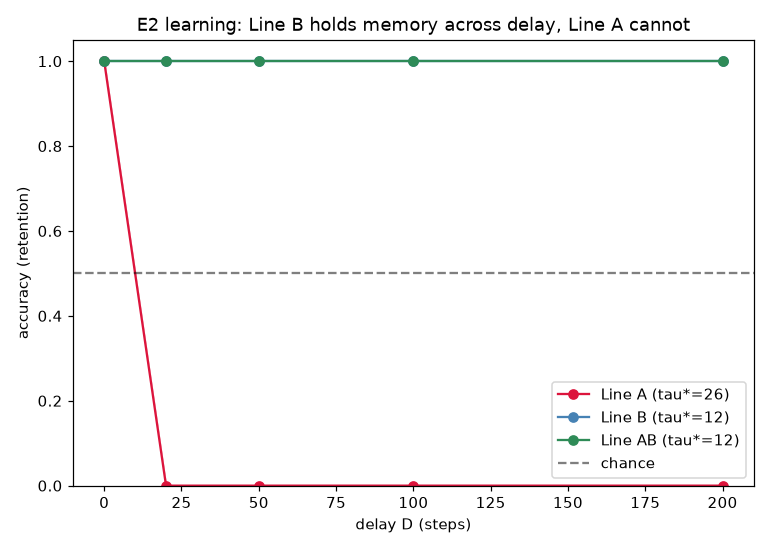
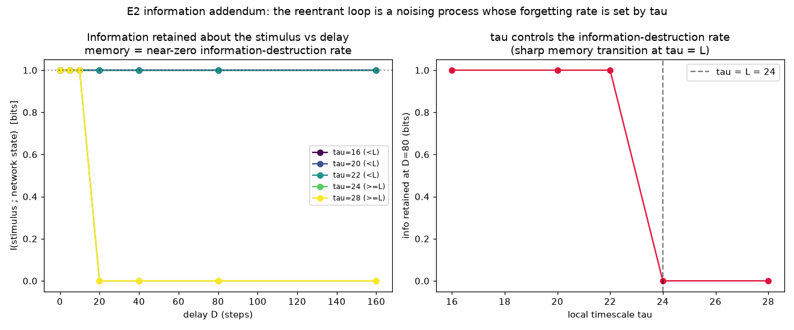

# E2 Results — Delayed Response (Working Memory)

*Run of `experiments/e2_delayed_response.py`. Purpose: show memory as a
persistent reentrant loop bridging a stimulus-free delay, and test the predicted
**inversion** of the E1 dissociation — that here Line B (timescale plasticity)
is critical while Line A (conduction weights) cannot. See
`docs/learning_experiments.md` §5, experiment E2.*

## Substrate and task

Two stimulus-specific directed rings (length `L = 24`) form the recurrent hidden
medium; a cue ignites ring `x`, and each motor channel reads its own ring over a
full loop period (so the readout is phase-insensitive). A directed ring sustains
a rotating pulse **indefinitely when `τ < L`** and **dies in ~`L` steps when
`τ ≥ L`** — so the local timescale `τ` is the memory-duration control variable.
Per trial: ignite cue → stimulus-free delay `D` (no spontaneous firing, so the
only persisting activity is the cued loop) → read motor channels → strict reward
`r = 1[action == x]`.

## Result 1 — Mechanism: memory duration is τ-controlled

Accuracy vs delay for fixed uniform `τ` (no learning), ring `L = 24`:

| τ | D=0 | D=10 | D=20 | D=40 | D=80 | D=150 |
|----|-----|------|------|------|------|-------|
| 16 | 1.00 | 1.00 | 1.00 | 1.00 | 1.00 | 1.00 |
| 20 | 1.00 | 1.00 | 1.00 | 1.00 | 1.00 | 1.00 |
| 22 | 1.00 | 1.00 | 1.00 | 1.00 | 1.00 | 1.00 |
| 24 | 1.00 | 0.00 | 0.00 | 0.00 | 0.00 | 0.00 |
| 28 | 1.00 | 0.00 | 0.00 | 0.00 | 0.00 | 0.00 |



**Animation of the mechanism.** Two identical rings ignited the same way, differing
only in `τ`: the left (`τ=20 < L`) sustains its rotating pulse indefinitely — the
stimulus is *held* — while the right (`τ=28 ≥ L`) dies within ~`L` steps as its
refractory tail wraps round and blocks reentry. `τ` *is* the memory-duration knob.



Below the transit time (`τ < L`) the loop sustains and memory is perfect at
arbitrary delay; at/above it (`τ ≥ L`) the loop dies after one revolution and
only the immediate (`D = 0`) readout succeeds. This is the causal lever the
learning result depends on. (The full-loop-period readout window matters: a
sparse fixed readout of a rotating pulse otherwise drops out at delays where the
pulse is out of phase — an artifact, not memory failure.)

## Result 2 — Learning: Line B holds memory, Line A cannot

Lines trained with a strict reward at the end of a delay drawn from `[15, 70]`,
then evaluated (frozen) on a retention curve. Line B uses a **shared regional
timescale** learned by reward-gated perturbation. 5 seeds.

| Line | learned τ (L=24) | D=0 | D=20 | D=50 | D=100 | D=200 |
|------|------------------|-----|------|------|-------|-------|
| **A** (weights) | 26.0 (unchanged) | 1.00 | 0.00 | 0.00 | 0.00 | 0.00 |
| **B** (timescale) | 12.2 | 1.00 | 1.00 | 1.00 | 1.00 | 1.00 |
| **A+B** | 12.2 | 1.00 | 1.00 | 1.00 | 1.00 | 1.00 |



- **Line A cannot form working memory.** With `τ` fixed at 26 > `L`, the loop
  dies within one revolution; strengthening conduction weights does not change
  the refractory sustain condition, so accuracy collapses to chance for any
  `D > 0`. This is the predicted A-only decay with delay, in its sharpest form.
- **Line B learns to hold memory across arbitrary delay.** Reward-gated
  timescale perturbation drives the ring's shared `τ` from 26 down to ~12 (well
  below `L`), converting the dying loop into a self-sustaining one; retention is
  perfect out to `D = 200`.
- **The dissociation inverts E1.** In E1 (identity mapping, no delay) Line A was
  essential and B was useless; in E2 (delayed response) Line B is essential and
  A alone fails. Spatial credit assignment and temporal credit assignment solve
  different problems — routing vs retention.

## Findings about the learning rules (honest caveats)

Getting Line B to work surfaced two genuine issues, both documented in code:

1. **The resonance rule targets the death boundary.** The design-doc rule
   "drive `τ` toward the observed re-fire interval" targets `τ = L` (the loop
   period). But `τ = L` is exactly the marginal point that dies; sustaining
   needs `τ` safely *below* `L`. The resonance rule can *maintain* an
   already-sustaining loop but does not *find* the sustaining regime — it lands
   on the boundary. Line B therefore uses reward-gated perturbation (which is
   selected toward `τ < L`, since only sustaining loops earn reward).

2. **Per-node timescales hit a weakest-link problem.** A loop dies at the
   single slowest node (the first `τ_i ≥ L` the pulse revisits), so with
   independent per-node `τ` there is no reward gradient until *every* node is
   simultaneously below `L` — a needle-in-a-haystack for independent
   perturbations (per-node runs left `mean τ ≈ 23` but `max τ ≈ 38`, and memory
   failed). A **shared regional timescale** — one neuromodulatory-style knob for
   the ring — collapses the conjunction into a 1-D search and solves it cleanly
   and reliably across seeds. This is a substantive modelling conclusion:
   working memory here needs a *coordinated* timescale, not independently
   plastic ones.

## Operating point

```
substrate : two directed rings L=24, act=6, initial tau=26 (> L, dying),
            theta_ring=1, motor readout theta_m=1, w_hm=0.6, p_s=0 in delay
readout   : per-ring, integrated over a full loop period (window = L = 24)
learning  : Line B shared regional tau, reward-gated perturbation
            (eta_tau=0.4, tau_sigma=3.0); Line A eta_w=0.05
trial     : cue=4, delay D in [15,70] (train) then eval; 1800 trials, 5 seeds
```

## Caveats / open items

- Rings are stimulus-specific and motor readout is per-ring by construction, so
  routing is not the challenge here (E1 covered routing); E2 isolates retention.
  A combined task where both routing *and* retention must be learned is a
  natural E3 extension.
- The clean positive result required a shared regional timescale; making genuinely
  per-node timescale plasticity work (overcoming the weakest-link problem, e.g.
  with a more robust loop topology or a better temporal credit rule) is open.
- No spontaneous firing during the delay (it would activate both rings and
  destroy stimulus specificity); a noise-robust memory is not yet tested.

## Addendum — working memory as a low information-destruction rate

*Run of `experiments/e2_information.py`.* Recasting the E2 mechanism in the
information-theoretic language of discrete-diffusion learning (Casado Noguerales
et al., 2026): the irreducible cost of a noising process is the rate at which it
destroys information about the clean data, `−d/dt I(Z₀;Z_t)`. Take the clean data
to be the stimulus identity `X` and the noised state to be the network state at
delay `D`. Then a reentrant loop is a noising process whose
**information-destruction rate is tuned by `τ`**.

Measuring `I(X ; ring readout)` in bits (exact, from the confusion counts; no
learning) vs delay:

| τ (L=24) | I at D=0…160 | info retained at D=80 | memory half-life |
|----------|--------------|-----------------------|------------------|
| 16, 20, 22 (`<L`) | **1.00 bit at every delay** | 1.00 | > 160 |
| 24, 28 (`≥L`) | 1.00 until D≈10, then **0** | 0.00 | ~20 |



- For `τ < L` the loop retains the **full bit** of stimulus information at every
  delay out to 160 steps — the information-destruction rate is ≈ 0 (perfect
  memory).
- For `τ ≥ L` the loop dies by `D≈20`, destroying all stimulus information — a
  high, effectively step-like destruction rate.
- The transition is sharp at `τ = L`: `τ` *is* the knob on the
  information-destruction rate, giving E2 an information-theoretic backbone and
  restating "memory" as "a noising process the substrate has tuned to forget
  slowly."

This is the **temporal** information-loss companion to C4's **coarse-graining**
information loss (`I(B;W)` vs `I(B;S)`, [`c4_results.md`](c4_results.md)): the
same currency (bits about the behaviourally-relevant variable) lost either over
time (here) or under macro compression (C4). See [`synthesis.md`](synthesis.md).

## Reproduce

```
python3 experiments/e2_delayed_response.py     # mechanism + learning
python3 experiments/e2_information.py          # information-destruction addendum
```

Writes `docs/figures/e2_mechanism.png`, `docs/figures/e2_learning.png`,
`docs/figures/e2_information.png`, and `result/e2/e2_data.npz`,
`result/e2/e2_information.npz`.
