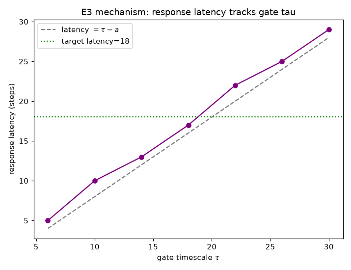
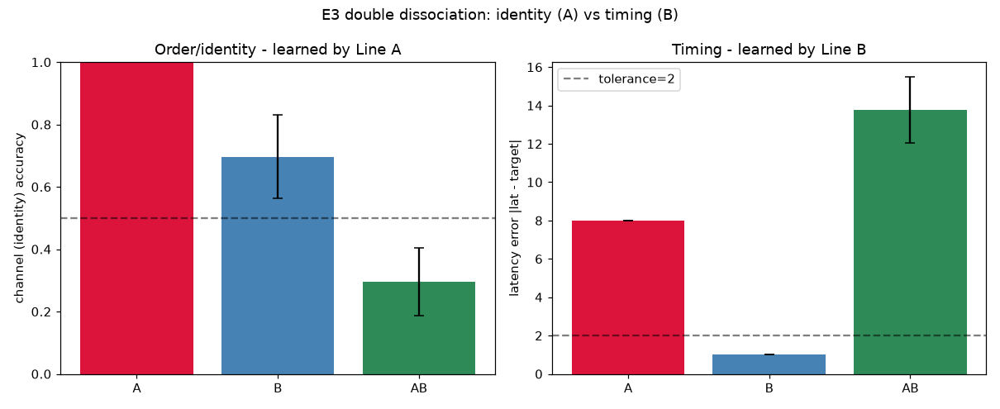

# E3 Results — Timed Response (identity × latency)

*Run of `experiments/e3_timed_response.py`. A **reduced** version of the
design-doc E3 (which specifies multi-element sequence reproduction). It tests
the same spatial-vs-temporal double dissociation on a single timed event: fire
the **correct channel** (identity / order → spatial routing → Line A) at a
**target latency** after go (timing → a τ-controlled metronome gate → Line B).
See `docs/learning_experiments.md` §5, experiment E3.*

## Task and mechanism

A stimulus is routed `S → H → M` (plastic, Line A). A **gate node** is reset to
just-refractory at go and driven tonically, so it first fires ~`τ − a` steps
later and then every ~`τ` steps — a refractory-limited metronome whose period
tracks `τ` (validated in E0). Motor fires only in **coincidence** with a gate
beat (hard gate: hidden-alone and gate-alone are both subthreshold; only their
sum crosses `θ_m`), so the response latency = first gate beat ≈ `τ − a`. The
relay (`H`, `M`) is gapless (`τ = a`) so the response reliably fires at the
*first* beat. Line B tunes the gate's shared `τ`; Line A tunes which channel.

Reward is a single scalar, graded: `r = 0.5·[channel correct] + 0.5·[|latency −
target| ≤ tol]` (target latency = 18, default `τ = 10` → default latency 8, so
the target requires `τ ≈ 20`; tolerance = 2).

## Result 1 — Mechanism: latency tracks gate τ



Response latency follows `τ − a` across the whole range (target latency 18 is
reached at `τ ≈ 20`). This is the temporal control lever: the local timescale
sets *when* the response is emitted.

## Result 2 — Double dissociation (single lines), and A+B interference

5 seeds. Channel = identity accuracy; latency error = `|latency − target|`.

| Line | channel acc | latency err | learned gate τ |
|------|-------------|-------------|----------------|
| **A** (weights) | **1.00** | **8.0** (wrong) | 10.0 (unchanged) |
| **B** (timescale) | 0.70 (not learned) | **1.0** (within tol) | 19.7 |
| **A+B** | 0.30 | 13.8 | 13.4 |



- **Line A learns identity, not timing.** Channel accuracy → 1.00, but with the
  gate `τ` fixed at its default the response comes at latency ~8, far from the
  target 18 (error 8). Exactly the predicted "order right, timing wrong."
- **Line B learns timing, not identity.** The gate `τ` climbs 10 → ~20, putting
  the latency within tolerance of the target (error ~1); channel accuracy stays
  at its *innate* ~0.70 (residual selectivity from the channel-biased hidden
  wiring — it does not improve, because Line B has no routing plasticity).
  Predicted "timing right, identity not acquired."
- **The double dissociation holds:** spatial credit assignment (A) solves the
  identity/order half; temporal credit assignment (B) solves the timing half.
  They are genuinely different mechanisms.

- **A+B does NOT compose — it interferes.** Jointly, both objectives get *worse*
  than either line alone (channel 0.30, latency error 13.8). This is a real
  negative result and answers the design doc's open question ("do A and B
  compose or trade off?"): under a **single shared TD-error broadcast**, they
  interfere. Line B's timescale changes shift *which gate beat* the response
  fires on, which changes *which hidden units are active at firing time* — i.e.
  it moves the target that Line A's spatial credit assignment is chasing — and
  symmetrically, A's routing changes perturb the reward that B is climbing. The
  shared scalar `δ` reinforces the current routing *and* the current `τ`
  together, so a trial that is right on one axis and wrong on the other sends a
  confounded signal to both. Gentler B exploration did not fix it (it just
  stalled B without rescuing A).

## Interpretation

The clean single-line dissociation confirms the core thesis: **identity/order is
spatial (conduction weights) and timing is temporal (local timescales), and they
are separable.** The A+B interference is the interesting frontier: composing
spatial and temporal credit assignment under one scalar reward needs more than
a shared three-factor rule. Natural next steps (deferred): a curriculum
(learn timing first, then freeze `τ` and learn routing — the E0→E2 finding that
`τ` is a slow, near-static variable supports this), factored eligibility so each
line is credited by the reward component it controls, or separate
neuromodulatory channels for spatial vs temporal error.

## Relation to the substrate's "spike vs wave" duality

This experiment cleanly separates the two kinds of activity the GH substrate
supports — **spikes** (individual node firings, the routing/identity carrier for
Line A) and **waves/rhythms** (the metronome's periodic population activity, the
timing carrier for Line B) — and shows they carry *different, dissociable*
behavioural information. That resonates with recent work formalizing whether
population waves are causally efficacious or epiphenomenal reflections of
spiking (Jalaldoust et al., *A Causal Formulation of Spike-Wave Duality*,
arXiv:2511.06602, 2025): here the wave/rhythm is not epiphenomenal — the timing
of behaviour is *caused* by the τ-controlled rhythm, and intervening on `τ`
changes the response latency (Result 1) while leaving identity untouched. The GH
model could serve as a concrete SCM-style testbed for that spike/wave causal
question. (Noted as a connection, not a result of this experiment.)

## Operating point

```
substrate : source(tonic) + K=2 sensory + hidden(80) + A=2 motor + gate node
routing   : S->H channel-biased + H->M, plastic (Line A); theta_h=2
gate      : hard coincidence theta_m=5, w_gate=4, w_hm=0.15; reset-to-refractory
            at go; shared gate tau plastic (Line B), tau_sigma=2.5, eta_tau=0.5
relay     : hidden & motor tau = act (gapless) so response fires at 1st gate beat
task      : target latency=18 (default tau=10 -> latency 8), tol=2; 1500 trials
```

## Caveats / open items

- **Reduced task.** This is a single timed event (identity + latency), not the
  full multi-element sequence (order + inter-element intervals) of the design
  doc. A genuine sequence needs a counter / shift-register to route successive
  beats to different channels; that is deferred. The reduced task nonetheless
  isolates the same spatial-vs-temporal dissociation.
- **A+B interference is unresolved** (see Interpretation) — the headline open
  problem from E3.
- Line B's identity accuracy (~0.70) reflects innate wiring selectivity, not
  chance; the dissociation is in what each line *improves*, not the absolute
  level.

## Reproduce

```
python3 experiments/e3_timed_response.py
```

Writes `docs/figures/e3_mechanism.png`, `docs/figures/e3_dissociation.png`, and
`result/e3/e3_data.npz`.
