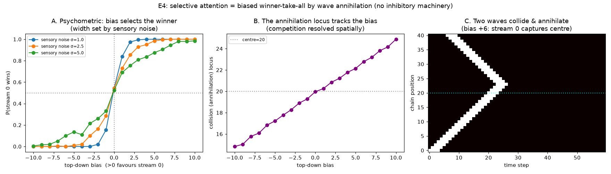
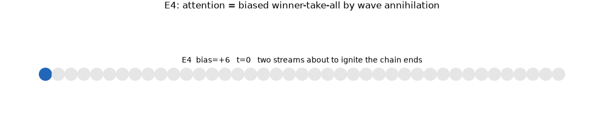

# E4 Results — Selective Attention as Biased Winner-Take-All by Wave Annihilation

*Run of `experiments/e4_attention.py`. Tests the design-doc E4 claim: attention
here is biased winner-take-all among competing waves, resolved by the substrate's
own refractory annihilation — **no added inhibitory machinery**. See
`docs/learning_experiments.md` §5, experiment E4.*

## Task and mechanism

Two stimulus streams are presented simultaneously (conflict); each would drive a
different action. A shared 1D excitable chain is the competition arena: stream 0
ignites the left end, stream 1 the right end. The two waves travel inward,
collide, and **annihilate in each other's refractory wake**. Whichever wave
captures the centre node wins (its action fires). A top-down bias gives the
attended stream a small timing advantage; sensory noise (trial-to-trial jitter
in ignition times) makes the outcome probabilistic near zero bias. Propagation is
deterministic (`p_s = 0`); the substrate contains **only excitatory weights and
refractoriness — no inhibitory node**.

## Results

**Bias selects the winner, with textbook psychometric curves.** `P(stream 0
wins)` is a sigmoid in the top-down bias, centred at zero bias (0.5) and with
**width set by the sensory noise** `σ` (steeper for low noise). Attention
accuracy at a modest bias `|b|=4` is **0.96**.

**The competition is resolved spatially, at the annihilation locus.** The point
where the two waves collide is **linear in the bias** (slope 0.50, intercept 19.8
≈ centre 20): the bias literally moves where the waves annihilate, and the winner
is whichever captured the centre.

**Winner-take-all with no inhibition.** The space-time raster shows the two waves
converging and annihilating on contact; after the collision the arena is silent.
The loser is suppressed not by an inhibitory signal but by the winner's refractory
wake — the mechanism the C-series flagged as already present in the substrate.



**Animation of the mechanism.** The panel-C raster, animated: the two waves
ignite the chain ends, travel inward (blue = attended left stream, orange =
right), collide, and annihilate — the collision landing *left of centre* under a
`+6` bias, so the attended stream captures the centre node. No inhibition; just
excitation meeting refractoriness.



| quantity | value |
|----------|-------|
| accuracy at bias \|b\|=4 (σ=2.5) | 0.96 |
| psychometric midpoint | bias = 0 (unbiased) |
| annihilation-locus vs bias | slope 0.50, intercept 19.8 (centre = 20) |
| inhibitory nodes used | 0 |

## Interpretation

- **Attention = biased WTA on a noisy competition.** The bias-vs-noise sigmoid is
  exactly the signal-detection picture of selective attention: a top-down bias
  shifts the balance of a competition whose sharpness is set by sensory noise.
- **Refractoriness *is* the competition.** Two coactive streams do not both drive
  the output; their waves annihilate, and only one captures the centre. This is
  the concrete pay-off of the C-series observation that refractoriness supplies
  competition/WTA for free — no lateral-inhibition population is needed. The
  discriminator (design doc E4) is passed: accurate routing did **not** require an
  added inhibitory mechanism.
- **The decision is spatial.** The analog decision variable is the annihilation
  locus, which the bias moves continuously — a graded competition read out as a
  categorical winner at the centre.

## Caveats / open items

- The arena is a clean 1D chain and the bias is a timing advantage; a gain-based
  bias (top-down `θ` reduction on the attended pathway) is the more standard
  attention framing and would be a natural variant (on a chain, gain changes
  robustness-to-noise rather than speed, so it competes with the sensory noise
  rather than shifting the locus directly).
- Attention here is *tested*, not *learned*: the bias is applied top-down, not
  acquired by reward. Coupling E4's competition to an executive controller that
  *learns* where to bias (E5) is the natural continuation.
- Single collision on a 1D arena; competition among >2 streams or on a 2D field
  (spiral/target competition, overdrive suppression) is not covered here.

## Reproduce

```
python3 experiments/e4_attention.py
```

Writes `docs/figures/e4_attention.png` and `result/e4/e4_data.npz`.
