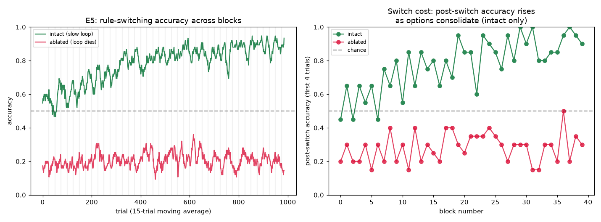
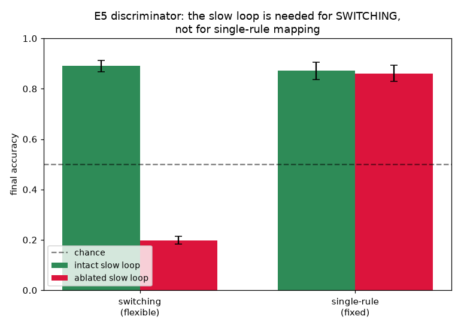

# E5 Results — Executive Control / Task Switching (options)

*Run of `experiments/e5_executive.py`. Tests the design-doc E5 claim: a **slow
loop** acts as an **option** that gates fast stimulus→response mappings, so a
context signal can reconfigure routing and support rule reversal — and the
substrate's own persistent reentrant loop (the E2 working-memory mechanism) is
what holds the rule across a block. See `docs/learning_experiments.md` §5, E5.*

## Task and mechanism

Two rules alternate in **blocks**:

| rule | mapping | note |
|------|---------|------|
| Rule 0 (identity) | action = x | stim0→act0, stim1→act1 |
| Rule 1 (reversal) | action = 1 − x | stim0→act1, stim1→act0 |

so the correct action is `action = x XOR rule` — it depends on **both** the
stimulus and the currently-active rule.

**The option.** Each rule owns a slow directed-ring loop (`L = 16`, `τ = 12 < L`,
so it self-sustains — the E2 result). At each block start the block's context cue
briefly ignites that rule's ring (a single seed launches a rotating pulse) and the
other ring is extinguished; the cue is then removed and the ring **persists for
the whole block**, supplying a standing context signal. Because each hidden unit
fans in from *all* nodes of its preferred ring, the ~`a` rotating-pulse nodes
deliver the context drive **phase-invariantly** for as long as the ring is alive.

**The conjunction gate.** Hidden units have a preferred stimulus (channel-biased
sensory fan-in) and a preferred rule (ring fan-in), tuned to a **hard coincidence
(AND)**: stimulus-alone is subthreshold (~0 active), ring-alone is subthreshold
(~0), only their sum fires the unit (~0.83). So within a block only the
`(current stimulus × current rule)` conjunction subpopulation is active and the
other three are silent — no cross-talk. The alive ring is thus a hard **option**
selecting *which* routing subpopulation exists; the plastic `H→M` readout (Line A,
reward-driven) maps each conjunction subpopulation to its rewarded action. Nothing
is taught per-node — the only signal is the strict scalar reward
`r = 1[action == x XOR rule]`, from which `δ = r − V` is formed internally.
Exploration is supplied by spontaneous firing `p_s` **confined to the hidden+motor
medium** (a per-node `p_s` mask), leaving the cue and the context rings
deterministic so that exploration never spuriously re-ignites a dead ring.

## Result 1 — options gate routing; switch cost consolidates

5 seeds; 40 alternating blocks × 25 trials.

| quantity | value |
|----------|-------|
| switching final accuracy (last 6 blocks) | **0.89** (per seed 0.96, 0.82, 0.92, 0.91, 0.85) |
| post-switch accuracy, **first** 6 blocks | 0.57 |
| post-switch accuracy, **last** 6 blocks | **0.92** |
| rule decodable from ring state (frac trials ring alive) | 1.00 |



- **A slow loop reconfigures fast routing.** With the persistent ring holding the
  block's rule, reward-driven Line A learns all four `(stimulus × rule)`
  conjunctions → correct actions, and the network applies the currently-cued rule:
  switching accuracy reaches 0.89.
- **Switch cost shrinks as options consolidate.** Immediately after a block switch
  the accuracy dips; averaged over the first six blocks the post-switch accuracy is
  0.57 (near chance — the newly-active rule's conjunctions are still being learned),
  rising to 0.92 over the last six blocks. This is the predicted consolidation: once
  both rules' routing is learned, a switch is just the context loop flipping, and
  behaviour follows with little cost.
- **The rule lives in the loop.** The active rule is decodable from the ring state
  on essentially every trial (alive fraction 1.00) — the slow loop *is* the context
  variable.

## Result 2 — discriminator: the slow loop is necessary for switching, not for routing

Ablate the slow loop by setting the ring `τ = 18 ≥ L`, so the ring **dies ~`L`
steps after the cue** (context is not held). The single-rule control **re-cues the
ring every trial**, so it needs no persistence and isolates the routing itself.

| condition | intact slow loop | ablated slow loop |
|-----------|:----------------:|:-----------------:|
| **switching** (cue at block start only) | **0.89** | **0.20** |
| **single-rule** (ring re-cued every trial) | 0.87 | 0.86 |
| ring alive (frac trials) | 1.00 | 0.04 |



Per-seed, single-rule is essentially **unchanged** by the ablation
(intact 0.99, 0.82, 0.85, 0.77, 0.92 vs ablated 0.99, 0.82, 0.85, 0.77, 0.87),
while switching **collapses** (0.89 → 0.20). This is the design-doc discriminator,
passed cleanly:

- **Ablating the slow sub-population abolishes flexible switching.** Without a held
  loop the context signal is gone within ~`L` steps of the block cue; for the rest
  of the block the conjunction gate has no ring input, the medium falls silent, and
  the network cannot apply the current rule (0.20, below chance because silence
  reads as a wrong/no-response commit).
- **…while leaving single-rule performance intact.** When the ring is re-cued every
  trial (persistence not required), routing works equally well in the intact and
  ablated substrates (0.87 vs 0.86). So the ablation removes exactly the
  *held-context* capability, not the routing machinery — the slow loop's role is
  specifically to *hold* the rule across the block.

## Interpretation

E5 realises the design's executive-control claim on the homogeneous substrate:
context is not a dedicated module but a **slow reentrant loop** — the same
persistent-loop mechanism E2 used for working memory, here repurposed as an
**option** whose standing activity selects which fast stimulus→response routing is
expressed. Reward-driven conduction plasticity (Line A) does the routing; the slow
loop does the gating; and the two together produce reversal learning with a switch
cost that consolidates away. The discriminator localises the loop's causal role:
kill its persistence and *switching* dies while *single-rule* routing is spared.

This dovetails with the rest of the series. It reuses **Line A** (the identity/
routing learner of [E1](e1_results.md)) and the **persistent loop** of
[E2](e2_results.md), and it is the *learned*, top-down-controlled counterpart to
[E4](e4_results.md)'s bottom-up competition: E4 applies a bias, E5 learns to hold
one. In the C-series language of [`synthesis.md`](synthesis.md), the option is a
slow **timescale** structure (`τ < L`) gating a spatial **routing** structure
(weights) — the two orthogonal `do(θ)` handles again, now composed hierarchically
rather than in conflict (contrast the E3 A+B interference).

## Caveats / open items

- **Reduced, in the same spirit as E3/E4.** Two rules, two stimuli, two actions,
  and the option is *cued* (ignited by a context input at block start), not
  *discovered*. A harder version would have the network infer the rule from reward
  history alone (no explicit context cue) and let a slow sub-population
  self-organise into the option via homeostasis — deferred.
- **The conjunction gate is a hard AND**, so under ablation the medium goes silent
  and switching accuracy falls *below* chance (mute ≈ wrong) rather than to 0.5.
  This is an honest consequence of the mechanism (hidden units require the option
  to fire), not a tuned artefact; a softer gate would land ablated switching nearer
  chance but reintroduce the cross-talk that a hard gate removes.
- **Ablation = raising the ring `τ` above `L`.** This kills the loop's persistence
  while leaving the ring nodes present (they still fire briefly when cued), which is
  why the re-cued single-rule control still works ablated. A structural ablation
  (deleting the ring nodes) would additionally break the re-cued control and so
  could not separate persistence from routing — raising `τ` is the cleaner knife.
- **Substrate change.** A small, backward-compatible `p_s_mask` was added to
  `ghca_net.Network` to confine spontaneous-firing exploration to a chosen medium;
  with `p_s_mask=None` the substrate is unchanged, so E0–E4 are unaffected.
- Homeostasis and the full `{A,B,A+B} × homeostasis × p_s` ablation matrix are not
  swept here; E5 uses Line A only (routing), since the option is supplied as a
  cued loop rather than learned via Line B.

## Operating point

```
substrate : K=2 stimuli, A=2 actions; N_S=8 sensory/chan, N_H=120 hidden,
            N_M=8 motor/chan; two context rings L=16
timescales: rings tau=12 (<L, sustains) | ablation tau=18 (>=L, dies ~L steps);
            sensory/hidden/motor gapless relay (tau=act=2)
gate      : hidden hard-coincidence theta_h=3.5 (stim-only & ring-only subthreshold,
            sum ~0.83 active); w_sh=0.7, w_ch=0.7 (ring fans in from all L nodes)
readout   : H->M plastic (Line A), theta_m=1.0, w_hm=0.5, eta_w=0.06, lambda=0.8
explore   : p_s=3e-3 confined to hidden+motor (p_s_mask); rings/sensory deterministic
trial     : settle=6, cue=3, response window=6
protocol  : switching = 40 blocks x 25 trials, rule alternates, cue at block start;
            single-rule control re-cues the ring every trial; 5 seeds
```

## Reproduce

```
python3 experiments/e5_executive.py
```

Writes `docs/figures/e5_switching.png`, `docs/figures/e5_discriminator.png`, and
`result/e5/e5_data.npz`.
