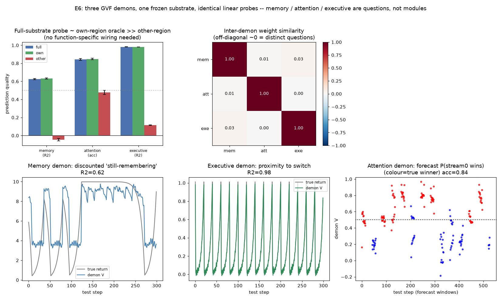

# E6 Results — Emergent Categories (Horde / GVF readout)

*Run of `experiments/e6_horde.py`. Operationalises the design-doc claim that
**memory, attention and executive control are emergent categories, not modules**:
three General Value Function (GVF) demons, riding one unchanged Greenberg–Hastings
substrate and reading the same node-phase stream through identical linear probes,
answer three distinct predictive questions well. See
`docs/learning_experiments.md` §5, E6.*

## Substrate and demons

One frozen substrate — a single weight matrix with three **non-interacting**
regions sharing nothing but the one phase vector `φ(t)` — carries three dynamical
motifs drawn from earlier experiments:

| region | motif | dynamics (reused from) |
|--------|-------|------------------------|
| **M** memory | two stimulus-specific directed rings; each epoch a random stimulus is cued, and with prob 0.45 the ring is ignited in a **dying** mode (`τ ≥ L`) so held duration varies | [E2](e2_results.md) |
| **A** attention | an excitable chain; each episode two waves ignite the ends with a random bias/jitter, travel inward and annihilate — the winner varies | [E4](e4_results.md) |
| **X** executive | a slow rotating ring whose phase advances one node/step with period = the context-switch interval, so an imminent switch is encoded in its phase | [E5](e5_results.md) |

Onto this frozen substrate we attach three **linear GVF demons**, each reading the
**same** feature vector (the whole-network active mask + a bias). Only the
cumulant/continuation differ:

- **memory demon** — cumulant `c = 1` while the current stimulus ring is alive,
  `γ = 0.9` → value = discounted future *still-remembering* time (a continuing
  prediction, learned by online **TD(0)**).
- **attention demon** — predict the eventual centre-capture **winner** during the
  pre-collision forecast window (an episodic terminal-outcome prediction, learned
  by **Monte-Carlo** regression to the realised winner).
- **executive demon** — cumulant `c = 1` at a context-switch step, `γ = 0.8` →
  value = discounted proximity to the next switch (continuing, **TD(0)**).

Demons are trained on the first half of a 6000-step stream and evaluated frozen on
the held-out second half, over 5 seeds. TD (continuing) vs MC (episodic terminal)
are both standard Horde learning rules; the choice follows the GVF *type*, not the
substrate.

## Result 1 — three distinct questions, all answered well above chance

| demon | metric | full-substrate probe | baseline |
|-------|--------|:--------------------:|:--------:|
| memory | R² of discounted-return | **0.62** | 0 |
| attention | forecast accuracy (pre-collision) | **0.84** | 0.50 |
| executive | R² of switch-proximity return | **0.98** | 0 |



Per seed the demons are stable — memory R² 0.63/0.60/0.63/0.65/0.61, attention acc
0.81/0.84/0.86/0.88/0.84, executive R² 0.98 (all seeds). Each demon predicts its
own target from the same unchanged substrate:

- The **memory** demon tracks how much longer the current stimulus will be held —
  high while a sustaining ring rotates, collapsing when a dying ring's pulse
  expires (R² 0.62; the residual is the genuinely unpredictable disruption itself).
- The **attention** demon **forecasts the winner before the waves collide** (0.84,
  vs 0.50 chance); it reads which wave front is further along. The ceiling is below
  1.0 because near-zero-bias episodes are genuinely ambiguous (the E4 psychometric
  point) — an honest limit, not a training failure.
- The **executive** demon reads the slow loop's phase to predict the next switch
  almost perfectly (R² 0.98), because switch timing is near-deterministic in the
  loop's phase.

## Result 2 — genuinely distinct questions (near-orthogonal readouts)

Pairwise cosine similarity of the three demons' learned weight vectors:

|        | mem | att | exe |
|--------|:---:|:---:|:---:|
| **mem**| 1.00 | 0.01 | 0.03 |
| **att**| 0.01 | 1.00 | 0.00 |
| **exe**| 0.03 | 0.00 | 1.00 |

The off-diagonal similarities are ≈ 0: each demon's readout concentrates on a
different region of the same substrate, so the three are **not one signal
relabelled** — they are genuinely different questions asked of one machine.

## Result 3 — discriminator: the function is in the probe, not a module

For each demon we compare three read scopes: the generic **full-substrate** probe,
an **own-region** oracle (features restricted to that demon's region), and an
**other-region** control (features restricted to the *complement*).

| demon | full | own-region oracle | other-region |
|-------|:----:|:-----------------:|:------------:|
| memory (R²) | 0.62 | 0.63 | −0.05 |
| attention (acc) | 0.84 | 0.85 | 0.48 |
| executive (R²) | 0.98 | 0.98 | 0.11 |

- **Full ≈ own** for every demon (0.62≈0.63, 0.84≈0.85, 0.98≈0.98): a generic
  linear probe on the *whole* substrate does as well as an oracle handed exactly
  the right region. **No function-specific sub-network is required** — the design
  doc's discriminator is passed, so the strong-emergence reading holds (it is *not*
  weakened to a modular one).
- **Other-region fails** (memory −0.05, attention 0.48 ≈ chance, executive 0.11):
  the predictive information lives where the relevant dynamics are, but the *probe*
  that harvests it is identical across demons. The "function" is the question the
  probe asks, not a dedicated piece of machinery.

## Interpretation

E6 closes the series' arc. E1–E5 *shaped* the substrate (routing, memory, timing,
attention, options) by reward; E6 shows that once the substrate is running, the
cognitive "faculties" are **readouts** — distinct GVF questions answered by one
homogeneous medium through one kind of linear probe. Memory, attention and
executive control here are not three modules but three cumulant/continuation
choices over one phase stream, and a generic probe suffices for each. This is the
Buzsáki inside-out thesis in its sharpest form (the framing in
[`learning_experiments.md`](learning_experiments.md)): the machine generates the
dynamics; the "functions" live in the questions an observer asks of it.

It also lands the C-series' "read the wave, drive the parameters" split from
[`synthesis.md`](synthesis.md): the demons are exactly *readers* of the collective
state (order-parameter-like features), never controllers — consistent with C2/C4's
finding that the wave is an informative descriptive variable but not a well-posed
control handle. E6's probes read; E1–E5's plasticity drove the parameters `θ`.

## Caveats / open items

- **Self-contained substrate, not a literal E2–E5 pipeline.** The design doc says
  "freeze a substrate trained through E2–E5." Here the three motifs are reused
  mechanisms wired into one frozen graph and driven by a scripted world (in the
  spirit of the reduced E3/E4 substrates), rather than the actual trained weights
  of the prior experiments carried forward. The claim tested — distinct questions,
  one substrate, one probe, no dedicated wiring — is unchanged; chaining the
  literally-trained networks is deferred.
- **Prediction, not off-policy control.** The demons are Pavlovian *prediction*
  GVFs (on-policy, from the single behaviour stream). The design doc's full Horde
  spec is off-policy gradient-TD demons with distinct target policies; genuine
  off-policy targets (importance-sampled) are not exercised here.
- **Mixed estimators by GVF type.** Continuing demons (memory, executive) use online
  TD(0); the episodic terminal-outcome demon (attention) uses Monte-Carlo
  regression. Both are standard; the mix follows the GVF type, but a single
  estimator (e.g. LSTD) across all three would be tidier.
- **Executive R² is high (0.98) partly because switch timing is near-deterministic**
  in the loop phase by construction; a noisier or non-commensurate switch schedule
  would lower it and is the more stringent test.

## Operating point

```
substrate : one frozen Network, act=2, p_s=0; three non-interacting regions --
            memory 2 rings L=16 (tau=12 live / 18 dying, epoch=44, p_disrupt=0.45),
            attention chain L=31 (tau=6, episode=40, bias in [-3,3]+jitter),
            executive ring L=20 (tau=16, switch every 20 steps)
features  : whole-network active mask + bias (same vector for all demons)
demons    : memory  TD(0), gamma=0.9, cumulant=ring-alive
            executive TD(0), gamma=0.8, cumulant=switch-step
            attention Monte-Carlo ridge (lam=1), target=centre-capture winner,
                      evaluated in the pre-collision forecast window
eval      : train on first 3000 steps, freeze, evaluate on last 3000; 5 seeds
scopes    : full substrate | own-region oracle | other-region control
```

## Reproduce

```
python3 experiments/e6_horde.py
```

Writes `docs/figures/e6_horde.png` and `result/e6/e6_data.npz`.
