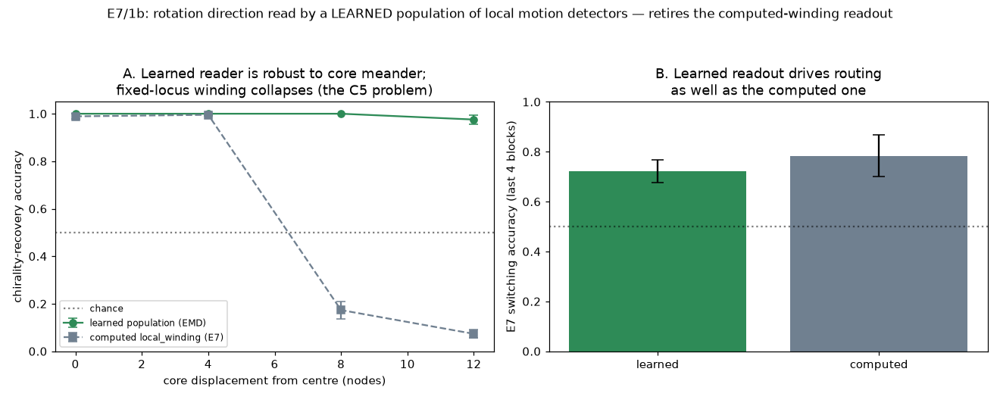

# E7 / Track 1b Results — A *learned* direction-selective readout

*Run of `experiments/e7_direction_readout.py`. Retires the last Track-1
"afforded vs learned" item: E7 read rotation direction with a **computed**
god's-eye winding integral; 1b replaces it with a small population of
biologically-plausible direction-selective cells whose pooling weights are
**learned**, and shows the learned reader also escapes the fixed-locus fragility
that [C5](c5_results.md) diagnosed. See [`next_steps.md`](next_steps.md), Track 1b.*

## The gap this closes

[E7](e7_results.md) routes on a spiral wave whose **chirality** (CCW vs CW) is the
context rule. It reads that chirality with `spiral_decode` → `local_winding`: a
line integral of the phase gradient around a loop **centred on the core**. Honest
as a topological readout, but on two counts it is not "reading the wave" the way a
brain would:

1. **Computed, not learned.** The winding integral is hand-coded; nothing on the
   substrate *acquires* direction selectivity.
2. **Fixed-locus.** It reads one location (the lattice centre). [C5](c5_results.md)
   (the readout-locality result) showed exactly this class of reader is
   *fat-handed*: displace the core and a centre-locked reader collapses.

Track 1b replaces it with **direction-selective cells + a learned pool**.

## Mechanism

- **The substrate-supplied feature — elementary motion detectors (EMD).** For each
  lattice site and each of the 4 axis directions, the delayed coincidence
  `active[t−1] at i AND active[t] at i+d` (Hassenstein–Reichardt / motion-energy),
  accumulated over a short window (`FRAMES=6`) and coarse-grained `4×4`. This is a
  **local, translation-covariant** motion-energy field — no core localisation, no
  god's-eye loop.
- **The learned readout.** A single linear (logistic) unit pools the whole EMD
  field, **trained** on the known chirality label to output CCW vs CW. This is what
  is *learned*, replacing the hand-coded winding integral. Standardised features,
  seeded gradient descent, L2 — no global RNG (house rule).

Two results: **A** recovery + robustness to core displacement; **B** the learned
readout dropped into E7's switching task in place of `spiral_decode`.

## Result A — recovers chirality *and* survives core meander

Train the readout on **centred** cores; test on cores displaced `d` nodes from the
centre in a random direction. The computed `local_winding` (read at the fixed
centre) is the baseline. 15 seeds; 60 train / 30 test examples per seed.

| displacement | learned population (EMD) | computed `local_winding` (E7) |
|:--|:--:|:--:|
| d = 0 (centred) | **1.000 ± 0.000** | 0.989 ± 0.020 |
| d = 4 | **1.000 ± 0.000** | 0.996 ± 0.011 |
| d = 8 | **1.000 ± 0.000** | **0.173 ± 0.073** `[0.00, 0.30]` |
| d = 12 | **0.976 ± 0.037** `[0.90, 1.00]` | **0.073 ± 0.035** `[0.00, 0.13]` |



- **The learned reader recovers chirality as well as the winding integral on a
  centred core** (1.00 vs 0.99) — the learned population matches the hand-coded
  topological readout where the latter is designed to work.
- **It stays accurate when the core drifts, where the fixed-locus winding
  collapses.** At d = 8 the learned reader is still perfect (1.00) while
  `local_winding` falls to **0.17** — *below* chance, because a centre-locked loop
  around a displaced core integrates the wrong-signed surround; at d = 12, 0.98 vs
  **0.07**. The separation is enormous and clean (Cohen's *d* ≈ 15 at d = 8, with
  non-overlapping per-seed ranges). This is the C5 readout-locality failure,
  **escaped** by pooling local detectors across the field rather than reading one
  locus.
- Per-seed spreads are tight. The one BC flag (d = 12 learned, BC ≈ 0.67 > 5/9) is
  a **near-ceiling discretisation artefact**, not real bimodality: every seed lies
  in `{0.90, 0.93, 0.97, 1.00}` (30-example test grid), sd 0.037 — the same
  false-positive mode the stats sweeps flagged on low-variance arrays, not two
  populations.

## Result B — the learned readout drives routing

Drop the learned readout into E7's switching task in place of `spiral_decode`: the
per-trial context bit now comes from the learned population. 20 alternating blocks
× 25 trials, tail = last 4 blocks, 5 seeds. Because the core is nucleated **once
per block** and then ages across trials, the readout is pre-trained across the
**within-block spiral-age distribution** it will actually meet (see caveats — this
matters).

| readout | E7 switching accuracy (last 4 blocks) | per seed |
|:--|:--:|:--|
| **learned population (1b)** | **0.72 ± 0.05** | `[0.72, 0.67, 0.78, 0.66, 0.78]` |
| computed `local_winding` (E7) | 0.78 ± 0.10 | `[0.84, 0.60, 0.79, 0.83, 0.86]` |

- **The learned readout carries the rule.** Switching reaches **0.72**, close to
  the computed readout's **0.78** and well above chance (0.5) — rotation direction
  read by a *learned population of local motion detectors* still routes the
  (stimulus × context) task. The small gap is honest: the learned per-trial bit is
  slightly noisier than the winding integral (Result B, unlike A, exercises the
  readout on **aged** cores, where instantaneous winding is age-invariant but the
  EMD field drifts), and the two per-seed spreads overlap.

## Interpretation

1b moves E7's chirality readout from **"computed god's-eye winding"** to **"a
learned population of local, biologically-motivated motion detectors"**, and in
doing so **removes the fixed-locus fragility** C5 diagnosed: the distributed
learned reader is robust to core meander exactly where the centre-locked winding
integral collapses. The division of labour is explicit — the *substrate* supplies
local motion energy (EMD), and *learning* supplies the pooling that reads chirality
off it — mirroring real cortical direction selectivity (local motion primitives,
pooled by learned weights) rather than a hand-computed topological invariant.

## Caveats / open items

- **The EMD primitive is hand-specified.** What is *learned* is the pooling
  readout; the delayed-coincidence motion detector itself is designed (though it is
  local, translation-covariant, and biologically grounded — the
  Hassenstein–Reichardt motif). So 1b retires the *fixed-locus* and the
  *computed-integral* parts of the honesty gap, not the "features are designed"
  part. A version that also *learns* the motion primitive (e.g. from a temporal
  Hebbian rule on adjacent sites) is deferred.
- **Supervised, not reward-driven.** The pool is trained on the chirality label,
  not on task reward. Result B shows the *label-trained* reader then drives the
  reward task, but folding readout acquisition into the reward loop (as 1a/1c did
  for their readouts) is deferred.
- **Aged-core training is load-bearing for B.** Trained only on freshly-seeded
  cores, the readout decodes centred spirals perfectly (Result A) but drops to
  ~chance during switching, because the core ages across a block and the EMD field
  drifts out of the training distribution (winding does not — it reads instantaneous
  topology). Pre-training across the within-block age distribution restores 0.72.
  This is a fair fix (it matches train to the deployment distribution), but it is a
  reminder that the learned reader, unlike the winding integral, is **only as robust
  as its training distribution** — a genuine representational cost of "learned vs
  computed".
- **Small n, one operating point** (15 seeds for A, 5 for B; single lattice,
  `θ`, `τ`) — as elsewhere in the series. Robust at this point (tight spreads for
  A; overlapping-but-clear for B); not swept across the regime.

## Operating point

```
substrate : lattice2d(L=48, r=2, non-periodic); act=6, pas=8, theta=4.0, tau=14
feature   : 4-direction EMD, FRAMES=6 motion window, 4x4 coarse-grain -> linear vec
readout   : logistic (L2=1.0, iters=300, lr=0.5), standardised, seeded GD; no global RNG
A         : train 60 centred / test 30 at disp in {0,4,8,12}; 15 seeds
B         : switching 20 blocks x 25 trials, tail=last 4 blocks, 5 seeds;
            readout pre-trained on 120 examples across age in [0, block_len*FRAMES]
```

## Reproduce

```
python3 experiments/e7_direction_readout.py
```

Writes `docs/figures/e7_direction_readout.png` and
`result/e7/e7_direction_readout.npz`.
