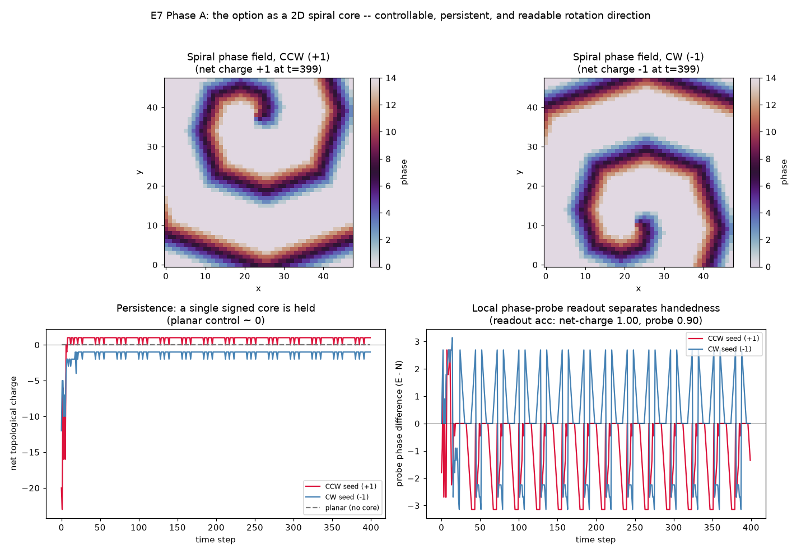
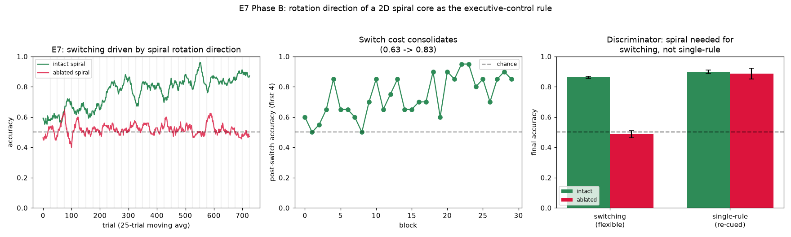

# E7 Results — The Option as a 2D Spiral Core (rotation direction as the rule)

*Run of `experiments/e7_spiral_option.py`. E7 extends the program beyond the
original E0–E6 plan, prompted by the rotating-wave neuroscience (Xu/Gong et al.,
*Nat. Hum. Behav.* 2023; Ye/Steinmetz et al., *Science* 2026): cortical activity
rides rotating waves whose **rotation direction is task-relevant**. E5 realised
the executive-control "option" as a persistent 1-D ring; E7 moves it onto the
substrate's **native 2-D medium** — a genuine spiral wave with a phase-singularity
core — and asks whether rotation direction is a controllable, persistent, readable
variable here. **Phase A** (`e7_spiral_option.py`) establishes the mechanism;
**Phase B** (`e7_learning.py`) makes rotation direction the learned rule, reusing
E5's routing. Both are reported below; the C-series causal test (`do(chirality)`)
is the remaining sequel.*

## Setup

The lattice from [E0](e0_results.md)'s organised spiral band — `lattice2d`,
`r = 2`, `a = 6`, `τ = 14`, `θ = 4`, `p_s = 0` — with **no-flux (non-periodic)
boundaries**. The boundary choice is not cosmetic: on a periodic torus the total
topological charge must be zero, so a lone spiral necessarily breeds a
compensating anti-spiral; no-flux boundaries let a single signed core persist (a
concrete echo of Ye et al.'s point that boundaries / anatomy shape the wave).

A spiral of chosen handedness is nucleated by imposing a polar-angle phase ramp
around a core (`φ ∝ chirality · atan2(y−c_y, x−c_x)`); the sign of the ramp sets
CW vs CCW. Rotation direction is read out two ways: **globally** as the sign of the
net topological charge (a signed phase-singularity count over 2×2 plaquettes), and
**locally** from two phase probes placed 90° apart around the (tracked) core, where
which probe leads in phase flips with handedness.

## Result 1 — nucleation and persistence

| condition | net charge (mean, t ≥ 60) | net charge at t = 399 |
|-----------|:-------------------------:|:---------------------:|
| CCW seed (+1) | **+0.89** | **+1** |
| CW seed (−1) | **−1.11** | **−1** |
| planar (no core, control) | +0.00 | 0 |



A single spiral of the seeded handedness nucleates and **persists for the full 400
steps**, holding net charge +1 (CCW) or −1 (CW); the planar-wave control carries no
core and ~zero net charge, confirming the signal is spiral-specific. (The mean net
charge is not exactly ±1 because of brief transient secondary defects the detector
occasionally registers, but the *sign* — the handedness — is stable throughout.)
This persistence is the causal lever the learning phase will use, the 2-D analogue
of E2's "memory duration is τ-controlled" mechanism result.

## Result 2 — rotation direction is readable

Chirality recovered over 20 trials (varying core position ±6 and adding init
jitter):

| readout | accuracy |
|---------|:--------:|
| net topological charge (global) | **1.00** |
| phase-probe lead (local, core-tracked) | **0.90** |

The global charge readout is perfect. The **local** phase-probe readout — the
on-thesis one, where the rotating wave itself delivers a binary context signal with
no explicit charge computation — reaches 0.90 once the probes are anchored to the
*tracked* core rather than the seeded position (0.70 → 0.90), because the spiral tip
meanders. This is exactly the quantity Phase B will feed into routing, and the
mechanistic counterpart of the fMRI finding that rotation direction classifies the
task.

## Interpretation

The object the rotating-wave papers describe — a persistent rotating wave whose
*direction* is a state variable — exists in our substrate and is controllable
(seed the handedness), persistent (holds across a block), and readable (globally
exact; locally 0.90). E7 thus lifts E5's "option" from a hand-built 1-D ring to a
genuine 2-D spiral core on the medium E0 characterised, closing the gap between the
learning program and the spiral-wave neuroscience. It also sets up the sharpest
version of the field's open controversy: once rotation direction *drives* routing
(Phase B), the C-series machinery ([`synthesis.md`](synthesis.md)) can ask whether
the chirality is **causal** (`do(chirality)`) or merely epiphenomenal.

## Phase B — rotation direction as the learned rule

*Run of `experiments/e7_learning.py`.* Chirality becomes the **rule** of a
task-switching problem (the E5 design, now carried by the spiral): CCW (+winding) →
identity (`x→x`), CW (−winding) → reversal (`x→¬x`), so `action = x XOR rule`. Each
trial a **direction-selective readout** recovers the rotation direction from the
wave as the **local winding around the core** (a small phase-circulation loop —
immediate and robust, unlike the global net charge, which has a nucleation
transient); that decoded direction drives the context input of an E5-style
hard-coincidence `(stimulus × context)` conjunction gate, and reward-driven Line A
learns the `H→M` routing. Nothing is taught per node — only `r = 1[action == x XOR
rule]`. 5 seeds; 30 alternating blocks × 25 trials; the single-rule control
re-nucleates the spiral every trial (so it needs no persistence).

| quantity | intact spiral | ablated spiral |
|----------|:-------------:|:--------------:|
| switching accuracy (last 4 blocks) | **0.86** (0.89, 0.84, 0.86, 0.85, 0.87) | **0.49** (0.51, 0.44, 0.57, 0.49, 0.42) |
| single-rule (re-cued each trial) | 0.90 | 0.89 |
| rotation→rule decode, local winding | **1.00** | 0.56 |
| rotation→rule decode, global charge (x-check) | 0.95 | — |
| post-switch accuracy, first 3 → last 3 blocks | 0.55 → **0.87** | — |



- **Rotation direction carries the rule.** Switching reaches 0.86 with the
  persistent spiral, and the rule is *perfectly* decodable from the core's rotation
  direction (local winding 1.00; global-charge cross-check 0.95) — the mechanistic
  counterpart of the fMRI "rotation direction classifies the task."
- **Switch cost consolidates** (post-switch accuracy 0.55 → 0.87 across blocks) as
  both rules' routing is learned — the E5 consolidation, now on the 2-D medium.
- **Discriminator.** Ablating the spiral's *persistence* (`θ = 5`, so the core dies
  ~10 steps after nucleation) makes the mid-block direction readout chance (0.56) →
  switching collapses to 0.49, while the single-rule control — which re-nucleates
  the spiral each trial and reads it in the first few steps — is **spared**
  (0.90 vs 0.89, per-seed nearly identical). So the *persistent* spiral is necessary
  for holding the rule across a block (switching), not for the routing itself. This
  reproduces E5's ring discriminator on the substrate's native 2-D medium.
- Ablated switching sits at chance (0.49), not *below* it as in E5: here the ablated
  context is random-but-valid (a coin-flip rotation readout), so the router emits a
  random legal action (~0.5) rather than going silent.

> **Update (Track 3a, n=50 statistics).** The n=5 numbers above reproduce, but the
> switching headline is small-sample: at **n=50** the intact mean is
> **0.75 [0.70, 0.79]** (bootstrap 95% CI) — a low-seed tail pulls it below the
> lucky-5 0.86 — still well clear of ablated **0.50** (Cohen d ≈ 2.2). An
> operating-point sweep shows the dissociation is **robust across the excitable
> band**: it holds at thresholds ≥2/≥3/≥4 active neighbours and collapses to the
> ablated baseline only at the death threshold ≥5. So the headline softens in
> magnitude but the mechanism is not knife-edge on the operating point. See
> [`stats_sweeps_results.md`](stats_sweeps_results.md).

## Caveats / open items

- **The direction-selective readout is computed, not emergent.** The chirality→
  context step is a fixed local operation (winding of the phase around the core —
  biologically, a direction-selective detector reading the rotating wave), not a
  learned or spiking sub-circuit; and the routing back-end is E5's, reused. E7's
  contribution is that the *option itself* is a genuine 2-D spiral whose *rotation
  direction* is the state variable — not a new routing learner.
- **Tip meander.** The core drifts; the local winding is read at the lattice centre
  (stable to ≥150 steps under no-flux confinement), and the global net charge is the
  robust cross-check. The two-probe phase-lead readout of Phase A (0.90) is the
  weaker local alternative.
- **Operating point is narrow.** Persistence needs the E0 band (θ ≈ 4); θ ≥ 5 lets
  the medium die and lower θ turns turbulent. This is the same narrow organised band
  E0 flagged.
- **Deterministic spiral** (`p_s = 0` on the lattice; trial variation from core
  position + small init jitter). The Phase B router uses masked spontaneous firing
  (`p_s = 3e-3` on hidden+motor only) for exploration, exactly as E5 does.

## Operating point

```
Phase A (mechanism):
substrate : lattice2d L=48, range r=2, act=6, tau=14, theta=4.0, no-flux (periodic=False), p_s=0
nucleation: polar-angle phase ramp about the core; sign of ramp = CW / CCW
readout   : (global) sign of net topological charge; (local) phase-probe lead 90deg
            apart around the tracked core, radius 10
run       : 400 steps; readout accuracy over 20 trials (core jitter +/-6, init jitter)

Phase B (learning):
spiral    : as Phase A; intact theta=4 (persists) / ablated theta=5 (core dies ~10 steps)
decode    : local winding around the centre (radius 6) over 4 steps/trial -> rule bit
router    : E5-style gate -- K=A=2, N_S=8, 2 context groups x16 (3 clamped active),
            N_H=120 conjunction, N_M=8; theta_h=3.0, w_sh=w_ch=0.7, theta_m=1.0,
            Line A eta_w=0.06; p_s=3e-3 confined to hidden+motor
protocol  : switching = 30 blocks x 25 trials (rule alternates, spiral nucleated at
            block start); single-rule control re-nucleates each trial; 5 seeds
```

## Reproduce

```
python3 experiments/e7_spiral_option.py     # Phase A: mechanism
python3 experiments/e7_learning.py          # Phase B: rotation direction as the rule
```

Writes `docs/figures/e7_mechanism.png` and `result/e7/e7_mechanism.npz`.
