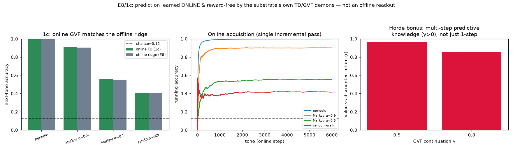
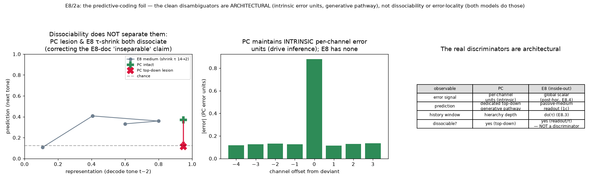

# E8 hardening — learned prediction (1c) + the predictive-coding foil (2a)

*Two follow-ups that harden E8 ([`e8_results.md`](e8_results.md)) on the two
tension axes it still touched: **1c** makes E8's prediction *learned* (tension 1,
"afforded vs learned"); **2a** makes the "not predictive coding" claim *empirical*
(tension 3, "illustrative not proof"). See [`next_steps.md`](next_steps.md)
Tracks 1c and 2a. Both reuse E8's tone task verbatim.*

---

## 1c — Online, reward-free GVF prediction (learned, not offline-fit)

*Run of `experiments/e8_online_prediction.py`.* E8's next-tone predictor is an
**offline ridge** on a frozen substrate — the extensions audit's caveat 7 ("the
learning credited to E8 is in the readout weights"). 1c folds it into the
substrate's own online machinery: a bank of `M` linear **GVF demons** (one per
tone channel) learned by the [E6](e6_results.md) TD rule
`δ_k = c_k + γ·(w_k·x') − w_k·x ; w_k += α·δ_k·x`, `c_k[t] = 1[next tone = k]`.

| sequence | online TD (1c) | offline ridge (E8) |
|----------|:--:|:--:|
| periodic | **1.00** | 1.00 |
| Markov α=0.9 | **0.91** | 0.90 |
| Markov α=0.5 | **0.56** | 0.55 |
| random-walk | **0.41** | 0.41 |

*(chance = 0.125; γ = 0 for the one-step demon)*



- **Prediction is acquired online and matches the offline ridge** on every
  sequence, in a single incremental pass (running accuracy rises to asymptote —
  middle panel). Online even edges the ridge on Markov (0.91 vs 0.90) because it
  keeps adapting through the stream.
- **Intrinsic / reward-free.** The only signal is the next tone (self-supervised);
  no reward, no error-unit hierarchy — prediction is learned inside-out by the
  same demon rule E6 uses.
- **Horde bonus.** γ > 0 demons predict the *discounted future occurrence* of each
  tone (multi-step predictive knowledge), value-vs-return correlation **r = 0.97**
  (γ = 0.5) / **0.85** (γ = 0.8) — a genuine GVF the one-shot ridge does not give.
- **Honest scope.** It is still a linear readout of a fixed substrate; 1c changes
  *how* the readout is learned (online, incremental, reward-free, the substrate's
  own machinery) — it does not make the *dynamics* plastic. It softens caveat 7
  (prediction is no longer a god's-eye batch solve) without fully retiring it.

---

## 2a — The predictive-coding foil (and an overclaim it corrects)

*Run of `experiments/e8_pc_foil.py`.* E8 *asserts* "prediction as forward
dynamics, not predictive coding". 2a builds a minimal untied Rao–Ballard PC model
(separate feedforward recognition `Wff` and top-down generative `Wtd`, temporal
prior `A`) on the same tones and measures what actually distinguishes the accounts.

**The clean PC signature reproduces.** Lesioning the top-down generative pathway
`Wtd` abolishes prediction while sparing the feedforward representation:

| PC | prediction (next tone) | representation (decode tone t−2) |
|----|:--:|:--:|
| intact | 0.37 | 0.95 |
| top-down lesion | **0.12** (chance) | **0.95** (spared) |

**But two observables one would expect to separate PC from E8 do NOT — and this
corrects an E8-doc overclaim:**

- **Dissociability is not a discriminator.** The E8 doc claims prediction and
  representation are "not dissociable" in E8 (no separable top-down to lesion). In
  fact E8 *is* dissociable: its two readouts tap different parts of the one medium,
  so shrinking the trace τ (14→2) kills past-representation while sparing the
  current-tone-driven random-walk prediction. E8 moves around the
  prediction-vs-representation plane just as PC does (left panel). **The "not
  dissociable" claim does not hold and is corrected here.**
- **Error locality is not a discriminator.** PC's per-channel error field peaks on
  the deviant (middle panel, concentration ≈ 0.50) — but an analogous residual
  formed from E8's readout *also* peaks there (≈ 0.50). Both localise.



**What actually separates them is architectural** — and these become the empirical
discriminators for MEG/data (right panel):

| observable | predictive coding | E8 (inside-out) |
|---|---|---|
| error signal | intrinsic per-channel **error units** driving inference/learning | post-hoc **global scalar** surprise, no error units (E8.4: 0.16→0.64) |
| prediction | dedicated top-down **generative pathway** | passive-medium **readout**, learning in the weights (1c) |
| history window | hierarchy depth | **do(τ)** (E8.3) |

So the disambiguation is real but *not* where the E8 doc placed it. PC and E8 are
empirically distinct in their **mechanism** — intrinsic error units + a generative
pathway vs a passive medium read out with a global surprise and a τ-set window —
not in whether prediction and representation can be pried apart (both models allow
that). This is the honest, testable form of "prediction without predictive coding".

## Caveats / open items

- **1c is still a readout.** It makes the *learning* online/intrinsic, not the
  *dynamics* plastic; the substrate is fixed. Making the tonotopic medium itself
  plastic (reward-driven Line A/B on the traces) is the deeper, deferred step.
- **The PC model is minimal** (H = 32, one hidden level, online one-step gradient,
  untied recognition/generation). It is built to exhibit the *defining PC
  architecture* (separate pathways, error units), not to be a strong sequence
  model; its absolute accuracy (0.37 on random-walk) is not the point.
- **2a corrects, rather than confirms, an E8 framing.** The `e8_results.md`
  "not dissociable" line should be read down to "prediction is a passive readout of
  the same medium as representation" — the mechanism claim — not the (false)
  behavioural claim that they cannot be dissociated.
- Small models, single seeds on the deterministic PC training; the qualitative
  results (clean PC lesion dissociation; E8 also dissociates; both errors localise)
  are the robust content.

## Reproduce

```
python3 experiments/e8_online_prediction.py   # 1c
python3 experiments/e8_pc_foil.py             # 2a
```

Write `docs/figures/e8_online_prediction.png`, `docs/figures/e8_pc_foil.png`, and
`result/e8/e8_online_prediction.npz`, `result/e8/e8_pc_foil.npz`.
