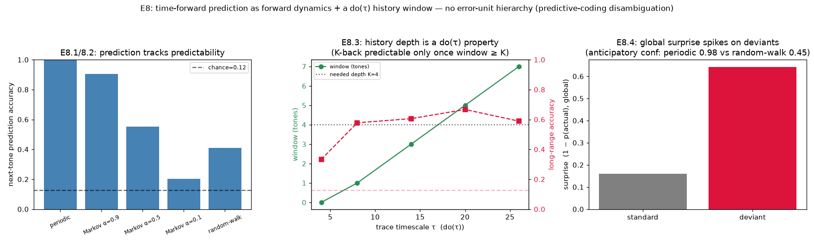
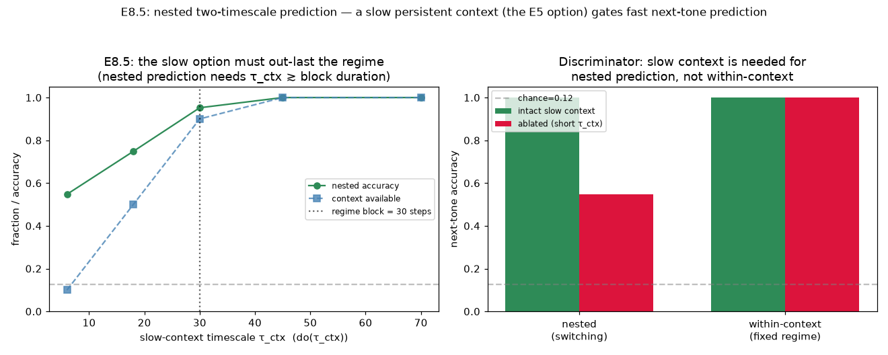
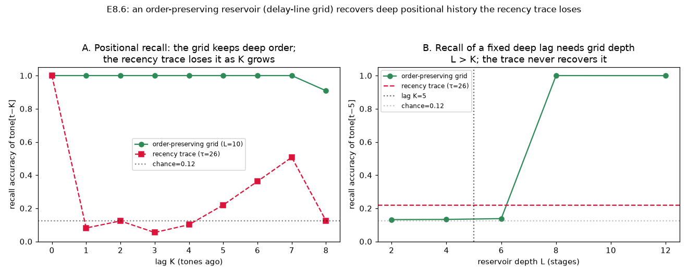
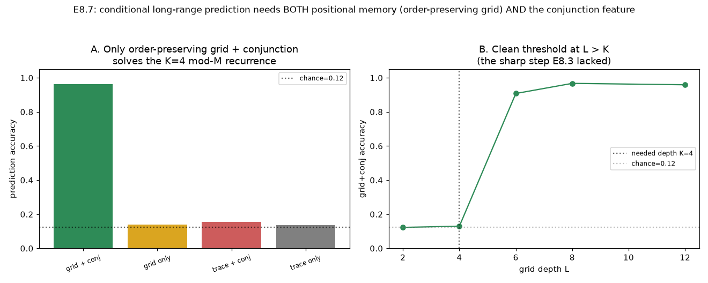

# E8 Results — Predictive Dynamics on Naturalistic Tone Sequences

*Run of `experiments/e8_predictive.py`. First cut of the E-series predictive
extension (see [`predictive_dynamics_experiments.md`](predictive_dynamics_experiments.md)).
Asks whether the substrate makes **time-forward predictions** of upcoming input, and
how that prediction differs from predictive coding. Motivated by the auditory-sequence
literature (Chait/Bianco: neural activity integrates ~the last 7 tones to predict the
next pitch; anticipatory tuning sharpens for more predictable sequences).*

## Setup

A tonotopic map of `M = 8` tone channels. A per-channel **trace bank** on the GH
clock: presenting tone `c` sets trace `c` to phase 1, and the phase then advances
`1…τ` and wraps to 0 — so a tone is represented for ~`τ` steps after it occurs, the
phase encoding time-since-onset. The non-rested traces are therefore a **`τ`-deep
history window** whose depth is a `do(τ)` property (Line B). A next-tone **predictive
readout** (a GVF-style linear/ridge demon, self-supervised, no reward) reads the
*whole* trace state — heeding [C5](c5_results.md): read the medium's integrated state,
not a fixed locus — and predicts the upcoming tone. There is no error-unit hierarchy;
prediction is the forward readout of the medium's own dynamics.

## Result 1 — prediction tracks predictability; anticipation sharpens (E8.1/8.2)

Next-tone accuracy and anticipatory confidence (chance = 0.125), 6000-tone streams,
train/test split:

| sequence | next-tone accuracy | anticipatory confidence |
|----------|:------------------:|:-----------------------:|
| periodic | **1.00** | 0.98 |
| Markov α=0.9 | 0.90 | 0.97 |
| Markov α=0.5 | 0.55 | 0.74 |
| Markov α=0.1 | 0.20 | 0.21 |
| random-walk | 0.41 | 0.45 |

Prediction accuracy and the readout's **anticipatory confidence** both grade
monotonically with the sequence's predictability — the substrate anticipates the next
tone, and its pre-onset confidence *sharpens for more regular sequences*, the
signature reported for auditory cortex.

## Result 2 — the history window is a `do(τ)` property (E8.3, the causal headline)

Integration window = the deepest past-tone lag decodable from the trace state (from an
i.i.d. stream, so memory is isolated), swept over the trace timescale `τ`:

| τ | 4 | 8 | 14 | 20 | 26 |
|---|:-:|:-:|:--:|:--:|:--:|
| **window (tones)** | 0 | 1 | 3 | 5 | 7 |
| long-range (K=4) accuracy | 0.33 | 0.58 | 0.61 | 0.67 | 0.59 |



The memory depth grows monotonically with `τ` — **`do(τ)` sets how many past tones
inform the prediction.** This turns the MEG *correlation* ("activity integrates ~7
tones") into an *intervention*: the "~7 tones" is not a fixed architectural depth but
a timescale parameter one can dial. On a long-range recurrence
(`x[t] = x[t−1] + x[t−K] mod M`, `K=4`) that needs history, accuracy rises from 0.33
(no window) to ~0.67 as the window opens — history availability helps prediction, up to
a representational ceiling (see caveats).

## Result 3 — surprise is a global scalar, not a per-feature error field (E8.4, PC disambiguation)

On an oddball stream (periodic standard, 12% random deviants), the prediction-error
magnitude `1 − p(actual)` (a single global scalar):

| | standard | deviant |
|---|:--------:|:-------:|
| surprise `1 − p(actual)` | **0.16** | **0.64** |

Surprise spikes ~4× on deviants — a genuine violation response — but it is a **single
aggregate mismatch signal**, not a hierarchy of per-channel error units. Combined with
Result 1's anticipatory sharpening, this is the predictive-coding disambiguation made
concrete: the substrate *predicts and is surprised*, yet has **no dedicated
prediction-vs-error pathway** — prediction is the forward evolution of one medium, and
the only error is a global TD/surprise scalar (the same `δ` the E-series critic uses).

## Result 4 — nested two-timescale prediction: a slow context gates the fast readout (E8.5)

*Run of `experiments/e8_nested.py`.* A second, slow timescale is added: an i.i.d.
carrier tone stream plus a **regime** that is cued only at each switch (every 10
tones) and sets a transform of the current tone, `target = (tone + regime·3) mod M`.
Because the carrier is i.i.d. it leaks *no* information about the regime — so the
regime must be **held** from the switch cue by a slow context trace (persistence set
by `τ_ctx`), exactly the E5 "option" idea at a slow timescale. The linear readout is
given the **fast × slow conjunction** (current-tone ⊗ held-context) — the
interaction E5's conjunction cells compute — because a context-dependent transform is
not linearly separable from the concatenation alone.

| τ_ctx | 6 | 18 | 30 | 45 | 70 |
|-------|:-:|:--:|:--:|:--:|:--:|
| nested accuracy | 0.55 | 0.75 | 0.95 | 1.00 | 1.00 |
| context available | 0.10 | 0.50 | 0.90 | 1.00 | 1.00 |

| condition | intact slow context (τ_ctx=70) | ablated (τ_ctx=6) |
|-----------|:------------------------------:|:-----------------:|
| **nested** (switching) | **1.00** | **0.55** |
| **within-context** (fixed regime) | 1.00 | 1.00 |



- **The slow option must out-last the regime block.** Nested accuracy rises with
  `τ_ctx`, reaching 1.00 once the context persists across the block (`τ_ctx ≳ T_ctx·ISI
  = 30` steps) — a `do(τ_ctx)` result at the *slow* timescale, the complement of Result
  2's fast history window. (A clean single-regime representation needs the context
  reset at each switch, E5-style — otherwise the previous regime lingers and both are
  ambiguously held.)
- **Discriminator.** Ablating the slow context (short `τ_ctx`) collapses the nested,
  context-conditioned prediction to chance-between-regimes (1.00 → 0.55), while a
  within-context control (single regime, no switching) is spared (1.00) — the slow
  option is necessary for holding the regime across the block, not for the fast
  mapping itself. This is the E5 discriminator, now bridging two timescales in a
  predictive task.

## Result 5 — an order-preserving reservoir recovers deep positional history (E8.6)

*Run of `experiments/e8_reservoir.py`.* Result 2's long-range recall was capped
because the per-channel trace stores *recency* — when a tone repeats, the older
occurrence is overwritten, so the exact tone *at lag K* is lost. E8.6 fixes the
representation with an **order-preserving reservoir**: a delay-line grid of
`M` channels × `L` stages (a directed shift-register per channel — a synfire /
delay-line motif on the GH substrate). Presenting tone `c` injects a token at stage 0
of channel `c`; each tone the tokens shift one stage down their channel, so cell
`(c, k)` active means "tone `c` occurred ~`k` tones ago" — an exact, ordered history
with no overwrite on repeats. Lag-`K` recall (decode tone[t−K]) on an i.i.d. stream:

| lag K | 0 | 1 | 2 | 3 | 4 | 5 | 6 | 7 | 8 |
|-------|:-:|:-:|:-:|:-:|:-:|:-:|:-:|:-:|:-:|
| order-preserving grid (L=10) | 1.00 | 1.00 | 1.00 | 1.00 | 1.00 | 1.00 | 1.00 | 1.00 | 0.91 |
| recency trace (τ=26) | 1.00 | 0.08 | 0.12 | 0.05 | 0.10 | 0.22 | 0.36 | 0.51 | 0.13 |



- **The grid keeps deep order; the trace does not.** The order-preserving reservoir
  recalls the exact tone at every lag up to its depth (~1.00 through lag 7, falling
  near `L`), while the recency trace recovers only the *current* tone (lag 0) and
  drops to ≈chance for any deeper lag — because a per-channel recency code cannot say
  *which* of the recently-seen tones was at a specific lag once channels repeat.
- **Recall depth = reservoir depth (structural handle).** Recovering a fixed deep lag
  (K=5) needs grid depth `L > K`: recall jumps from chance (L≤6) to 1.00 (L≥8), while
  the trace never recovers it (0.22 regardless). This is the positional-memory
  complement of Result 2's `do(τ)` window — here the depth is set by the reservoir's
  structure `L` rather than the timescale `τ`.

(Honest note: a periodic *delayed-copy* task `x[t]=x[t−K]` is predicted equally well
by both reservoirs, because periodicity is recoverable from the recency signature too
— positional recall is strictly needed only for non-periodic history, as isolated
here with the i.i.d. stream.)

## Result 6 — conditional long-range prediction needs positional memory AND conjunction (E8.7)

*Run of `experiments/e8_conditional.py`.* Result 2's long-range recurrence was only
muddily predictable for two *independent* reasons the later experiments each isolated:
the recency trace cannot recall the exact tone at lag K (positional memory — E8.6),
and a value that is a *transform of two symbols* is not linearly separable from the
concatenation (it needs the conjunction — E8.5). E8.7 puts them together on a
high-entropy, non-memorisable task — i.i.d. carrier `x`, target `= (x[t] + x[t−K]) mod
M` (`K=4`) — and crosses {order-preserving grid, recency trace} × {conjunction on/off}:

| | conjunction on | conjunction off |
|---|:---:|:---:|
| **order-preserving grid** | **0.96** | 0.14 |
| recency trace | 0.15 | 0.13 |



- **Both ingredients are necessary and jointly sufficient.** Only the
  order-preserving grid *with* the conjunction solves the task (0.96); dropping either
  — the grid alone (can't form the mod-M sum, 0.14) or the trace with conjunction
  (can't recall the lag-K symbol, 0.15) — collapses to chance (0.125). This cleanly
  decomposes E8.3's failure into its two causes and fixes both.
- **Clean depth threshold at `L > K`.** Grid+conjunction accuracy jumps from chance
  (L≤4) to ~1.0 (L≥6) as the reservoir depth passes the dependency lag — the sharp
  step E8.3's recency trace could not produce.

This closes the loop across the predictive extension: **positional memory** (E8.6, an
order-preserving reservoir), the **`do(τ)` history window** (E8.3), and the **fast×slow
conjunction** (E8.5, the E5 conjunction-cell motif) are three separable capabilities
that compose to give genuine conditional long-range prediction — all without a
predictive-coding error hierarchy.

## Interpretation — prediction without predictive coding

E8 shows the substrate is a genuinely *predictive* system that is not a
*predictive-coding* one:

- **Prediction = forward dynamics + history integration**, read off one medium, rather
  than the top-down output of an inverted generative model.
- **The integration window is a `do(τ)` (Line B) property** — the causal handle the
  [C-series](causal_experiments.md) isolates — not a hierarchy depth. This is the
  clean intervention the biological correlations cannot make, and it is the E-side
  echo of the C-series thesis: *the causally meaningful variable is the generative
  timescale.*
- **Surprise is global, and prediction is not dissociable from representation** (there
  is no separate top-down pathway to lesion) — two observables that distinguish this
  account from hierarchical predictive coding (Rao–Ballard/Friston).

It also carries [C5](c5_results.md)'s lesson across the series: the predictive readout
succeeds because it integrates the medium's *whole* trace state; a fixed-locus readout
(the fat-handed reader of C5) would be the wrong probe here too.

## Caveats / open items

- **Per-channel traces store recency, not positional order** — so the exact tone at
  lag K is lost when channels repeat (Result 2's ~0.67 plateau). **Result 5 (E8.6)
  resolves this** with an order-preserving delay-line reservoir that recalls every lag
  up to its depth; the recency trace is retained in Results 1–4 as the minimal
  reservoir where recency suffices. **Result 6 (E8.7)** then folds the
  order-preserving reservoir into the *conditional* long-range task and shows it needs
  the fast×slow conjunction too — both ingredients necessary and jointly sufficient.
- **The learner is the predictive readout (a next-tone GVF), not Line A plasticity.**
  Transition structure is learned by the self-supervised readout; folding it into Line A
  conduction plasticity (so the *substrate* learns the transition graph) is the deferred
  variant named in the spec.
- **Prediction here is self-supervised (no reward)** — an intrinsic/inside-out result;
  the reward-driven variant and the E8.5 nested (two-timescale) task are not yet run.
- The trace bank is a deliberately minimal reservoir (independent clocked nodes); the
  qualitative results (predictability grading, `do(τ)` window, global surprise) are the
  robust claims, not the absolute accuracies.

## Operating point

```
map        : M=8 tone channels; ISI=3 steps between tones; act=2
traces     : one GH-clocked node per channel, tau swept in {4,8,14,20,26} (do(tau));
             theta=99 (only clamped), p_s=0, no edges
readout    : ridge next-tone demon on [trace recency (M) + current-tone one-hot (M) + bias];
             softmax temperature beta=6 for confidence/surprise; train/test split 0.5
sequences  : periodic (period 4); Markov (neighbour-bias alpha); random-walk (+-1);
             long-range recurrence x[t]=x[t-1]+x[t-K] mod M (K=4); oddball (12% deviants)
streams    : 6000 tones; window measured on i.i.d. streams; 3-seed average for E8.3
```

## Reproduce

```
python3 experiments/e8_predictive.py
```

Writes `docs/figures/e8_predictive.png` and `result/e8/e8_data.npz`.
