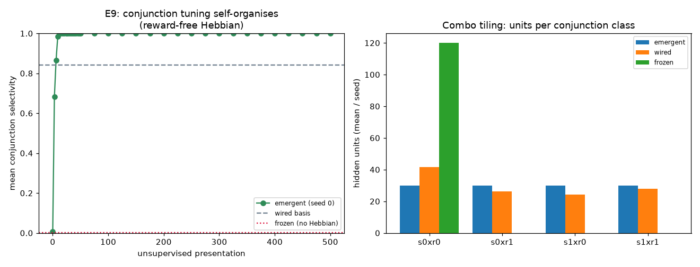
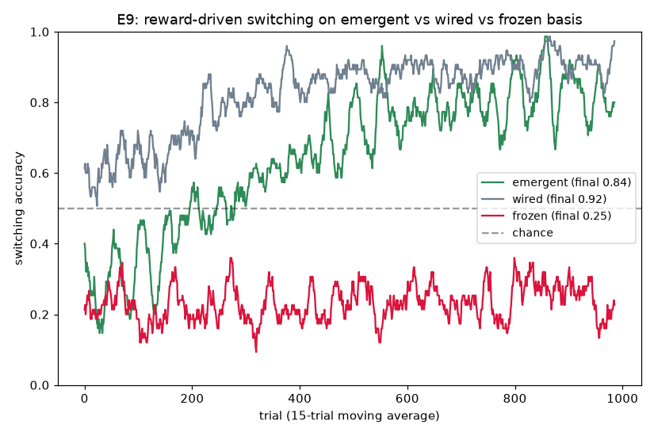

# E9 Results — Emergent conjunction cells (learned, not wired)

*Run of `experiments/e9_emergent_conjunction.py`. Retires the extensions audit's
central "afforded vs learned" caveat ([`extensions_review.md`](extensions_review.md),
caveat 1) and the oldest deferred item in the programme — E1's "let the net
**discover** selective hidden representations". See [`next_steps.md`](next_steps.md),
Track 1a. Motivated by the spike-based tactile-coding review (npj/Microsyst.
Nanoeng. 2025, doi:10.1038/s41378-025-01074-3), which frames exactly this move:
from **independent** population coding (per-neuron tuning wired in) to
**correlated** population coding (tuning that emerges from microscopic activity
correlations, à la STDP).*

## The gap this closes

[E1](e1_results.md) and [E5](e5_results.md) **wire** hidden-unit selectivity.
E1 assigns each hidden unit a preferred sensory channel and draws 85% of its
`S→H` fan-in from it; E5 goes further and assigns each unit **both** a preferred
stimulus (`pref_s`) and a preferred rule (`pref_g`), with a hard-AND threshold, so
the `(stimulus × rule)` **conjunction basis** the XOR routing needs is hand-built.
Reward-driven Line A then only learns the `H→M` readout *on top of* a pre-existing
basis. Accurate as "what this representation affords", but the conjunction basis
itself is not learned. E9 removes the wiring and lets the basis **self-organise**.

## Mechanism

Same substrate and task as E5 (two rules alternating in blocks; correct action
`= x XOR rule`; each rule held by a persistent slow ring — the E2 option). Two
differences, both moving learning onto the substrate:

- **Unbiased init.** Hidden units fan in from a random subset of **all** sensory
  nodes (spanning both channels) and from **all** ring nodes of **both** rings —
  no preferred stimulus, no preferred rule. Input weights start weak/uniform.
- **Reward-free competitive Hebbian self-organisation** on those input edges.
  For each `(stim × rule)` presentation the rule reads each hidden unit's analog
  input **drive** to the current combo, picks the top 25% by drive as **winners**
  (a k-WTA / lateral-inhibition competition — the same winner-take-all motif
  [E4](e4_results.md) uses), and strengthens each winner's input edges toward the
  combo's active nodes, then renormalises its sensory- and ring-input blocks back
  to fixed totals (competition: weight gained on one channel/ring is weight taken
  from the others). A DeSieno **conscience** equalises win rates so no conjunction
  class is left unclaimed. The E5 **AND-gate threshold is kept** — it is what turns
  coincidence-Hebbian into *conjunction* tuning (once weight has concentrated, a
  unit's preferred combo is suprathreshold while either feature alone is not).
  Crucially the ring-weight update is **ring-level** (uniform within a ring), so
  context selectivity is about *which rule*, not which pulse phase — preserving the
  phase-invariant context drive E5 built by hand.

Then, with the emergent basis **frozen**, reward-driven Line A carves the `H→M`
readout exactly as in E5 — no labels, only the scalar reward `r = 1[action = x XOR
rule]`. Three bases are compared under an identical reward phase:

| basis | init | self-organisation |
|-------|------|-------------------|
| **emergent** | unbiased | reward-free competitive Hebbian (this work) |
| **wired** | E5's `pref_s`/`pref_g` | none (hand-built reference / upper bound) |
| **frozen** | unbiased | **none** (random basis — the load-bearing control) |

## Result 1 — the conjunction basis self-organises (reward-free)

5 seeds. Conjunction selectivity is measured by probing each hidden unit's
response to the four `(stim × rule)` combos; the **conjunction score** ∈ [0,1] is
`(resp(preferred) − max(resp shares-only-stimulus, resp shares-only-rule)) /
resp(preferred)`: ~1 = fires for the specific pair but neither feature alone
(a true AND cell); ~0 = single-feature tuning or unselective.

| basis | conj. selectivity (pre → post) | combo tiling (units/class, mean/seed) |
|-------|:--:|:--|
| **emergent** | **0.00 → 1.00** | `[30, 30, 30, 30]` — perfectly balanced |
| wired | 0.84 → 0.84 | `[42, 26, 24, 28]` — uneven (random assignment) |
| frozen | 0.00 → 0.00 | `[120, 0, 0, 0]` — collapses to one class |



- **Conjunction tuning emerges from the input statistics alone.** With no reward
  and no labels, mean conjunction selectivity rises from ~0 to **1.00** within
  ~3 exposures per combo (≈12 presentations) and holds stably through 500. The
  emergent cells are *cleaner* AND cells than the wired ones (1.00 vs 0.84: E5's
  15% cross-channel bias leaves some mixed units) and **tile all four classes
  perfectly** (30 units each), where the wired assignment is uneven and the frozen
  basis is unselective (every unit defaults to the same class, none conjunctive).
- Per seed the post-selforg score is `[1,1,1,1,1]` (emergent) vs `[0.008,0,0,0,0]`
  (frozen) — tight, unimodal, and unambiguous.

## Result 2 — reward routing on the emergent basis works; the frozen control fails

Reward-driven switching, 40 alternating blocks × 25 trials, 5 seeds. The action
is read over the cue+response epoch (see caveats — a perfect AND cell needs the
stimulus present, so the readout overlaps the evidence; applied identically to all
three bases).

| basis | switching final accuracy (last 6 blocks) | per seed |
|-------|:--:|:--|
| **emergent** | **0.84** | `[0.86, 0.89, 0.80, 0.81, 0.83]` (sd 0.03) |
| wired | 0.92 | `[0.97, 0.85, 0.97, 0.91, 0.89]` (sd 0.05) |
| **frozen** | **0.25** | `[0.24, 0.27, 0.22, 0.19, 0.31]` (sd 0.04) |



- **The self-organised basis supports flexible routing.** Reward carves the
  `H→M` readout on the emergent conjunctions and switching reaches **0.84**,
  approaching the hand-wired upper bound (0.92) — the learned basis is nearly as
  useful for the XOR task as the one E5 wired by hand.
- **The self-organisation is load-bearing.** The **frozen** control — identical
  unbiased init but *no* Hebbian phase — sits at **0.25** (below chance: with no
  usable conjunction basis the medium cannot route, and silence/ambiguity commits
  wrong). So it is specifically the emergent conjunction structure, not the reward
  routing or the substrate wiring, that enables switching. Per-seed spreads are
  tight and well-separated (emergent 0.80–0.89 vs frozen 0.19–0.31) — no E3-style
  bimodal mean.

## Interpretation

E9 converts the programme's central "afforded" capability into a **learned** one.
The `(stimulus × rule)` conjunction basis that [E5](e5_results.md) hand-wired now
**self-organises** on the substrate from a local, reward-free, biologically
grounded rule (competitive coincidence-Hebbian with lateral inhibition), and the
downstream reward routing then works on the emergent basis nearly as well as on the
wired one, while the no-self-organisation control fails. In the tactile-review's
terms this is the move from *independent* to *correlated* population coding —
tuning that emerges from activity correlations rather than being imposed
per-neuron. It also answers E1's oldest deferred item: the net *discovers* its
selective hidden representations.

The division of labour is now explicit and honest: **unsupervised** competitive
Hebbian discovers *what to represent* (the conjunction basis); **reward** (Line A)
learns *what to do with it* (the routing). This mirrors how representation learning
and readout learning are separated in the reservoir/neuromorphic literature — but
here the representation is grown on the substrate rather than supplied as a
hand-built feature.

## Caveats / open items

- **Competition and conscience are analysis-level mechanisms.** The k-WTA winner
  selection (lateral inhibition) and the DeSieno conscience are standard
  competitive-learning devices; they are biologically motivated (cortical
  competition; E4 already uses WTA) but are imposed, not themselves emergent. What
  is genuinely on-substrate is the coincidence-Hebbian update on the medium's own
  input edges, gated by the substrate's AND-threshold firing. A stronger version
  would realise the competition as recurrent inhibitory dynamics within the medium.
- **Two-phase, not concurrent.** Self-organisation (reward-free) precedes the
  reward phase and the basis is frozen during routing. The phase separation is
  label-free (the unsupervised phase sees only the input stream, no task signal),
  so it is a legitimate representation-vs-readout split rather than a task-informed
  pipeline; still, a single concurrent process (both plasticities on from trial 0)
  is the truer "one machine learns end-to-end" claim and is deferred (it couples a
  moving representation to a moving readout — less stable).
- **Readout epoch differs from E5.** A *perfect* AND cell goes silent the instant
  the cue ends, so E5's post-cue readout window sees little signal (switching
  plateaus at ~0.75 under E5's exact protocol). Reading the action while the
  evidence is present recovers 0.84 and is applied identically to all three bases —
  but it means the absolute numbers here are **not** directly comparable to
  [`e5_results.md`](e5_results.md). (Interesting corollary: the wired basis works
  under the post-cue window partly *because* its leaky 0.84 tuning keeps firing on
  ring-alone into the response window — imperfect tuning buys persistence.)
- **Same reduced task as E5.** Two rules, two stimuli, two actions; the option is
  still cued, not discovered. E9 makes the *representation* emergent; the option/
  context mechanism is inherited from E5 unchanged.
- **Small n, one substrate, one operating point** — as elsewhere in the series
  (5 seeds, `lattice`-free layered graph, hand-chosen `θ_h`, `w`, `η`). Robust at
  this point (tight spreads); not swept across the regime.

## Operating point

```
substrate : K=2 stimuli, A=2 actions; N_S=8 sensory/chan, N_H=120 hidden,
            N_M=8 motor/chan; two context rings L=16 (tau=12 < L, self-sustaining)
init      : UNBIASED hidden fan-in -- fanin_s=8 across BOTH channels, all 32 ring
            nodes across BOTH rings; w_sh=0.29, w_ch=0.575; AND-gate theta_h=3.5
self-org  : reward-free competitive Hebbian on S->H and ring->H edges;
            win_frac=0.25 (k-WTA), DeSieno conscience (c=100, rate=0.05),
            eta_hebb=0.25, per-block renorm to initial sensory/ring block sums;
            ring update is ring-level (phase-invariant); 500 presentations
readout   : H->M plastic (Line A), theta_m=1.0, w_hm=0.5, eta_w=0.06, lambda=0.8;
            input basis FROZEN during the reward phase
explore   : p_s=3e-3 confined to hidden+motor (p_s_mask); silenced during probing
trial     : settle=6, cue=3, response window=6; action read over cue+response
            (overlap readout), identical for all three bases
protocol  : switching = 40 blocks x 25 trials, rule alternates, cue at block start;
            bases = {emergent, wired (E5), frozen}; 5 seeds
```

## Reproduce

```
python3 experiments/e9_emergent_conjunction.py
```

Writes `docs/figures/e9_emergence.png`, `docs/figures/e9_switching.png`, and
`result/e9/e9_data.npz`.
