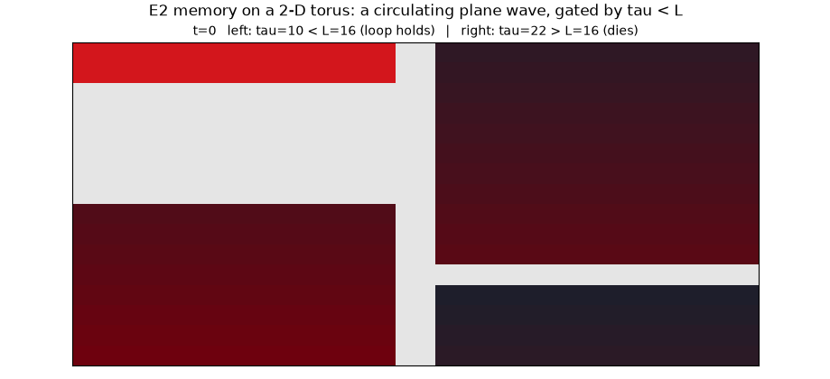
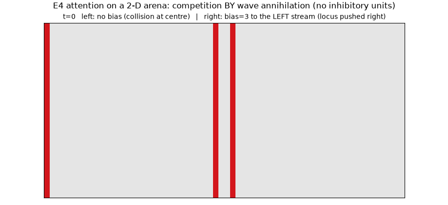
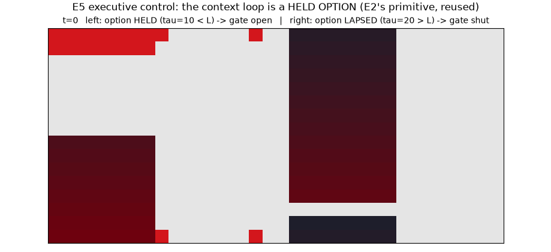

# Representation, and the 2-D lattice port, for memory / attention / control

*Run of `experiments/lattice_capacities.py` (+ `lattice_animation.py` for the
GIFs). Companion to [`scaling_capacities.md`](scaling_capacities.md): that
document asked whether size buys capacity; this one asks **what each capacity
actually is on the substrate**, and whether each mechanism survives a move to
`lattice2d`.*

## 1. How each capacity is represented, and how it touches the substrate

Read off the three builders, the capacities do **not** share a representation.
Each uses a different substrate primitive, and each is limited by a different
property of the medium:

| capacity | representation | substrate requirement | binding constraint |
|---|---|---|---|
| **E2 memory** | position of one circulating pulse on a directed cycle | a cycle; `tau < L` so the refractory tail clears before the pulse returns | **loop transit length `L`** |
| **E4 attention** | which of two counter-propagating waves captured the centre | an arena wide enough for two fronts; refractoriness (annihilation *is* the competition) | **bias-to-noise ratio** |
| **E5 control** | a *held option* (a persistent reentrant loop) gating a feedforward conjunction | a loop that outlives a block, plus coincidence gates | **the ring, not hidden width** |

Three things follow, and each is checked numerically below.

**E5 reuses E2's loop, but not E2's capacity axis — and the distinction matters.**
The two loops are the same *dynamical object*: both are directed rings obeying
the same sustain law (verified in isolation, and the boundary is `tau <= L`, with
`tau == L` marginal-but-alive at L ∈ {8,12,16,24,32} — independently
corroborating the winding-number result in
[`topology_winding_capacity.md`](topology_winding_capacity.md), which found the
strict `tau < L` gate's only misses are exactly `tau == L`).

But **what the loop encodes differs**, and that changes what scaling it buys:

| | E2 | E5 |
|---|---|---|
| what the ring holds | the **remembered item** — *which* ring is lit encodes which stimulus | the **rule/context** — ring identity selects which conjunction subpopulation exists |
| ring length is | the memory's duration budget | the option's survival budget |
| graded axis | **`tau` (retention demand)** — capacity is *how slow a node the loop tolerates* | none found |

The decisive test is to hold the **sustain margin** fixed (`tau = L − 4`) and
sweep `L` in each system's own task:

- **E2**: retains at *every* delay tested (to D=800) for **every** L from 8 to
  48. Flat.
- **E5**: switching accuracy 0.608, 0.675, 0.604, 0.649, 0.526 for
  `L_ring` = 8…32 (n=10). **Flat within per-seed spread.**

So neither is graded in loop length once the margin is controlled. **The 0.484
"span" reported below is entirely the threshold crossing**, not a size effect —
which is why §4's honest statement is a threshold, not a gradient. E2's genuinely
graded axis is `tau`: at fixed margin the largest holdable `tau` tracks `L`
exactly (8→8, 12→12, … 48→48), which is `scaling_capacities.md`'s 6/6 result
seen from the other side.

The practical reading for a composite architecture: E5 does not get *more*
executive control from a bigger loop, it gets the option's *existence*. E2 does
get more memory from a bigger loop, but only measured in `tau`, not in `L`.

**Attention needs no inhibition.** The competition is refractory annihilation:
two wavefronts extinguish each other where they meet, and a top-down timing bias
moves that locus. No node in the substrate is inhibitory. "SNR" here is concrete
and has units of *time steps*: the **signal** is `bias`, the ignition-time
advantage given to the attended stream; the **noise** is `jitter`, the standard
deviation of Gaussian noise on each stream's ignition time
(`e4_attention.trial`). Their ratio is dimensionless, which is why arena width
drops out (§3).

**E5's hidden layer is not a medium at all.** Asserted in the experiment:

    H->H edges = 0        (per-ring recurrent edges = 16)

The hidden layer is **purely feedforward** — sensory→hidden and ring→hidden in,
hidden→motor out, and nothing between hidden units. So widening `N_H` adds
*non-interacting parallel AND-gates*. This is the mechanism behind
[`scaling_capacities.md`](scaling_capacities.md)'s null on `N_H`: there was never
a reason for width to help, because width adds no interaction. **The `N_H` sweep
swept the wrong knob** — the only recurrent structure in E5 is the context ring.

## 2. E2 memory ports to the 2-D torus — law intact, 28/28

On a periodic `lattice2d`, a full-row plane wave with a refractory tail behind it
circulates the torus; its transit length is the side `L`. Sweeping `L × tau`:

| `L` \ `τ` | 6 | 10 | 14 | 18 | 22 | 26 | 30 |
|---|---|---|---|---|---|---|---|
| 12 | ✓ | ✓ | — | — | — | — | — |
| 16 | ✓ | ✓ | ✓ | — | — | — | — |
| 24 | ✓ | ✓ | ✓ | ✓ | ✓ | — | — |
| 32 | ✓ | ✓ | ✓ | ✓ | ✓ | ✓ | ✓ |

**Agreement with `tau < L`: 28/28 cells.** The 1-D ring law transfers to the 2-D
torus unchanged, with the torus side playing the role of ring length.

## 3. E4 attention ports to the 2-D arena — and is still size-invariant

Igniting the left and right *edges* of a non-periodic lattice, the two fronts
collide and annihilate; the centre node's wave label is the winner (the same
label-propagation readout as `e4_attention`, lifted to 2-D).

| `L` (nodes) | bias 0 | 1 | 2 | 3 | sensitivity |
|---|---|---|---|---|---|
| 21 (441) | 0.49 | 0.82 | 0.96 | 0.96 | +0.34 |
| 41 (1681) | 0.41 | 0.76 | 0.91 | 0.99 | +0.35 |
| 61 (3721) | 0.55 | 0.78 | 0.90 | 0.97 | +0.22 |

The psychometric curve has the same shape as in 1-D (1-D sensitivities were
+0.28…+0.35), chance at zero bias, and **no systematic gain from an 8×-larger
arena** — consistent with `scaling_capacities.md`. The 61-node dip to +0.22 is
within the n=80 sampling spread, not a trend.

## 4. E5's binding constraint is the ring — 11× the effect of hidden width

Sweeping the context-ring length (E5's only recurrent structure) at fixed
`N_H = 120`, n=12 seeds:

| `L_ring` | 8 | 12 | 16 | 24 | 32 |
|---|---|---|---|---|---|
| switching accuracy | **0.202** | 0.661 | 0.613 | 0.685 | 0.565 |
| per-seed spread | [0.17, 0.24] | [0.50, 0.86] | [0.18, 0.82] | [0.50, 0.92] | [0.24, 0.80] |
| `TAU_SLOW=12 < L_ring`? | no | no | yes | yes | yes |

Span 0.484, against 0.043 for the 16× `N_H` sweep. **But that span is a
threshold crossing, not a size effect.** The dominant feature is the **collapse
at `L_ring = 8`**, where the option cannot survive (`tau=12 > L=8`) and accuracy
falls to 0.202 — *below* the 0.5 chance line, because a dead ring silences the
conjunction gates and the motor channel mostly fails to fire at all rather than
guessing. That is a mechanism failure, not graded capacity. Above the boundary
(`L_ring ≥ 12`) the curve is **flat within its per-seed spread** (0.565–0.685,
and every arm bimodal).

Controlling for it directly — holding the sustain margin fixed at `tau = L − 4`
so every arm sits equally far inside the sustaining regime — **the span falls
from 0.484 to 0.149** (0.608, 0.675, 0.604, 0.649, 0.526 for `L_ring` = 8…32,
n=10), which is still inside the per-seed spread of a single arm. So the honest
statement is:

> E5 has a **threshold** at the option's sustain boundary, and no measurable
> graded size dependence above it — on either knob.

This *strengthens* `scaling_capacities.md`'s null rather than overturning it:
neither hidden width nor ring length buys graded executive control. What the ring
buys is the option's existence.

## Substrate / analysis boundary

- **E2 and E4 here are pure dynamics** (E4 plus a fixed centre readout); no
  plasticity anywhere. They test whether the *mechanism* survives the medium, not
  whether a learner can exploit it.
- **E5's ring sweep involves learning** (Line A routing), so its variance mixes
  substrate and learning-rule effects.
- The `H->H = 0` count is a **structural fact** about `e5_executive.build`, not a
  measurement.

## Caveats

- **`L_ring = 8` is a below-chance mechanism failure**, not a capacity reading;
  including it in a "span" inflates the apparent effect. The 0.484 span is
  reported to compare *knobs*, and the flat region above the threshold is the
  substantive result.
- **E5 was not ported to `lattice2d`.** Its context ring could be replaced by a
  torus row (§2 shows that sustains), but the conjunction layer's calibrated
  `theta_h` coincidence gate would need re-tuning; not attempted.
- **Torus reentry used a plane wave**, the simplest non-contractible loop. Other
  cycle classes on the torus (diagonal, longer windings) are untested, and this
  is not a spiral (E7's regime is different).
- **E4's 2-D readout is a single centre node.** A pooled readout could behave
  differently, as E7's direction work found for a fixed-locus winding reader.
- **n=80 per arena cell, n=12 per ring length** — adequate for the shape claims,
  not for tight effect bounds. Bimodality is the dominant variance in E5.
- **No composite task.** Nothing here runs two capacities at once; the modular
  argument in §1 is a structural reading, not a measured composition result.
