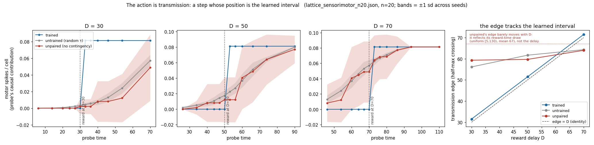
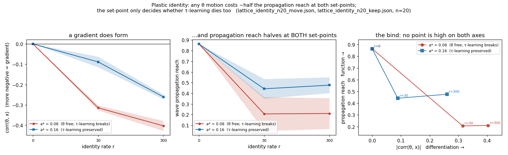
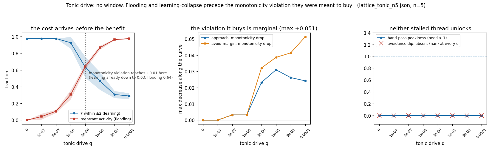

# Lattice port of the input-timing τ rule — two results, two negatives

*Preliminary. Validation run before building an interactive demo of 3e.2, to check that
what the demo would show is true. It partly is not, so this is recorded before anything
is built. Experiment: `experiments/lattice_timescale_demo.py`; L=96 torus, 4-neighbour
Greenberg–Hastings, `act=2`, sparse pacemaker sites, τ ∈ [3, 34], η=0.15.*

## Why a lattice port at all

3d/3e established the input-timing τ rule on a **non-spatial pool**: every unit fanned
in from two rhythmic drive sources, and a population conscience split the pool ~50/50.
The natural demo is a *2-D lattice*, because waves are legible on sight where a
histogram is not. That requires the rule to work on a recurrent spatial medium, which
the repo had never tested.

## One thing that had to be fixed first: edges, not levels

Ported naively, the rule **collapses τ to the floor** (mean 3.1 of a [3, 34] range).
Cause: an "input event" defined as *suprathreshold input* is nearly always true on a
lattice — with θ=1 and dense local coupling some neighbour is almost always active, and
a passing wave holds input high for `act` consecutive steps. The measured inter-arrival
interval is then ~1 step and carries no rhythm at all.

The fix is **rising-edge detection** — an input event is the *onset* of suprathreshold
drive, not its presence. This is a genuine generalisation rather than a patch: in the
3e.2 pool the drive sources fired as discrete pulses, so every input already *was* an
edge, and the distinction was invisible. Any port of this rule to a recurrent medium
needs it.

## Result 1 — the rule works, and the old rule still fails (n=3, single rhythm)

| rule | mean τ (drive P=6) | fraction near P | Moran's I (spatial autocorr.) |
|---|:--:|:--:|:--:|
| **input-timing (new)** | **8.0** | **0.51** | **0.32** |
| own-firing (old, e10) | 33.9 (ceiling) | 0.00 | 0.002 |

The input rule pulls τ from a uniform-random init toward the drive period and produces
genuine **spatial** structure (Moran's I 0.32 vs 0.002). The own-firing rule rails to
the ceiling with no spatial structure — **the e10 ratchet, reproduced on a lattice**.
That contrast is solid and is the one demo-worthy claim here.

(τ settles near 8 rather than exactly 6: a cell's inter-arrival interval is the drive
period plus propagation jitter, and cells receive multiple wavefronts, so the effective
period it senses is slightly longer than the pacemaker's.)

### Correction to Result 1 (added later, on audit)

The table above was **unsourced**. The committed artifact was a *two-rhythm* run (P_F=6, P_S=24,
n=2, Moran's I −0.005) — Negative 1's data, not Result 1's — and the single-rhythm numbers came
from an earlier version of the script that no longer existed. Regenerating them required making
the periods configurable **and decoupling the interval clip from `P_S`**: the clip was derived as
`P_S × 2`, so lowering the slow period silently capped learned τ at 12, and a first reproduction
attempt read τ = 11.95 (the clip) instead of the ceiling.

Reproducible values (`lattice_timescale_demo_single.json`, P=6, L=96, n=5): input-timing **7.9 /
0.55 / +0.484**, own-firing **33.8 / 0.01 / −0.002**. The ceiling contrast holds; Moran's I is
**0.484**, not the 0.32 quoted above, so the spatial-structure claim is stronger than reported.

Also corrected on the same audit: the mechanism note below says the localised-afferent profile is
a distance gradient rising 1.54 → 2.92. It is **non-monotone** (1.54, 2.07, 2.06, 2.01, 1.94,
1.87, 1.80, 1.82, …) — a failure to lock at any depth, not a clean gradient. And τ settles at 8.9
against P=6, so the recovered intervals are *longer* than the period, not shorter as stated.

## Negative 1 — two-timescale *spatial* tiling does not happen: global entrainment

The hoped-for demo was τ tiling space into fast and slow domains around fast and slow
pacemakers. It does not occur, for a physically meaningful reason.

| layout | θ | near P_f=6 | near P_s=24 | Moran's I | τ near fast vs slow pacemakers |
|---|:-:|:--:|:--:|:--:|:--:|
| mixed | 1 | 0.51 | **0.00** | 0.32 | 7.9 vs 8.2 (Δ +0.2) |
| split (fast left, slow right) | 1 | 0.51 | **0.00** | 0.32 | 8.0 vs 8.1 (Δ +0.1) |
| mixed | 2 | 0.14 | 0.19 | −0.007 | 18.6 vs 18.5 |

**The fastest pacemaker entrains the whole medium.** Fast sites fire 4× more often,
their waves flood the torus and annihilate the slow waves, so *every* cell's dominant
input interval is P_f regardless of which pacemaker is nearest. Confining the fast
pacemakers to one half changes nothing (Δ +0.1) — the waves cross anyway. This is the
standard excitable-media/cardiac phenomenon (fastest pacemaker wins, as the SA node
does), not an artifact.

There is also **no useful coupling window**: θ=1 propagates globally and entrains; θ=2
blocks propagation entirely, because a planar wavefront presents each cell with only
one active neighbour (Moran's I ≈ 0, τ → an uninformative mixture at 18.5). With a
4-neighbourhood and unweighted coupling there is nothing in between.

So this is the spatial form of e10's **diagnostic-2** failure (the fast channel swamps
the slow one). In the pool a population conscience fixed it by forcing ~50/50
commitment; on a lattice the swamping is done by wave propagation itself, which a
per-cell conscience cannot undo.

## Negative 2 — the rule does not *re-tune*, and the reason is new

Driving at P=6, then switching to P=18, then back (2500 steps each):

| phase | drive P | mean τ | \|τ − P\| |
|---|:-:|:--:|:--:|
| 1 | 6 | 8.0 | 2.1 |
| 2 | **18** | **8.0** | **10.0** |
| 3 | 6 | 7.9 | 1.9 |

τ locks during phase 1 and then **ignores the new drive period entirely**. This is
*not* the e10 ratchet (τ does not climb; it is stuck low), and it is not what 3e.1
found in the pool, where the basis re-tiled readily.

The mechanism: once τ has settled small, the medium **sustains its own reentrant
waves** with a period set by τ itself. Each cell's input is then generated by its
neighbours at interval ≈ τ, so the rule measures dt ≈ τ and sits at a **self-confirming
fixed point**, decoupled from the external drive.

This is the e10 lesson returning in a new guise. The lesson was *teach τ from external
input timing, not from self-timing*. On a **recurrent** medium that is much harder to
satisfy than in a feedforward pool, because the medium's own activity is
indistinguishable from external input at the single-cell level — **the network
re-introduces self-reference even when the rule is written to avoid it.**

## What this means

- **Do not build a demo claiming spatial domains or spatial re-tuning.** Neither is
  true on this substrate. The honest, demo-worthy claim is the single-rhythm one:
  the input rule tracks a drive period and organises spatially where the own-firing
  rule rails to the ceiling.
- The **pool** results (3d/3e, n=20) remain the validated science; the lattice is a
  visualisation medium with its own, different behaviour, not a free upgrade.
- Negative 2 is arguably more interesting than the demo, and it turned out to be
  fixable — see the next section.

## Negative 2, resolved: the rule needs a privileged **afferent** channel

*Experiment: `experiments/lattice_afferent_timing.py`.*

The diagnosis said the problem is that the medium's own activity is indistinguishable
from external input. So give the cell two distinguishable streams and vary **only which
one the τ rule learns from**:

- **afferent** — a weak global rhythmic timing pulse every cell senses, **subthreshold
  by construction** so it never fires the cell and never appears in `excite`. It carries
  timing, not drive. Biologically this is a modulatory/thalamic-style afferent; formally
  it is the exogenous channel the 3e.2 pool implicitly had.
- **lateral** — neighbour excitation, which propagates the waves and carries the
  medium's *own* rhythm.

Sparse pacemakers still inject real excitation, so waves exist and the rhythm is
available *both* exogenously (afferent) and endogenously (through waves). Drive schedule
6 → 18 → 6, so a rule that tracks exogenous timing must follow all three phases.

| τ learns from | P=6 | P=18 | P=6 | re-tune \|τ − P\| |
|---|:--:|:--:|:--:|:--:|
| all input edges (afferent ∪ lateral) | 3.6 | 5.1 | 3.6 | 12.9 |
| **afferent edges only** | **6.0** | **18.0** | **6.0** | **0.0** |
| all edges, gated on low local activity | 17.0 | 33.9 | 17.1 | 15.9 |
| own firing (e10 control) | 34.0 | 34.0 | 34.0 | 16.0 |

**The afferent-only rule tracks exactly and re-tunes bidirectionally** — τ = 6.0, 18.0,
6.0 with |τ − P| = 0.0 in every phase, on the *same* medium, with the *same* plasticity
rule, differing only in which input stream it listens to. Learning from all inputs
indiscriminately fails (12.9), reproducing the lock-in.

So the statement is architectural rather than about the learning rule:

> On a recurrent excitable medium, learning a timescale from input timing requires a
> **privileged exogenous channel that the rule can listen to separately from recurrent
> input**. Given one, the rule tracks perfectly and re-tunes in both directions. Without
> one, the medium teaches itself and τ freezes at a self-confirming fixed point.

**The harder version does not work.** Gating plasticity on low local activity — an
attempt to *discover* which inputs are exogenous, with no labelled channel — fails
(15.9, and it rails to the ceiling in the P=18 phase). Recovering the exogenous stream
from activity statistics alone remains open; a surprise/prediction-error gate (E8's
machinery) is the natural next candidate.

**Honest caveats.** The afferent pulse is global and simultaneous, and the dynamics are
near-deterministic, so per-seed variation is negligible and the CIs are ~zero-width —
this is a mechanism demonstration, not a statistical estimate (same status as the
3e.2b CFC result). A spatially structured or jittered afferent would be the stronger
test. `act` remains fixed and only τ is learned, as throughout.

## Correction: the global-afferent result was a *sensory-sheet* result, not a medium result

*Experiment: `experiments/lattice_afferent_depth.py`. Prompted by a reader's question —
why should the afferent be **global**, when this repo's layered experiments already carry
`roles = {sensory, hidden, motor}` in which the sensory population **is** the afferent
channel? The answer is that it should not be, and making it local changes the conclusion.*

The section above says a privileged afferent channel lets the rule "track perfectly and
re-tune in both directions". That is true, but the afferent there was delivered to **every
cell simultaneously** — so every cell was, in effect, *in the sensory layer*. The recurrent
connectivity was irrelevant to the learning; it only made the waves. It was therefore not a
demonstration that a **recurrent medium** can learn its timescale.

Put the afferent where the architecture says it belongs — a **sensory strip along one edge**
(τ imposed, force-fired on the beat, excluded from the statistics, exactly as `layered_graph`
treats sensory nodes) with a plastic **hidden medium** beyond it — and cross the afferent's
*extent* with the rule's *input selection*. Geometry: periodic in y, walled in x, so distance
from the sensory edge is just x. P=6, L=96, n=3, |τ−P| by distance:

| afferent extent | τ learns from | x=0 | x=8 | x=24 | far | locked depth |
|---|---|:--:|:--:|:--:|:--:|:--:|
| global | afferent only | 0.00 | 0.00 | 0.00 | 0.00 | all 92 |
| global | every input | 2.45 | 2.33 | 2.33 | 2.66 | 0 |
| **localised strip** | **afferent only** | 12.62 | 12.52 | 12.70 | 12.45 | **0** |
| **localised strip** | **every input** | **1.54** | **1.87** | **1.99** | **2.92** | **0** |
| — | own firing (e10) | 28.00 | 28.00 | 28.00 | 28.00 | 0 |

Three things follow.

**1. With a localised afferent, the afferent-only rule learns nothing beyond the strip.**
Error is flat at ~12.6 and τ sits at 18.2 — its random initialisation. Obvious in hindsight:
those cells never receive an afferent event, so the rule never fires. Zero penetration, and
not even a gradient.

**2. Learning from every input *does* produce a distance gradient — but never locks.**
Error rises monotonically with depth (1.54 → 2.92), so proximity to the sensory edge
genuinely helps and the mechanism is real and distance-dependent. But it never crosses the
lock threshold (1.5) *even in the column adjacent to the strip*. τ far from the edge settles
at 8.9 against a drive period of 6.

Why even x=0 fails: a "timing event" is the onset of *any* suprathreshold lateral input, and
a cell has four neighbours. Wavefronts arrive from several directions within one drive cycle,
so the cell registers several events per period and measures intervals shorter than P. The
drive rhythm is present in the input but not *recoverable* by a last-interval estimator.

**3. So the honest headline changes.** Exogenous timing does **not** usefully penetrate a
recurrent excitable medium under this rule. The earlier "tracks perfectly, re-tunes
bidirectionally" claim holds only where every cell has direct afferent access — a sensory
sheet, not a medium. This is a genuine correction to the section above, kept rather than
edited away.

**What 3e.5 should now target.** The obstacle is sharper than "the cell cannot tell exogenous
from endogenous". Even with lateral input that *is* drive-entrained, a last-interval estimator
cannot recover the period because multiple wavefronts arrive per cycle. Candidates, roughly
in order of promise:
- **Coincidence-gated timing events** — require ≥2 simultaneously active neighbours for an
  input to count as a timing event (while 1 still suffices to *excite*), so a single passing
  wavefront registers once rather than several times.
  *(Tested and refuted — see "Coincidence gating: refuted" below.)*
- **A longest-recurring-interval estimator** instead of last-interval: the drive period is the
  longest interval that recurs, and shorter spurious intervals are harmonics of it.
- **Surprise gating** (the original 3e.5 idea) — now aimed at the deep cells specifically,
  since it is *they* who have no clean signal to fall back on.

At P=12 the pattern is the same with worse absolute numbers (localised/every-input 3.24 at
x=0, 3.15 far; global/afferent-only still exactly 0.00), so this is not specific to one drive
period.

---

## Coincidence gating: refuted

The first candidate above — require ≥2 simultaneously active neighbours before an input
counts as a *timing* event, while 1 still suffices to *excite* — was the cheapest to test,
so it went first. It fails, and it fails worse than no gating at all.
(`experiments/lattice_afferent_depth.py`, θ_ev = the coincidence threshold, P=6, n=3;
|τ−P| by distance, with mean τ in parentheses.)

| timing-event threshold | x=0 | x=8 | x=24 | far |
|---|:--:|:--:|:--:|:--:|
| θ_ev = 1 (ungated) | **1.54** (7.5) | **1.87** (7.8) | **1.99** (7.9) | **2.92** (8.9) |
| θ_ev = 2 | 11.21 (17.2) | 27.79 (33.8) | 27.35 (33.4) | 27.91 (33.9) |
| θ_ev = 3 | 27.96 (34.0) | 25.86 (31.9) | 25.23 (31.2) | 19.36 (25.3) |
| θ_ev = 4 | 18.12 (23.9) | 20.87 (26.8) | 20.95 (26.9) | 12.45 (18.2) |

None of the gated rows locks anywhere (depth 0), and every one of them is worse than ungated
at every distance. The reasoning was right about *why* the ungated rule fails (one wavefront
registers several times) and wrong about the remedy. Coincidences of two wavefronts are rare,
so raising the threshold does not merely deduplicate a wave — it discards most drive cycles
entirely. Intervals then run long, and τ is driven towards the ceiling (33.9 at θ_ev=2) by a
different route than e10's. The higher thresholds are not an improvement on that but a
further degradation: the rule fires so seldom that τ is left near wherever its random
initialisation put it (mean 18.2 at θ_ev=4, against an initialisation mean of 18.5), and the
apparent "better" numbers far from the strip are untouched initial values, not learning.

This is the bind worth stating plainly: **any amplitude threshold low enough to sample every
drive cycle also admits spurious lateral traffic, and any threshold high enough to reject the
traffic also misses most cycles. Amplitude cannot separate drive from traffic.** What
distinguishes them is not how strong the input is but *when* it arrives — which is an argument
for selecting on phase.

## An attention strip made of the same substrate

So: a **1-D Greenberg–Hastings chain running orthogonal to the sensory edge**, one cell per
column, seeded at x=0 by the sensory layer on each beat and propagating along x as a
travelling pulse. Column x is therefore gated once per drive period, at a phase delayed in
proportion to x. This is E4/E5 machinery pointed at plasticity rather than routing: E4 showed
selection is native to the substrate, E5 used a persistent loop as an option gating spatial
routing; here the same idea gates **learning**. (`experiments/lattice_attention_gate.py`,
L=96, W_S=4, 5000 steps, n=3.)

Two ways to use the gate, and they come out very differently. P=6:

| rule | x=0 | x=8 | x=24 | far | locked depth | τ far |
|---|:--:|:--:|:--:|:--:|:--:|:--:|
| global afferent, afferent-only *(upper bound)* | 0.00 | 0.00 | 0.00 | 0.00 | all 92 | 6.0 |
| localised strip, every input *(the bar)* | 1.54 | 1.87 | 1.99 | 2.92 | 0 | 8.9 |
| **gate edge is the timing event** | **0.00** | **0.00** | **0.00** | **0.00** | **all 92** | **6.0** |
| **three-factor: gate times, activity selects** | **0.00** | **0.01** | **0.00** | **0.00** | **all 92** | **6.0** |
| gated own-input, window 1 | 27.78 | 27.99 | 27.87 | 27.96 | 0 | 34.0 |
| gated own-input, window 2 | 27.77 | 27.98 | 27.79 | 27.98 | 0 | 34.0 |
| gated own-input, window 4 | 4.59 | 27.96 | 27.94 | 28.00 | 0 | 34.0 |
| gated own-input, window 6 = P *(ungated control)* | 1.54 | 1.87 | 1.99 | 2.92 | 0 | 8.9 |
| own firing (e10) | 28.00 | 28.00 | 28.00 | 28.00 | 0 | 34.0 |

P=12 is the same picture: gate-edge and three-factor both 0.00 at every depth, every
gated-own-input width between 16.3 and 22.0, the bar at 3.15–3.99.

**The gate is not the global afferent in disguise.** Gate arrival phase (mod P) rises by
exactly one step per column and wraps — at P=12, columns 4…15 are gated at phases
4,5,6,7,8,9,10,11,0,1,2,3. A global pulse would be flat at every x. The strip's own τ is
hand-set from the window width alone (τ_a=3 for both P=6 and P=12); the drive period never
enters it, so the strip is not covertly tuned to the quantity the medium is meant to learn.
The period reaches column x only by being carried, one cell per step, from the seed.

**Is the gate just riding the drive wavefront?** Worth asking, because both the chain and the
medium are built from the same cells and so both propagate at one cell per step. Comparing the
gate's arrival phase against the medium's mean firing phase (circular mean over firings, P=12):

| x | 0 | 10 | 20 | 30 | 40 | 60 | 90 |
|---|:--:|:--:|:--:|:--:|:--:|:--:|:--:|
| gate − wave arrival (steps) | +3.1 | +1.7 | +1.2 | −0.1 | −1.0 | −1.4 | −1.0 |

Partly. Beyond x≈40 the lag is roughly constant (mean −1.48, sd 0.55), i.e. the two do travel
at about the same speed with the gate ~1.5 steps ahead; but over the first forty columns it
drifts by four steps (+3.1 → −0.9) as the wavefront falls behind, so they are not in lockstep
throughout. Either way the coincidence is not what makes the rule work. The gate is autonomous:
each column's chain cell fires once per beat regardless of the medium's state, so the interval
between successive gate edges at any column is exactly P whatever the pulse speed is and
whatever the waves beside it do. Read the gate as an independent propagating clock, not as a
label attached to the drive wave.

**Two lessons had to be re-learned inside the gate.** The first attempt read the gate as a
*level*: open for `act`=2 steps means two events one step apart, so τ collapsed to the floor
(3.0) — the same level-vs-edge error as the original lattice port. The second read it as an
edge but did not latch, so with a widened window several arrivals inside one window again gave
short intervals. Rising edge, plus one measurement per window, fixes both.

### What this does and does not show

**It works as a clock, not as a filter.** Gating *when the cell listens to its own input*
fails at every window width, and fails in the two ways already familiar: narrow windows miss
most drive cycles and τ ratchets to the ceiling (34.0), and a window as wide as the period
reproduces the ungated numbers *exactly* (1.54 / 1.87 / 1.99 / 2.92, τ 8.9 — the row is a
numerical identity check, not an independent result). Phase selection of the cell's own input
does no better than amplitude selection did. What succeeds is the case where the timing
information lives in **the gate itself** rather than in what the gate selects.

That is a real structural result rather than a trivial one: a dedicated 1-D pathway carries a
period to arbitrary depth without degradation, while the recurrent 2-D medium destroys it over
a single column. Same cells, same rule, same threshold — only the connectivity differs. But it
should be read as *clock distribution*, not as the medium inferring a period from its input.
Whether the medium can do the latter at all remains open, and the two candidates still
untested are the longest-recurring-interval estimator and surprise gating.

**The three-factor claim is untested.** `att-3f` matches `att-gate` to 0.01, but the fraction
of medium cells that ever updated is 1.00 in *every* condition: with θ=1 and full lateral
coupling the whole medium is active, so "cells with recent input" is not a selective set here.
The three-factor structure is implemented and does no harm; the claim it is meant to support —
that the gate times plasticity while activity selects *who* receives it — needs a partially
active medium to test, which needs structural isolation the current lattice does not have.

**A single strip carries a single period per column.** One attention cell per column is shared
across all y, so the strip cannot serve two y-bands driven at different periods. That is a
consequence of the geometry, not a measurement — but it bounds what this architecture could be
asked to do, and it is the obvious thing a recursively coupled gate (gate ↔ medium, deferred)
would have to break.

---

## Reward as a fourth edge: the substrate learns a stimulus–reward interval

The attention result above is thin in one specific way. The chain's τ is hand-set, and all the
medium does is *copy a clock* — the content of the representation is designed. So: can **reward**
supply content instead? Use all four edges (`experiments/lattice_reward_edges.py`, L=64, walls on
all four sides, 30 training trials + 3 probe, n=3):

```
   ┌──── attention chain (1-D, travels →, seeded by stimulus onset) ────┐
 stimulus                     plastic medium                      (reward onset
  patch                     (τ learned per cell)                   at t = D)
   └──── reward chain (1-D, travels ←, seeded at the right edge) ───────┘
```

Both chains are **labelled lines by construction** — separate structures, exactly what the
`roles = {sensory, hidden, motor}` convention licenses. That is not fastidiousness. The cheaper
design, where reward is a suprathreshold wave *inside* the medium, fails for a reason that is now
familiar: "input arriving from my right" does not mean "reward". A rightward-travelling wave
excites cell *x* from the left at *t*, and one step later cell *x−1* sees *x* active on its right.
Every cell in a passing wave would measure an interval of ~1 and floor its τ. **Direction is no
more a pathway label than amplitude or phase was.**

The rule is three-factor, with each factor a physically different thing:

- *who* — **eligibility**: the cell's own firing time this trial, set by the stimulus wave
  reaching it. The medium's 2-D geometry decides who can learn.
- *when* — the **attention chain**, optionally gating which columns may update.
- *what* — the **reward chain**: on reward arrival, `τ ← τ + η((t_now − t_fire) − τ)`.

So τ converges to *this cell's own stimulus-to-reward interval*, which differs cell by cell
because it depends on how long the stimulus wave took to arrive. Scored on probe trials as
alignment `|(t_rew − t_fire) − τ|`:

| condition | probe \|Δ\| | within ±2 | cells written | τ at D=8 → 32 | σ_y | columns written |
|---|:--:|:--:|:--:|:--:|:--:|:--:|
| **paired, no gate** | **0.16–0.19** | **0.97–0.98** | 0.49–0.67 | 31.3 → 43.1 | 7.1–7.5 | 0–36 → 0–48 |
| paired + gate, K=1 | 0.80 | 0.87 | 0.004 | 3.0 → 3.0 | **0.00** | one, 35 → 47 |
| **paired + gate, K=3** | **0.00** | **1.00** | 0.016 | 26.8 → 38.8 | 8.9 | one, 17 → 23 |
| paired + gate, K=6 | 0.00 | 1.00 | 0.016 | 40.8 → 58.7 | 8.9 | one, 10 → 13 |
| unpaired *(the control)* | 26.8 / 16.6 / 6.4 | 0.00–0.19 | 0.89 | 38.9 **flat** | 7.4 | 0–61 |
| no reward *(untrained)* | ~30 | 0.04 | — | 46.4 (init) | 24.9 | — |

**1. It works, and the control is the reason to believe it.** The unpaired condition redraws the
reward delay every trial, so it delivers *exactly as many reward events on the same line* — and it
fails completely (0–19% within ±2, and its τ sits at 38.9 regardless of D, i.e. the mean of the
random delays). Untrained τ scores 4%. Paired scores 97%. What is learned is the contingency, not
the extra input. Note the unpaired |Δ| falls from 26.8 to 6.4 as D rises purely because 32 happens
to sit near the random-delay mean — read the flat τ, not the shrinking error.

**2. The 2-D medium is load-bearing.** After learning, τ still varies by σ_y ≈ 7 along y at fixed
x. That is the `|Δy|` term in each cell's own interval — cells further from the stimulus patch fire
later and so learn a shorter interval. Since the field is simultaneously accurate to 0.2, this is
structure rather than residual noise: the code reflects wave geometry, not column index.

**3. The fast attention gate is degenerate — an instructive failure.** With K=1 the gate and the
reward pulse meet exactly where the stimulus wave and the reward arrive *together*, so the interval
there is ≈0, τ pins to the floor (3.0, and σ_y is exactly 0.00 — no variation at all), and the
delay survives only as *which column* was written. That position is fixed kinematics, not
learning. Its 0.87 "within ±2" passes for the wrong reason: τ and the true interval are both
near zero. A metric can be satisfied by a representation that contains nothing.

**4. Slowing the chain repairs it.** Give the attention chain K cells per medium column and the
meeting point moves back into the medium, where the interval is substantial — then *both* the
position and the τ value carry the delay (K=3: τ 26.8 → 38.8 as D goes 8 → 32). The write column
lands where two-pulse kinematics say it must, x* = (D+L−1)/(K+1):

| chain | K=1 | K=3 | K=6 |
|---|:--:|:--:|:--:|
| measured slope (columns per step of delay) | +0.500 | +0.250 | +0.125 |
| predicted 1/(K+1) | +0.500 | +0.250 | +0.143 |

**5. A knife-edge worth recording.** Two travelling pulses approaching at relative speed
(K+1)/K cross *between* columns and never overlap at any single one unless (D+L−1) mod (K+1) ≤ 1.
With the default 2-step pulse every K>1 condition silently produced zero learning events. The
gate pulse has to be at least K+1 wide — the same window-width lesson as the attention sweep.

**6. It generalises, to about the size of the noise.** Trials above are deterministic, so paired's
alignment is strictly a convergence check. Jittering the stimulus patch ±5 cells in y per trial
(including probes) raises paired's error to 3.08 with 40% within ±2 — roughly the jitter magnitude
itself, since moving the patch by δ moves `t_fire` by up to δ. So τ holds the *expected* interval
rather than a memorised one, and still beats unpaired (0–10%) and untrained (4%) by a wide margin.

### What this does and does not establish

It is the first result in this arc where the substrate's learned dynamics carry content that was
**not designed in**. τ is not copying an imposed period; it is computing an interval from a
contingency between two edges, with the medium's own wave geometry deciding which cells learn
what. The functional reading is that each cell becomes ready again approximately when reward is
due — a learned expectancy expressed directly in excitability rather than in a readout.

Three things it is not. Reward is still **hand-placed as an edge**, and both chains' τ are still
hand-set, so "emergent" applies to the content, not the architecture. The medium **represents the
interval but does nothing with it** — no choice, no behaviour, no motor side; calling this
reinforcement learning would be an overstatement of what a scalar-free timing rule does. And the
fourth idea in the original proposal, a **value signal for the attention chain itself** so that
*where to gate* becomes learned rather than set by K, is designed but not implemented. That is the
recursive step, and it is the one that would make the attention structure emergent too.

---

## The fourth edge: a value signal that teaches the attention chain where to gate

The reward result above left exactly one designed constant in the loop: the attention chain's
speed K. At K=1 the gate meets reward where the stimulus wave and the reward arrive together,
so the interval is ≈0 and τ pins to the floor; hand-setting K=3 fixes it. This closes that gap
with the last quarter of the four-edge proposal (`experiments/lattice_attention_value.py`,
L=64, 50 training trials + 3 probe, n=3).

**Why the value signal has to be an edge and not a scalar.** The gate's arrival time at column
x is the *cumulative* delay of every chain cell upstream of it. A write landing in a useless
place is therefore not the fault of the cell that fired — it is the fault of the delays behind
it. A global scalar cannot express that. A pulse launched **backward from the write site**,
updating each delay it passes, assigns credit exactly where it belongs, and it is built from the
same cells as everything else. The geometry does the credit assignment.

**What the signal is.** When a gated write happens, the cells written either land inside τ's
usable range or pin against a bound. Saturation is the substrate failing to represent the
interval it was shown, and it is locally detectable:
`sat = (fraction of written cells at τ_min) − (fraction at τ_max)`. Positive means the interval
was too short, so the gate met reward too far right and the chain must be slower. The backward
pulse carries `sat`, and each chain cell it passes does `d[j] ← clip(d[j] + η_a·sat, 1, 12)`.
Every per-column delay starts at **1** — the degenerate value.

| condition | d̄ final | write column | saturation | probe \|Δ\| | within ±2 |
|---|:--:|:--:|:--:|:--:|:--:|
| **plastic, D=8** | **1.67** | **35 → 17** | +0.00 → **+0.00** | **0.00** | **1.00** |
| **plastic, D=20** | **1.45** | **41 → 27** | +0.00 → **+0.02** | **0.00** | **1.00** |
| **plastic, D=32** | **1.52** | **47 → 31** | +0.00 → **+0.00** | **0.00** | **1.00** |
| fixed K=1 *(the degeneracy)* | 1.00 | 35 / 41 / 47 static | +0.00 → **+1.00** | 0.80 | 0.87 |
| fixed K=3 *(hand-set target)* | 3.00 | 17 / 20 / 23 static | +0.00 | 0.00 | 1.00 |
| plastic-unpaired *(control)* | 1.36 | 53.3 → 38.6 | +0.01 | 26.2 / 25.9 / 13.9 | 0.03–0.10 |

**1. The last hand-set constant comes out.** Starting from the degenerate d=1, the gate moves
off it at every delay (35→17, 41→27, 47→31), saturation falls from the +1.00 that fixed-K=1
reaches — *every* written cell pinned at the floor — to ≈0, and probe alignment reaches the
hand-set K=3 condition's 0.00 / 1.00 without being told the value. Where to attend is now
learned rather than chosen.

**2. It finds a different solution than the one I picked, and that is the point.** d̄ settles
near 1.5, not 3, and its write columns (17/27/31) are not K=3's (17/20/23). Both reach |Δ| = 0.
The loop is not recovering a designer's answer; it is finding one of several placements where
τ can represent what it is shown.

**3. The predicted lock-in did not happen.** The earlier note predicted that closing a
recursive gate↔medium loop would reproduce the self-confirming fixed point that sank the
lateral-input rule. It does not: d settles around 1.5, far below its ceiling of 12, and does not
oscillate. The reason looks structural — the feedback is a **saturation boundary, not a rhythm**,
and a boundary cannot confirm itself the way a period can. That prediction is withdrawn for this
signal, not in general.

**4. The credit-assignment geometry is visible in the learned parameter.** Because the value
pulse only ever travels left, only delays upstream of the write site are ever trained. The final
profile shows it plainly (d sampled across x):

| | x=0 | 25% | 50% | 75% | x=L−1 |
|---|:--:|:--:|:--:|:--:|:--:|
| D=8 | 2.52 | 2.52 | 1.53 | 1.00 | 1.00 |
| D=20 | 1.76 | 1.76 | 1.55 | 1.00 | 1.00 |
| D=32 | 1.69 | 1.69 | 1.69 | 1.69 | 1.00 |

Downstream delays sit at their initial 1.00 forever. That is an honest artifact of the
mechanism rather than a feature — the mechanism's reach is written into its own parameters.

**5. Two interleaved delays coexist without interference — but for a cheap reason.** Alternating
D and D+16 across trials, both arms end up accurately represented, at **different columns**:

| delays | arm A | arm B |
|---|:--:|:--:|
| 8 / 24 | \|Δ\| 0.19 (0.97) at col 23 | \|Δ\| 0.00 (1.00) at col 29 |
| 20 / 36 | \|Δ\| 0.00 (1.00) at col 27 | \|Δ\| 0.00 (1.00) at col 33 |
| 32 / 48 | \|Δ\| 0.00 (1.00) at col 31 | \|Δ\| 0.00 (1.00) at col 37 |

This contrasts with the interference found in 3c and 3e.1 — but the contrast is not a solved
credit-assignment problem. The reward delay itself determines where the gate meets reward, so
different delays get different addresses automatically. The code is content-addressable by
construction, and no mechanism had to learn to keep them apart.

### What this does and does not establish

The architecture is now self-configuring in the one place it previously was not, and the
recursive loop the earlier notes feared turns out to be stable. Combined with the reward result,
the substrate learns *when* reward is due and *where* to look for it, from the same cells, with
no gradients, no objective function and no scalar reward channel.

Four things it is not. The value signal is **homeostatic, not appetitive** — derived from the
reward-gated update rather than from reward magnitude, saying "do not saturate your own
representation" rather than "get more reward"; there is no action and no policy, so this is not
reinforcement learning. **The unpaired control is the sharpest caveat**: its gate *also* moves
(53.3 → 38.6), because saturation is detectable whether or not the reward is predictable — so
gate motion on its own is no evidence of anything, and only the τ field distinguishes learning
(3–10% within ±2) from mechanism running idle. The **medium still does nothing** with what it
represents. And the four edges, the chain topology and both chains' pulse widths remain
hand-built; what has become emergent is the content and now the placement, not the anatomy.

---

## Layers instead of edges — and the medium finally does something

The four-edge work left three things standing: the anatomy was a hand-drawn 1-D delay line,
attention could only select a *column*, and the value pulse could only travel one direction so
downstream delays never trained. All three are artifacts of using an edge for a job the cortex
does with a sheet. So replace both chains with **2-D layers of the same cells**
(`experiments/lattice_layers.py`, L=64, 40 training trials + 3 probe, n=3, reward at t=D):

```
   V  value / neuromodulator sheet — "reward now", diffuse or propagating
   A  attention sheet  — fires on convergent H activity (3x3 field, θ_A=3), plastic τ_A;
                         its RECOVERY opens the plasticity gate
   H  hidden sheet     — plastic τ, stimulus patch, waves propagate
   M  motor readout    — H's recovery events, counted per step
```

Two choices were forced by results already in this repo rather than picked. **Vertical coupling
is modulatory**, because Negative 1 and the two failed 3e.2b cross-frequency designs both say
excitatory coupling between rhythmic populations gives rigid entrainment. And **A is a
coincidence detector with θ_A > 1**, which is Negative 1's dead end reused: θ=2 blocks
planar-wave propagation in a 4-neighbourhood, so A cannot sustain waves of its own and never
floods (A activity 0.008 throughout). V teaches A *ungated*; A's recovery then gates V's
teaching of H — so the gate need not be right before it can learn to be right.

**1. The payoff: a travelling wave becomes a synchronous burst timed to reward.** If every H
cell's τ equals its own stimulus-to-reward interval, then cells that fired at *different* times,
staggered across the sheet, all become excitable again at the *same* moment. Measured as the
fraction of recovery events landing within ±3 steps of the true reward time:

| condition | D=30 | D=50 | D=70 | \|peak − D\| |
|---|:--:|:--:|:--:|:--:|
| **layered, ungated** | **0.324** | **0.637** | **0.912** | **1.0** |
| layered, A-gated | 0.049 | 0.168 | 0.346 | 1.0 |
| untrained *(random τ)* | 0.020 | 0.049 | 0.070 | 59 / 39 / 19 |
| unpaired *(no contingency)* | **0.000** | **0.000** | **0.000** | 57 / 37 / 17 |

At D=70, **91% of all recovery events fall within ±3 steps of the reward time**, and the peak is
accurate to one step, against 7% untrained. Unpaired scores exactly 0.000 — its τ converges to a
consistent but wrong value, so the burst is sharp and in the wrong place. This is the first thing
in the arc the medium *does* with what it learned rather than merely representing it. Synchrony
rises with D because a cell can only learn an interval it fired before, so a longer delay lets
more of the sheet participate.

**2. Modulatory coupling is required — the prediction holds.** Adding excitatory A→H on top of
the gate collapses synchrony (0.168 → 0.034 at D=50, i.e. back to untrained) and inflates A's
own activity nearly fivefold (0.008 → 0.038). Same cells, same signal, same timing; only
excitatory instead of modulatory. Negative 1 and the CFC failures generalise.

**3. Value must be diffuse, not propagating.** With V spreading as a wave from the reward edge
instead of arriving everywhere at once, synchrony collapses to 0.005–0.041 and the burst lands
37–60 steps late — even though per-cell accuracy stays fine (|Δ| 0.03–0.22). Each column gets a
different reward reference, so the intervals are individually correct and collectively
unalignable. **Population synchrony needs a common temporal reference**, which is a functional
argument for volume transmission over wired propagation, and it is not something the edge
version could have shown.

**4. Attention buys precision and costs recall — and in this task family that is a net loss.**
The gate makes what it writes *more* accurate while writing far less of the sheet:

| distractor task, D=70 | \|Δ\| | within ±2 | written: predictable / distractor | overall sync |
|---|:--:|:--:|:--:|:--:|
| A-gated (window 4) | **0.93** | **0.93** | 0.340 / 0.094 — **3.6×** | 0.301 |
| ungated | 3.14 | 0.67 | 0.996 / 0.826 — 1.2× | **0.649** |

So attention genuinely works: with a second, onset-jittered distractor patch, gating cuts
per-cell error more than threefold and suppresses distractor writes 3.6× (5.3× at window 2). It
still loses on the population readout, because the readout depends on coverage. Sweeping the gate
window 2 → 16 trades selectivity for coverage exactly as expected and yet overall synchrony
barely moves (0.285 → 0.303) — the gate is lossy at every width.

**Correction at n=20 — the precision claim above is partly retracted.** Re-running both
distractor delays at 20 seeds (`_n20`, `_n20_d70`) and asking whether each difference actually
separates given its per-seed spread:

| | \|Δ\| error | fraction within ±2 | sync (population) |
|---|:--:|:--:|:--:|
| D=50 | +0.14, **0.1 sd** — not separable | −0.11, 1.2 sd — not separable | +0.34, **12.4 sd** |
| D=70 | +1.17, **0.9 sd** — not separable | −0.17, **2.2 sd** — separable | +0.37, **8.2 sd** |

So the headline "gating cuts per-cell error more than threefold (0.93 vs 3.14)" **does not
survive**. At n=20 the same comparison is 1.52 ± 1.38 vs 2.69 ± 1.11 — a 43% reduction, but only
**0.9 sd** of separation, and at D=50 it is 0.1 sd. `|Δ|` simply does not separate the conditions
at either delay; the threefold figure was an n=3 artifact of an unstable metric.

What does survive is narrower: the **fraction of cells accurate to ±2** is genuinely better under
gating at D=70 (0.87 ± 0.09 vs 0.70 ± 0.06, 2.2 sd) but not at D=50 (1.2 sd). So the precision
benefit is real, weak, and **delay-dependent** — present only where the interval is long enough
for the distractor's unpredictability to matter.

The *cost*, by contrast, is the most robust number in the whole comparison: gating loses the
population readout by **8.2 sd at D=70 and 12.4 sd at D=50**. Write-coverage selectivity (3.4×
vs 1.2×) also holds.

The honest summary is therefore stronger than "attention buys precision and costs recall". It is:
**attention's cost here is large and certain; its benefit is small, fragile, and absent on the
primary error metric.** Nothing in this task family justifies the gate.

The reason is worth stating, because it bounds where attention can help at all: **cells fed by an
unpredictable stimulus fail to produce a usable τ on their own**, so the dynamics already discard
the distractor and selective plasticity is redundant. Gating helps only if the bad learning
signal would otherwise be *consistent and wrong*. With one diffuse reward time every learned
interval is mutually consistent, so nothing competes. Attention should earn its place when reward
times **conflict** — two tasks with different delays, which is 3c's continual-learning setting,
not this one. That is a prediction, and the next experiment rather than this one.

### Where this leaves the three gaps

**Anatomy — improved, not solved.** The hand-drawn delay line is gone, and with it the leftward-
only credit assignment and the column-at-a-time gate. What remains (θ_A, the 3×3 receptive field,
the gate window) are **homogeneous cell properties rather than a topology**, which is a real
difference in kind. But that there are four sheets, and which projects to which, is still
designed.

**Action — now present and measured, but still open-loop.** There is an output: a population
burst whose timing is accurate to one step. Nothing the medium does changes whether reward
arrives, so the loop is not closed.

**Homeostatic vs appetitive — unchanged.** Making reward contingent on the burst is the obvious
next step and it has a real obstacle worth naming in advance: early in training the burst is
untimed, so a strictly contingent reward would never fire and nothing would ever learn. That
bootstrapping problem is the actual content of the next experiment — it needs either shaping, a
graded reward, or an initial uncontingent phase, and which of those is required is an empirical
question, not a detail.

---

## The action is transmission, not emission — and bootstrapping turns out to be free

`lattice_layers.py` called H's synchronous recovery a "motor readout". Read carefully, that was
generous: a Greenberg–Hastings cell returning to rest **emits nothing**. Recovery is visible only
to an observer counting it, and `rec_hist` was a statistic, not a population. So the arc had a
representation and an observable, but still no action.

What the synchronous recovery actually *is* is a synchronous window in which the medium becomes
**transmissive**. Refractoriness gating propagation is the one thing excitable media do natively,
so a learned τ field is a learned schedule of *when input can get through*. The action primitive
is not "emit at the expected time" but "**be transmissive at the expected time**" — which makes a
motor layer definable with no new machinery: M is a sheet of the same cells downstream of H
(3×3 convergent input, θ_M=3, no plasticity of its own) that fires when H transmits to it.

Tested by training H in the winning ungated layered condition, then re-presenting the stimulus at
a swept time `t_probe` and measuring what gets through (`experiments/lattice_sensorimotor.py`,
L=64, 40 training trials, n=3). **Transmission edge** = where the motor response crosses half its
range:

| | D=30 | D=50 | D=70 |
|---|:--:|:--:|:--:|
| **trained** | **31.5** | **51.5** | **71.5** |
| untrained *(random τ)* | 53.6 | 61.4 | 64.0 |
| unpaired | 62.0 | 59.0 | 58.5 |



*The action primitive. Trained media step sharply to full transmission exactly at the reward
delay; untrained and unpaired ramp gradually and never track it. Rightmost panel is the
anti-coincidence check — unpaired's edge is pinned near its random-delay mean (~52) regardless
of D, crossing trained precisely at D=50, which is why a single delay would have shown a
control that looked identical to the treatment. Bands are ±1 sd over 20 seeds.*

**1. The edge sits at the learned interval, at every delay** — slope 1.0 against D with a constant
+1.5 step offset (a cell recovers the step after its refractory period ends). Before the edge the
motor sheet is *exactly* silent (0.00 spikes/cell); after it, saturated (0.08). The learned τ
field has become a behaviourally readable property: when the medium will respond.

**2. Unpaired's edge is pinned near its distribution mean, not near D** (62.0 / 59.0 / 58.5 for
D = 30 / 50 / 70). Worth recording that at D=50 alone it is *indistinguishable* from trained,
because the random reward times average ≈52. A single delay would have shown a control that
looked like it had failed; only the sweep separates them. Same shape as the flat τ=38.9 in the
reward-edge run.

**3. Bootstrapping is free — this is the useful finding.** Roadmap item 13 worried that contingent
reward cannot start: if reward needs a well-timed action and the action is initially untimed,
reward never arrives and nothing learns. That worry is unfounded for this action primitive. An
untrained sheet has τ scattered across its whole range, so **some** fraction of cells is excitable
at any probe time and transmission is *partial* rather than zero — the untrained curve ramps
0.02 → 0.08 and sits at ~60% of ceiling at the true reward time, against a trained sheet's
all-or-nothing 0.00 → 0.08. Graded credit therefore exists from the first trial, with no shaping,
no graded reward schedule and no uncontingent warm-up. What learning adds is **sharpness**: it
converts a smeared population of independent timers into a synchronised gate.

### What this does and does not settle

The reframing is what makes a closed loop cheap: the environment does not need to interpret a
population code, it only needs to present an event and observe whether the medium passed it.
Bootstrapping, which was the one identified blocker, dissolves.

Two limits to state. The switch is **global, not spatial**: because every trained cell recovers at
the same moment, the whole sheet becomes transmissive at once, so this measures one switch rather
than a graded spatial gate — the probe's own entry cells recover at D like everything else, so
where the probe enters does not matter. And the loop is **still open**: the probe is presented on a
schedule the medium cannot influence, so nothing here is contingent and none of it is
reinforcement learning yet. What is now in place is the interface that would make it so.

---

## Avoidance is not sign-symmetric with approach, and the reason is a theorem

Approach — let the expected event through — works: the transmission edge sits at the learned
interval. Avoidance asks the substrate to **block** the event instead. Is that the same machinery
with a sign flip? (`experiments/lattice_avoidance.py`, L=64, 40 training trials, n=3, margin M=10.)

Transmission (motor spikes per cell, probe's causal contribution) by probe time, D=50:

| rule | 20 | 30 | 40 | 46 | **50** | 54 | 60 | 70 | 80 | 95 | 110 | τ | at floor | at ceiling |
|---|:--:|:--:|:--:|:--:|:--:|:--:|:--:|:--:|:--:|:--:|:--:|:--:|:--:|:--:|
| approach | 0 | 0 | 0 | 0 | **0** | .08 | .08 | .08 | .08 | .08 | .08 | 30.3 | 0.06 | 0.00 |
| avoid-flip | .02 | .02 | .02 | .02 | **.02** | .02 | .02 | .02 | .02 | .08 | .08 | 62.5 | **0.13** | **0.50** |
| avoid-ratchet | 0 | 0 | 0 | 0 | **0** | .03 | .04 | .05 | .07 | .08 | .08 | 48.5 | 0.00 | 0.00 |
| avoid-margin | 0 | 0 | 0 | 0 | **0** | 0 | 0 | .08 | .08 | .08 | .08 | 36.5 | 0.00 | 0.00 |

**1. Selective avoidance is impossible here, and not for want of a better rule.** For a dip —
transmission low at D but high at *both* D−δ and D+δ — a cell must be rested at D−δ and refractory
at D. But a rested cell **stays** rested; under transient dynamics nothing re-fires it. So every
cell transmitting at D−δ also transmits at D, and population transmission is **monotone
non-decreasing in probe time**. Measured max decrease anywhere along any curve, all rules, both
delays: **+0.00**. No dip is detectable for any rule, because no τ field can produce one.

Refractoriness is a **prefix** of the time after a firing, never a window inside it. A cell can
express "pass after T"; it cannot express "block near T, pass either side". Approach and avoidance
are therefore not mirror images: avoidance is only expressible as **postponed approach** — block
everything up to T+M — which is what `avoid-margin` does (step moved from 50 to 70 with M=10).

**2. The naive sign flip is bistable, and half of it is actively wrong.** `τ ← τ − η(dt − τ)` moves
τ *away* from the interval, so its direction depends on where it started: cells above the interval
climb to the ceiling (correct — refractory at D), cells below it fall to the floor (wrong — rested
and transmissive at D). Measured: 50% of cells at the ceiling and 13% at the floor at D=50 (29% /
3% at D=30). The residual 0.02 transmission at every probe time is exactly that wrong branch
leaking through. This is the one place where a sign flip *looks* like it should work and does not.

**3. A prediction of mine that was wrong.** I expected `avoid-ratchet` — increase τ only on trials
where the event got through — to run to the ceiling, reproducing the e10 ratchet as the "correct"
answer to a degenerate objective. It does not: floor 0.00, ceiling 0.00, τ settling at 48.5 for
D=50. Gating the update on *failure* self-limits, because the moment τ exceeds the interval the
cell stops updating. It is the best-behaved of the three avoidance rules, and it is the one I
predicted would fail worst.

**4. Avoidance costs a designed constant that approach does not.** Both working variants need the
margin M — as a target offset (`avoid-margin`) or as hysteresis past the boundary
(`avoid-ratchet`). Approach needs nothing: its target is the interval itself.

### What this changes about the task grammar

**"Avoidance" is not a separate task category on this substrate** — it is approach with a shifted
target. Listing it as its own category was wrong, and the correction is structural rather than
cosmetic.

It also names the condition under which it *would* become one. The monotonicity argument assumes
each cell fires at most once before the probe. Add **tonic drive or sustained reentrant activity**
and cells re-enter refractoriness, monotonicity breaks, and a genuine dip becomes possible. So
selective avoidance needs a different **dynamical regime**, not a different learning rule — the
same tonic-drive question deferred earlier when the transmission curve turned out to be a step
rather than a band-pass peak. Those are now the same open problem, which is worth knowing.

---

## Identity as a plastic variable: a disciplined negative, and why

The layered arc still hand-draws its anatomy. The proposal was to make *identity* plastic and let
structure organise from use, under a pre-agreed discipline — **one rate, one context dependence** —
with predictions committed before running. Identity is the firing threshold **θ**: Negative 1
established that θ=1 propagates waves and θ≥2 blocks them, so θ *is* the propagator↔coincidence-
detector axis, and moving θ is a cell changing type. The transition rule is the minimal
homeostatic law — `θ_i ← clip(θ_i + r·(ā_i − a*), 1, 4)`, ā the cell's own recent activity, one
rate `r`, one set-point `a*`. It is self-limiting (the conserved-flow property argued for over
birth–death). τ learns concurrently, so the sweep doubles as the timescale-separation test.
(`experiments/lattice_identity.py`, L=64, 5000 steps, n=3, drive period P=10.)

The prediction was a **window**: a rate range where θ organises into a stable useful gradient. There
is no such window. The two set-point regimes bracket the failure:

| regime | r | θ̄ ±σ | corr(θ,x) | churn | reach | \|τ−P\| |
|---|:--:|:--:|:--:|:--:|:--:|:--:|
| static (r=0) | 0 | 1.00 ±0.00 | +0.00 | 0.000 | 0.86 | **2.3** |
| a*=0.08 *(θ can move)* | 30 | 1.10 ±0.51 | −0.32 | 0.019 | **0.36** | **15.1** |
| a*=0.08 | 300 | 1.20 ±0.62 | −0.35 | 0.090 | **0.32** | **15.5** |
| a*=0.16 *(function kept)* | 30 | 1.01 ±0.05 | −0.09 | 0.009 | 0.50 | 1.9 |
| a*=0.16 | 300 | 1.09 ±0.43 | −0.26 | 0.068 | 0.41 | 1.8 |



*The structural bind in plastic identity. A θ gradient does form (left) but propagation reach
collapses wherever it does (middle). The right panel plots the two against each other: every
rate at both set-points falls on a descending trend, and no point sits high on both axes. The
only well-functioning point is r=0 — no identity plasticity at all.*

**1. A gradient does form — prediction 1 holds.** corr(θ,x) reaches −0.44, so θ genuinely responds
to the drive geometry: high near the patch, floor far away, with no wiring.

**2. But differentiation and function are anti-correlated — the window does not exist.**
*(Sharpened at n=20: the anti-correlation is real but the framing above was too kind to
a\*=0.16. Propagation reach falls from 0.86 to **0.44** there as soon as r>0 — so **both**
set-points lose about half their reach the moment θ moves. What a\*=0.16 preserves is
τ-**learning** (|τ−P| 1.7–1.9, in fact slightly better than the r=0 baseline's 2.3), not
propagation. The bind is therefore tighter than first stated: any θ motion costs reach, and
the set-point only decides whether τ-learning dies as well. The figure legend has been
corrected accordingly.)*

Wherever
the gradient is non-trivial (a*=0.08), propagation reach collapses from 0.86 to ~0.3 and τ-learning
breaks (15.1 vs the static 2.3). Where function survives (a*=0.16), θ barely moves (θ̄≈1.0). No
set-point buys both.

**3. The failure is init-independent, which makes it structural.** Starting from all-readers
(θ=4, a dead sheet: activity 0.005, reach 0.00) homeostasis converges to the *same* fixed point as
from all-propagators — θ̄≈1.1–1.2, activity≈0.06, corr(θ,x)≈−0.4. The interior fixed point of the
rule is ā_i = a* for **every** cell — uniform activity — and faithful relaying requires a relay to
fire once per wave, a rate set by P, not by an arbitrary a*. So the homeostatic fixed point is
generically incompatible with propagation unless a* already equals the natural relay rate, in which
case θ has no reason to move. That is an analytic statement, not a tuning accident.

**4. Two roads to broken timing, and only one is the rate.** At low a* the relays (highest-activity
cells) raise θ and quench the rhythm at its source, so timing breaks at the *smallest* r>0 — a
context failure, not a rate failure. But the timescale-separation worry is also real and separable:
at reverse-init, r=300, propagation fully recovers (reach 0.93) yet τ-learning stays broken (14.7),
because ongoing θ-churn keeps shifting what counts as a timing edge. Identity churning faster than
τ learns does corrupt τ — just secondarily to the deeper context problem.

### The diagnosis, and why it belongs to a pattern

Own-activity is the wrong context signal, for a reason specific to excitable media: **activity *is*
load-bearing relay work**, so activity-homeostasis punishes exactly the cells propagation depends
on. This is the **fourth** time a raw signal *magnitude or geometry* has failed as a label or
driver on this substrate — amplitude (coincidence gating), phase (gated own-input), direction
(reward-as-wave), and now activity-level — and the fix has been the same each time: the
distinguishing signal must be **structural or predictive**, never a magnitude.

So the constructive next step is not a better rate or set-point but a better context: one that
separates **rhythm-carrying activity** (necessary, protect it) from **wasteful/reentrant activity**
(prunable). That is a prediction-error / surprise signal — which is more than one context term and
therefore outside this sweep's committed scope, but it is exactly where the deferred surprise-gate
(3e.5) and this identity question converge. The discipline paid off: one rate and one context gave
a clean, interpretable "this signal is wrong and here is precisely why", rather than a tunable
mush that hid the reason.

---

## Tonic drive: the regime change that unlocks neither thread

Two dead ends in this arc traced to one assumption. The transmission curve is a monotone **step**
rather than a band-pass peak, and selective avoidance is impossible because transmission is
provably monotone in probe time — both because each cell fires once per trial and a rested cell
**stays** rested. The avoidance note said so explicitly: a dip "needs a different *dynamical
regime*, not a different learning rule". Weak tonic drive is that regime change — a rested cell
receiving background excitation with probability `q` re-fires and becomes periodically rather than
monotonically excitable. (`experiments/lattice_tonic.py`, L=64, D=50, 40 trials, n=5.)

The predictions were committed in advance, including the feared cost: that re-firing at interval
≈ τ would reinstate the **self-confirming fixed point** of Negative 2.

| q | 0 | 1e-7 | 3e-7 | 1e-6 | 3e-6 | 1e-5 | 3e-5 | 1e-4 |
|---|:--:|:--:|:--:|:--:|:--:|:--:|:--:|:--:|
| peakiness (>1 = band-pass) | 0.00 | 0.00 | 0.00 | 0.00 | 0.00 | 0.00 | 0.00 | nan |
| max monotonicity drop | +0.00 | +0.00 | +0.00 | +0.00 | +0.02 | +0.03 | +0.03 | +0.02 |
| avoidance dip | nan | nan | nan | nan | nan | nan | nan | nan |
| **τ within ±2** | **0.98** | 0.98 | 0.98 | 0.93 | **0.63** | **0.47** | **0.31** | 0.29 |
| reentrant activity | 0.00 | 0.04 | 0.11 | **0.31** | 0.64 | 0.87 | 0.96 | 0.98 |



*Why tonic drive has no window. Left: flooding rises and τ-learning collapses, crossing at
q=3e-6 where the monotonicity violation first reaches +0.01 — the cost arrives before the
benefit. Middle: the violation bought is marginal throughout (≤ +0.05). Right: neither target
is reached — band-pass peakiness never approaches 1, and the avoidance dip is absent (nan) at
every q.*

**There is no window, and the ordering is the finding.** Reentrant activity floods the medium
(0.31 at q=1e-6) and τ-learning has already started degrading (0.93) *before* monotonicity even
begins to break — and when it does break, only marginally (+0.02 to +0.05). By the time any
violation appears, half the learning is gone (within ±2 down to 0.63, then 0.31). Tonic drive
buys a technicality and costs the substrate's one working capability.

**Neither stalled thread moves.** `peakiness` never exceeds 0 at any q — no band-pass peak. `dip`
is nan at every q — **no avoidance dip, even in the regime that was supposed to permit one.** So
the avoidance result is now *stronger* than when it was proved: the prefix argument is not the only
obstacle, and the earlier note's escape hatch ("needs re-firing") is closed by measurement.

**Why, and it sharpens the next hypothesis.** Stochastic tonic drive re-fires cells at *random*
times, so the population's excitability windows **decohere** instead of becoming periodic. A
band-pass population response needs excitability that is periodic *and phase-aligned*. That points
at a **rhythmic** background rather than a stochastic one — which is a global oscillation, and note
the convergence: a diffuse, near-simultaneous signal is exactly what made the synchrony result work
in the layered run, where a *propagating* value signal destroyed it. Same lesson from the other
direction: population timing needs a common reference, and noise cannot supply one.

**A prediction I got wrong, caught by fixing my own instrument.** The first version of the τ metric
compared τ against an analytic guess (`D − x`), which is wrong for any cell off the patch row since
t_fire ≈ x + |Δy|. It read a flat 7.1 at every q, and I would have reported "learnability
preserved". Replacing it with the probe-measured alignment used elsewhere in the arc reversed the
answer: learning degrades sharply. Two earlier instrument failures had the same shape — a dip metric
that rated a rising step +1.00, and a probe that measured the conditioning wave. The pattern is
that *derived* metrics fail silently; metrics measured the same way as the rest of the arc do not.

---

## Raising n on the headline claims: what held, what was noise

Seven experiments in this arc ran at n=3 against the repo's own n=20 standard for the pool work.
Re-running the headline conditions at **n=20** (outputs tagged `_n20`):

| claim | n=3 | n=20 | verdict |
|---|:--:|:--:|---|
| transmission edge (D=30/50/70) | 31.5 / 51.5 / 71.5 | **31.5 / 51.5 / 71.5** | exact; motor@D sd **0.000** across all 20 seeds |
| monotonicity (all 4 avoidance rules, 2 delays) | drop +0.00 | **+0.00**, max *per-seed* drop **+0.000** | holds on 20 seeds/condition |
| avoid-flip bistability (floor/ceiling) | 0.13 / 0.50 | 0.13 / 0.51 | holds |
| reward-edge paired alignment | 0.16–0.19, w±2 0.97–0.98 | 0.16–0.19, w±2 0.97–0.98 | exact |
| reward-edge gated (K=3) | 0.00, w±2 1.00 | 0.00, w±2 1.00 | exact |
| **unpaired controls** | 26.8 / 16.6 / 6.4 | 24.6 / 14.8 / 8.1, **sd 7.5 / 5.9 / 3.4** | conclusion holds, **numbers were noisy** |
| untrained/no-reward baselines | ~30 | ~30, sd 0.35–0.53 | holds |

**The deterministic claims are exact**, which makes sense: given a τ initialisation the dynamics are
deterministic and the learned quantities converge, so seed variance enters only through the
initialisation these rules overwrite. Motor response at D is *identically* 0.000 for all 20 seeds in
every trained condition.

**The unpaired controls were the noisy part** — seed-to-seed spread of 3.4–7.5 on |Δ| and 0.03–0.04
on motor response, which n=3 could not see. No conclusion changes (unpaired still fails to track D
at any delay), but the specific figures previously quoted were point estimates with real variance
behind them, and the notes above should be read that way.

**A reproducibility defect found in passing.** `result/stats/lattice_reward_edges.json` had been
overwritten by the jitter variant (`REW_JIT=5`), so the stored artifact did not contain the
canonical numbers the notes cite. The numbers themselves were right — the n=20 canonical run
reproduces them exactly — but the artifact was wrong. Fixed by tagging every experiment's output
filename, so variants can no longer clobber each other, and by regenerating the canonical run under
`_canonical`. Worth noting as a class of error: **an experiment that writes one fixed filename will
silently lose whichever run finished first.**
