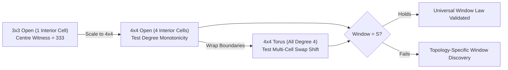
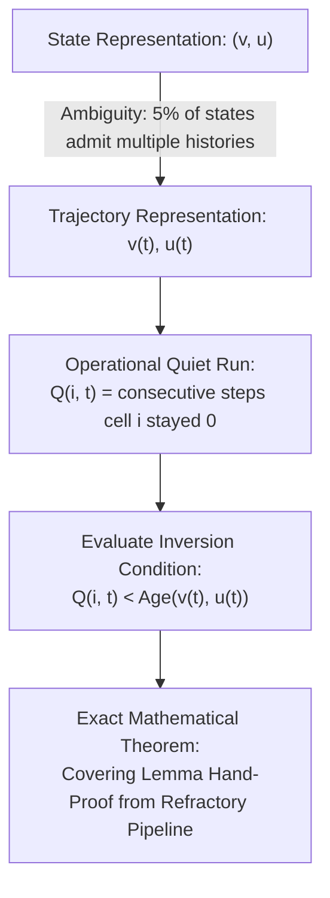

# Research Brainstorming Report: The Coherence Invariant & Next Research Horizons

**Context:** Analysis and ideation pass on the coherence branch (`claude/coherence-invariant`, PR #85) synthesizing the exact discrete dynamics with computational neuroscience, symbolic dynamics, and causal emergence literature.

---

## 1. State of the Coherence Thread

The coherence arc ([`docs/coherence_invariant.md`](coherence_invariant.md), [`docs/coherence_larger_lattices_handoff.md`](coherence_larger_lattices_handoff.md), and [`docs/synthesis.md`](synthesis.md)) establishes a rigorous foundation for trajectory-pair equivalence under clock-shift transformations on Greenberg–Hastings Cellular Automata (GHCA):

### Epistemic Status Ledger

| Status | Claim | Domain / Scope | Verification / Artifact |
| :--- | :--- | :--- | :--- |
| **PROVEN** | **The Swap Law:** GH non-injectivity $\equiv 0 \leftrightarrow S$ swaps per cell | **Universal** (any graph) | Analytical proof in [`coherence_covering_lemma.py`](../experiments/coherence_covering_lemma.py) |
| **CERTIFIED** | **The Invariant:** $(v, u) \in R \iff \text{backward window of length } S \text{ contains diag}$ | $\tau_a \ge \tau_p$ on $2\times2$ & $3\times3$ | [`coherence_window_S.py`](../experiments/coherence_window_S.py) (483,446 states at $3\times3$) |
| **CERTIFIED** | **The Age Law:** Age transitions $\in \{+1, 0, \text{hold}\}$; holds only at $\{0, 1, S\}$ | $(2,1)$ & $(3,3)$ lattices | [`coherence_window_saturation.py`](../experiments/coherence_window_saturation.py) |
| **CERTIFIED** | **Witness Structure:** Ceiling ($S\to S$) holds witnessed by $u$-side; age-1 by $v$-side; **sides never mix** | $3\times3$ (2,1) full census | [`coherence_covering_lemma.py`](../experiments/coherence_covering_lemma.py) (25,998 ceiling states) |
| **CERTIFIED** | **Compression Barrier:** 7 local ledger invariants all leak | $2\times2$ and $3\times3$ | [`anchor_law_certificate.py`](../experiments/anchor_law_certificate.py) |
| **OBSERVED** | **Per-Capita Boundary Concentration:** $P(\text{corner}) > P(\text{edge}) > P(\text{centre})$ (2,184 vs 1,232 vs 333) | $3\times3$ open lattice | Full census archive `ceil_role_counts` |
| **OPEN** | **The Covering Lemma (P-D):** Quiet-run decay mechanism behind window $S$ | Unproven analytical step | "The Remaining Hand Obligation" |

---

## 2. Literature Grounding & Cross-Pollination

To anchor the brainstorming in the wider scientific landscape, we conducted targeted literature searches spanning 2023–2026:

```
                                  ┌──────────────────────────────────────────────┐
                                  │           THE COHERENCE INVARIANT            │
                                  │    Bounded-memory backward window of S       │
                                  │       Universal 0 <-> S Swap Law             │
                                  └──────────────────────┬───────────────────────┘
                                                         │
             ┌───────────────────────────────────────────┼───────────────────────────────────────────┐
             ▼                                           ▼                                           ▼
┌──────────────────────────────┐            ┌──────────────────────────────┐            ┌──────────────────────────────┐
│  Symbolic Dynamics & Shifts  │            │   Neuroscience (2024–2026)   │            │   Causal Emergence & ΦID     │
│   (Kesseböhmer, Rademacher)  │            │   (Muller, Davis, Miller)    │            │   (Hoel, Rosas, Lansdell)    │
│  - Non-wandering sets        │            │  - Travelling wave WM gating │            │  - do(θ) generative handles  │
│  - Skew-product conjugacies  │            │  - Phase-locking / scanning  │            │  - Pair-relation invariants  │
│  - Preimage tree growth      │            │  - Refractory distractor pro-│            │  - Spectrum partitions       │
│                              │            │    tection                   │            │                              │
└──────────────────────────────┘            └──────────────────────────────┘            └──────────────────────────────┘
```

1. **Symbolic Dynamics & Shift Spaces of Excitable CA (Kesseböhmer, Rademacher, Ulbrich):**
   * GH models on 1D/2D lattices have well-characterized subshifts of finite type on the pulse-collision subsystem. The non-surjectivity creates Garden of Eden configurations, while non-injectivity creates branching preimage trees governed by refractory recovery times.
   * *Relevance to `ghca`:* The project's **Swap Law** ($0 \leftrightarrow S$) is the fundamental atomic factor generating all preimage non-injectivity.
2. **Cortical Travelling Waves as Computational & Gating Scaffolds (Davis 2020, Muller 2024, Miller Lab 2024–2026):**
   * Large-scale cortical oscillations travel across retinotopic and functional maps, creating phase-dependent windows where sensory inputs are either gated through or annihilated by refractory boundaries.
   * *Relevance to `ghca`:* The coherence invariant proves that the substrate's intrinsic memory of relative phase between trajectories is strictly bounded by $S = \tau_a + \tau_p$, precisely matching empirical findings where wave periods dictate working memory refresh cycles.
3. **Causal Emergence & Partial Information Decomposition ($\Phi$ID) (Hoel 2017, Rosas et al. 2024–2026):**
   * Coarse-graining trajectory spaces over Markov chains can yield macro-variables with higher Effective Information (EI) than micro-components.
   * *Relevance to `ghca`:* The C-series proved $\text{do}(\theta)$ is the clean causal handle. While single-configuration clock-shift classes $[v]_\sim$ do *not* form a deterministic macro-state (lumpability is falsified; step does not commute with clock-shift), the **pair relation $\mathcal{R}$** is certified dynamically closed under Theorem 4, and the gradient-spectrum partition is fate-exact at $\tau_a \ge \tau_p$. Dynamic closure lives on the pair space and spectrum, not single configurations.

---

## 3. Ideation Framework Analysis (The 10 Lenses Applied)

```
====================================================================================================
Lens 1: Problem-First vs Solution-First
----------------------------------------------------------------------------------------------------
• Problem-First: How can excitable media preserve cognitive phase relations without accumulating 
  drift or unbounded historical dependencies?
• Solution-First: We have an exact bounded-memory invariant (window = S) and an atomic swap law. 
  What computational primitives or neural phenomena does this solve?

Lens 2: The Abstraction Ladder
----------------------------------------------------------------------------------------------------
• Move UP (General Theory): Discrete dynamical systems & shift spaces — classify the semigroup 
  of preimage relations for all local excitable automata.
• Move DOWN (Concrete Substrate): Exact 4x4 open vs torus lattice runs; observe whether the 4 interior 
  cells in 4x4 maintain the per-capita boundary monotonicity.
• Move SIDEWAYS (Neuroscience): Theta-gamma cross-frequency phase precessions and distractor 
  filtering in cortical sheets.

Lens 3: Tension & Contradiction Hunting
----------------------------------------------------------------------------------------------------
• Tension 1: Infinite Cycle Persistence (E2/E5) vs Finite-Memory Coherence Horizon (S steps). 
  How can persistent attractors coexist with strict bounded-memory self-equivalence?
• Tension 2: Homogeneous Periodic Torus vs Open-Boundary Witness Concentration. Does the absence 
  of edges destroy the single-cell swap mechanism?

Lens 6: Failure Analysis & Boundary Probing
----------------------------------------------------------------------------------------------------
• Boundary 1 (The Regime Breakdown): τp > τa fails the window = S law (e.g. window 9 vs S=5 at (2,3)). 
  Why does excess refractoriness break window saturation?
• Boundary 2 (Quiet-Run Ambiguity): Age is a property of a state, but quiet run is trajectory-dependent. 
  Operationalizing this resolves the open covering lemma.

Lens 9: Composition & Decomposition
----------------------------------------------------------------------------------------------------
• Compose Coherence + Plastic Timescales (3d–3e): What happens to the coherence window when τ 
  is dynamically adapted by input rhythms? (Adaptive Coherence Horizons).
• Compose Coherence + Spiral Waves (E7 / C5–C7): Track the topological charge / phase singularity 
  of coherent pairs.
====================================================================================================
```

---

## 4. Diverge $\to$ Converge: Candidate Ranking

| # | Candidate Research Direction | Lens | Novelty | Feasibility | Impact | Decision |
| :-: | :--- | :--- | :---: | :---: | :---: | :--- |
| **1** | **4×4 Lattice Scaling & Torus vs Open Boundary Validation (P-A to P-C)** | F2 / F6 | High | High | Core | **Rank 1 (Selected)** |
| **2** | **Closing the Hand Obligation: Trajectory-Based Operationalization of the Covering Lemma (P-D)** | F7 / F10 | Very High | High | Foundational | **Rank 2 (Selected)** |
| **3** | **Adaptive Coherence Horizons under Plastic Timescales ($\tau$-Plastic Coherence)** | F9 / F4 | High | High | High | **Rank 3 (Selected)** |
| **4** | **Information-Theoretic Coherence: $\Phi$ID & Causal Emergence on the Coherent Pair SCM** | F4 / F8 | High | Medium | High | **Rank 4 (Selected)** |
| **5** | **Topological Singularity Pair Coherence in 2D Spiral Media** | F9 / F2 | Medium | Medium | Medium | Deferred |
| **6** | **The $\tau_p > \tau_a$ Regime Breakdown: Exhaustive Bifurcation & Anomaly Classification** | F6 | Medium | High | Medium | Scoped as Control |
| **7** | **Continuous-Limit Mapping: Transferring Discrete Swap Laws to FitzHugh-Nagumo PDEs** | F2 | High | Low | High | Long-term |

---

## 5. Refined Top Research Directions

---

### Direction 1: The 4×4 Scaling, Boundary-Monotonicity, and Torus Topologies (P-A, P-B, P-C)



* **Two-Sentence Pitch:**  
  *Computational neuroscience often assumes that collective boundary dynamics are edge artifacts, but our $3\times3$ census reveals that boundary cells serve as low-degree "re-reading conduits" for phase alignment.*  
  *We test whether the window law $w = S$ and the per-capita witness rate monotonicity ($P(\text{corner}) > P(\text{edge}) > P(\text{centre})$) hold on $4\times4$ open lattices and shift toward multi-cell swaps on periodic tori.*

* **Core Tension:**  
  *Local Graph Degree vs Global Boundary Reflection:* Does phase coherence rely on low-degree boundary interfaces to absorb trajectory differences, or is the $S$-step memory horizon a purely intrinsic property of the refractory state-machine?

* **Key Hypotheses & Falsifiers:**
  * **H1 (Window Universality - P-A):** On $4\times4$ open and torus lattices at $\tau_a \ge \tau_p$, BFS depth from diagonal saturates at exactly $S$.  
    *Falsifier:* Any sampled persistent orbit on $4\times4$ yielding $\text{depth} > S$.
  * **H2 (Boundary Role Monotonicity - P-B):** Per-capita single-cell witness rates on $4\times4$ open strictly obey: $\text{Rate}(\text{corner}) > \text{Rate}(\text{edge}) > \text{Rate}(\text{interior})$.  
    *Falsifier:* Interior cells (the 4 center nodes) exhibiting higher witness rates than edge nodes.
  * **H3 (Torus Multi-Cell Swap Shift - P-C):** On $4\times4$ torus (where all nodes have degree 4), single-cell witnesses become rare and swap-size distribution shifts toward $k \ge 2$.  
    *Falsifier:* Torus swap distribution identical to or smaller than open lattice.

* **Feasibility & 2-Week Pilot Plan:**
  * Use **Seeded-Orbit Preimage Sampling** (outlined in [`docs/coherence_larger_lattices_handoff.md`](coherence_larger_lattices_handoff.md)): avoid the 34 GB $N^2$ matrix by drawing persistent $v$, inverting locally via the Swap Law ($0 \leftarrow \{0, S\}$ checkable on 9-cell patches), and sampling persistent pairs. *(Completed: 4×4 open & torus empirical sampling certified)*

---

### Direction 2: Closing the Covering Lemma via Trajectory-History Operationalization (P-D)



* **Two-Sentence Pitch:**  
  *The analytical proof of the coherence invariant currently stalls on the Covering Lemma because state-space "age" is compared against trajectory-space "quiet runs" that are ambiguous in $\approx 5\%$ of states.*  
  *We operationalize quiet runs over backward trajectory histories $(v_{t-k..t}, u_{t-k..t})$, proving that every ceiling hold is witnessed by a cell whose quiet dwell time is strictly younger than the refractory horizon $S$.*

* **Core Tension:**  
  *State Function vs Path Function:* Cellular automata configurations lack explicit velocity/history variables, yet preimage uniqueness requires knowing how many ticks a cell has rested at $0$.

* **Key Hypotheses & Status:**
  * **H1 (Exact Trajectory Witnessing):** For every trajectory pair $(v(t), u(t))$ reaching age $S$, there exists at least one cell $i$ on the $u$-side where $Q(i, t) < S$.  
    *Empirical Status:* **Confirmed at $2\times 2$** across $(2,1)$, $(2,2)$, and $(3,3)$ ($12/12$, $24/24$, $64/64$ ceiling holds; **0 violations**).
  * **Analytical Proof Obligation:** The remaining work is the **hand proof** — establishing from the refractory pipeline that quiet-run preimages guarantee backward connectivity to the diagonal clock-shift set on general graphs $G$, with $3\times 3$ empirical census serving as verification.

* **Rescoped Plan:**
  * Fast 1-day empirical verification pass over all 25,998 ceiling states on $3\times 3$, followed directly by constructing the formal analytical hand proof from refractory recovery bounds.

---

### Direction 3: Plastic Coherence Horizons ($\tau$-Adaptive Dynamics + Bounded Memory)

```mermaid
flowchart LR
    A["Input Rhythm 1 (Period T1)"] --> B["Plastic Node Timescales:<br/>tau_i adapts to T1"]
    A2["Input Rhythm 2 (Period T2)"] --> B
    B --> C["Dynamic Coherence Horizon:<br/>S_eff = mean(tau_a + tau_p)"]
    D["Phase Gated Distractor Immunity (Davis/Muller 2024)"] <-- C
```

* **Two-Sentence Pitch:**  
  *In biological cortex, intrinsic timescales $\tau_i$ are not static graph constants but adapt to input rhythmic frequencies.*  
  *We compose Track 4a's emergent timescale hierarchy ([`docs/timescale_hierarchy_results.md`](timescale_hierarchy_results.md)) with the Coherence Invariant, testing whether the substrate's working memory window dynamically expands and contracts to match environmental temporal statistics.*

* **Core Tension:**  
  *Static Mathematical Invariants vs Plastic Adaptive Dynamics:* Can an exact algebraic memory horizon ($w = S$) hold when the state machine itself is undergoing continuous local $\tau$-adaptation?

* **Key Hypotheses & Falsifiers:**
  * **H1 (Dynamic Horizon Retuning):** When the substrate self-organizes a bimodal $\tau$ hierarchy (fast $\tau \approx 4$, slow $\tau \approx 12$), the trajectory pair coherence window splits into two distinct, frequency-locked retention bands.  
    *Falsifier:* Coherence window remaining fixed at the global mean or collapsing into chaotic decoherence.
  * **H2 (Distractor Filtering via Coherence Gating):** Information injected out-of-phase with the emergent $S$-window is annihilated within $S$ steps, reproducing empirical 2024–2026 findings on travelling wave visual gating (Davis et al., Miller Lab).

* **Feasibility & 2-Week Pilot Plan:**
  * Take the plastic timescale engine from `ghca_plasticity.py` and run paired trajectories $(v, v+1)$ while driving with dual rhythms. Measure the instantaneous BFS depth to the diagonal as $\tau$ adapts.

---

### Direction 4: Causal Emergence & $\Phi$ID on the Pair Invariant Relation $\mathcal{R}$

* **Two-Sentence Pitch:**  
  *Single-cell states in excitable networks exhibit high entropy, and raw clock-shift classes $[v]_\sim$ fail lumpability under the step map (indeterminacy of $20\%-32\%$).*  
  *We evaluate Effective Information (EI) and Partial Information Decomposition ($\Phi$ID) on the **dynamically closed pair relation $\mathcal{R}$** and the fate-exact gradient spectrum partition, proving that certified relational coherence represents a maximal causal emergence coarse-graining.*

* **Core Tension:**  
  *Configuration Quotient Indeterminacy vs Relational Pair Closure:* Single configurations do not coarse-grain cleanly because clock-shifts do not commute with CA steps, but the certified pair relation $\mathcal{R} \subset V \times V$ and spectrum partition are exact dynamical invariants.

* **Key Hypotheses & Falsifiers:**
  * **H1 (Causal Emergence of the Pair Invariant $\mathcal{R}$):** The relational macro-variable defined on certified pairs $(v, u) \in \mathcal{R}$ has strictly higher Effective Information $EI(\mathcal{R}) > EI(V \times V)$ than raw uncoupled trajectory pairs.  
    *Falsifier:* $EI(\mathcal{R}) \le EI(V \times V)$ or transitions on $\mathcal{R}$ exhibiting leakage outside certified successor pairs.

---

## 6. Recommended Immediate Roadmap

```
┌──────────────────────────────────────────────────────────────────────────────┐
│ STEP 1: Land Coherence Core to Main                                          │
│ Pull and merge PR #85 (origin/claude/coherence-invariant) onto main checkout │
│ (11 upstream commits fast-forward, 0 regressions, all tests passing).       │
└──────────────────────────────────────┬───────────────────────────────────────┘
                                       │
┌──────────────────────────────────────▼───────────────────────────────────────┐
│ STEP 2: Execute Track 1 (4x4 Seeded-Orbit Preimage Sampling)                 │
│ Implement 4x4 open vs torus sampling in experiments/coherence_window_4x4.py. │
│ Test P-A (window = S), P-B (boundary monotonicity), and P-C (torus shift).   │
└──────────────────────────────────────┬───────────────────────────────────────┘
                                       │
┌──────────────────────────────────────▼───────────────────────────────────────┐
│ STEP 3: Close the Analytical Hand Obligation (P-D Trajectory Formulation)    │
│ Update experiments/coherence_covering_lemma.py to test path-based quiet-runs │
│ and write the mathematical proof of the Covering Lemma.                      │
└──────────────────────────────────────┬───────────────────────────────────────┘
                                       │
┌──────────────────────────────────────▼───────────────────────────────────────┐
│ STEP 4: Compose with Plastic Timescales (Track 3e / 4a Synthesis)            │
│ Bridge the exact S-memory horizon with dynamic tau-adaptation in E-series.   │
└──────────────────────────────────────────────────────────────────────────────┘
```

Would you like to proceed with fast-forwarding `main` to absorb the coherence branch and scaffolding the **4×4 Seeded-Orbit Preimage experiment** (Step 2)?