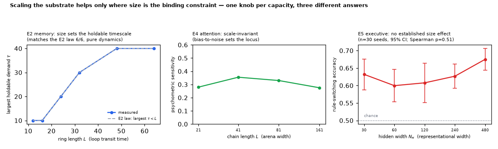

# Scaling — does substrate size buy cognitive capacity?

*Run of `experiments/scaling_capacities.py`. Addresses the size half of the
"degree/size sweep" left open under Track 3b (Deferred) in
[`next_steps.md`](next_steps.md), across the three capacities the E-series
established separately: working memory (E2), selective attention (E4), executive
control (E5).*

## The question, and why one answer won't do

"Scale up the substrate" is not a single manipulation on this substrate, because
each capacity's medium has a **different natural size knob**, and each knob means
something different dynamically:

| capacity | knob | what size *is* |
|---|---|---|
| E2 working memory | ring length `L` | loop transit time |
| E4 selective attention | chain length `L` | arena width for wave collision |
| E5 executive control | hidden width `N_H` | representational width |

So the useful question is not "does bigger help" but **which capacities are
size-limited**. The three answers here differ, and the differences are
interpretable from the mechanism in each case.

## Substrate / analysis boundary

These three are **not** measured at the same level, and the curves must not be
read as peers:

- **E2 is pure dynamics** — no plasticity at all. It measures what the medium can
  *hold*, not what a learner can find.
- **E4 is dynamics plus a fixed readout** — no learning.
- **E5 involves learning** (Line A routing on the conjunction medium).

A flat E4 curve is therefore a claim about the *medium*; an E5 curve is a claim
about *medium + learning rule*, and a null there could be either. Sizes are also
not comparable across capacities — a 24-node ring and a 240-node hidden medium
are different objects — so only the *shape* of each curve in its own knob means
anything.

## Results

### E2 memory — size-limited, and exactly as the law predicts

Sweeping ring length `L` against a grid of demand timescales
`τ ∈ {10, 20, 30, 40}`, the largest τ a loop can hold to the longest delay (300
steps) is:

| `L` | 12 | 16 | 24 | 32 | 48 | 64 |
|---|---|---|---|---|---|---|
| largest holdable τ | 10 | 10 | 20 | 30 | 40 | 40 |
| E2 law (largest grid τ < L) | 10 | 10 | 20 | 30 | 40 | 40 |

**6/6 exact agreement.** Memory capacity here *is* loop length, in the precise
sense that `L` sets the largest timescale demand the loop tolerates — which is
E2's `τ < L` law read along the size axis instead of the τ axis. The flattening
at `L = 48, 64` is the τ grid's ceiling (40), not a substrate limit.

*Caveat:* an earlier version of this sweep held τ = 10 fixed and found retention
saturated at 1.0 for every `L` — trivially, since τ < L everywhere. Size only
looks binding when the *demand* is scaled with it. That is a statement about how
to pose the question, not a result.

### E4 attention — scale-invariant

Psychometric sensitivity (P(attended wins) at bias 1 minus at bias 0, jitter
1.5, n=200 per cell):

| `L` | 21 | 41 | 81 | 161 |
|---|---|---|---|---|
| sensitivity | +0.28 | +0.35 | +0.33 | +0.28 |

Over an **8× range in arena width the sensitivity spread is 0.08** with no trend.
This is what E4's mechanism predicts: the winner is decided by *where* the two
waves annihilate, and that locus is set by the bias-to-noise ratio — a
dimensionless quantity — not by how much room the waves have to travel. Attention
on this substrate does not need a bigger arena; it needs a better
signal-to-noise ratio.

### E5 executive control — **no established size effect** (negative result)

| `N_H` | 30 | 60 | 120 | 240 | 480 |
|---|---|---|---|---|---|
| switching accuracy | 0.632 [0.588, 0.676] | 0.600 [0.553, 0.646] | 0.608 [0.552, 0.664] | 0.627 [0.592, 0.661] | 0.675 [0.644, 0.706] |

n=30 seeds, 95% CI. The endpoint gap is +0.043 (30 → 480) and the ordering is
suggestive, but **the trend does not hold up**:

- **Spearman(N_H, accuracy) ρ = +0.40, p = 0.505** — not significant.
- **The 30 and 480 CIs overlap** ([0.588, 0.676] vs [0.644, 0.706]).
- **The middle three sizes are a plateau** — spread 0.027 across a 4× range.
- Per-seed values are **strongly bimodal at every size** (e.g. at `N_H=120`:
  0.18, 0.31, … , 0.83, 0.84) — the E3 lesson, and it is the dominant variance
  here, not size.

**We cannot claim from this that widening the conjunction medium improves
executive control.** A 16× increase in `N_H` moves the mean by less than the
per-seed spread. This is a genuine null on the size axis, and it is *informative*
next to 3c/P4, which found representational capacity to be the lever for
continual-learning *interference*: that result was about holding several
task mappings apart, whereas rule switching with a persistent context ring may
simply not be limited by hidden width at all. Different capacity, different
binding constraint.

## What this says overall

**Size helps exactly where size is the binding constraint, and nowhere else.**
Memory is bounded by loop transit time, so it scales with `L` deterministically.
Attention is bounded by signal-to-noise, so it is invariant to arena width.
Executive control shows no measurable size dependence in the range tested — its
limit is elsewhere (candidates: the context ring's persistence, the
`theta_h`/fan-in operating point, or the credit rule).

For a Line-B timescale policy this sharpens the tradeoff in
[`topology_cycle_capacity.md`](topology_cycle_capacity.md): growing the substrate
buys *retention* (more room for longer loops) but not *selectivity*, and the
loop-capacity bound says the extra room is spent on fewer, longer loops.

## Caveats

- **E5's null is a null in this range and protocol**, not proof of no effect.
  24 blocks × 20 trials with alternating rules; a longer schedule, a different
  `theta_h`, or per-task heads could all change it. The bimodality means n=30 is
  adequate to reject the trend but not to bound the effect tightly.
- **E2's ceiling is the τ grid**, not the substrate. Extending τ past 40 would
  extend the line.
- **E4's null could be masked by a floor/ceiling** — sensitivity ~0.3 at every
  size sits mid-range, so the flatness is not a saturation artifact, but only one
  jitter level (1.5) was tested.
- **One knob per capacity.** Nothing here varies *degree* (the other half of
  Track 3b) or the topology class; `smallworld` hidden media only.
- **No cross-capacity comparison is licensed** — different measurement levels
  (dynamics vs dynamics+readout vs learning), different units.
