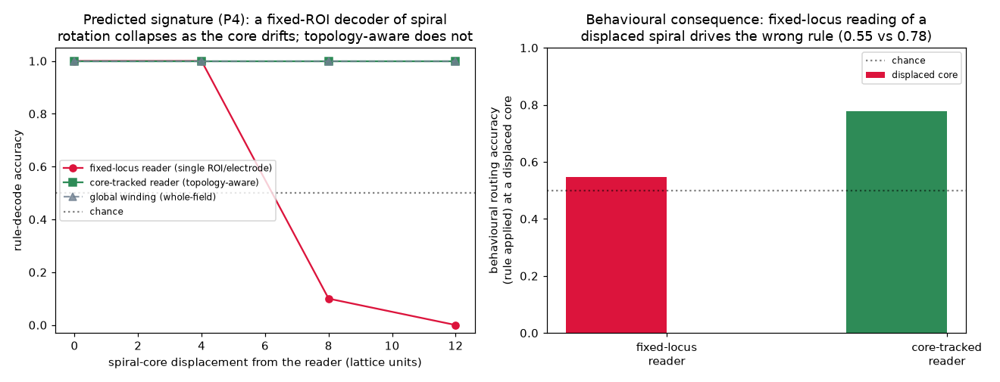

# Model → data: falsifiable predictions for cortical spiral waves

*Track 2b of [`next_steps.md`](next_steps.md). Turns the spiral results — E7
([`e7_results.md`](e7_results.md)) and the causal split C5–C7
([`c5_results.md`](c5_results.md), [`c6_results.md`](c6_results.md),
[`c7_results.md`](c7_results.md)) — into concrete, falsifiable predictions for
real spiral-wave recordings. These are **model-derived hypotheses, not claims
about neural data**; the point is that the toy substrate makes the rotating-wave
neuroscience's open question — **is the wave causal or epiphenomenal?** — sharp
and testable, and says *which measurement* would decide it.*

## The question the model sharpens

Cortical activity organises into rotating (spiral) waves whose **rotation
direction is task-relevant** (Xu/Gong et al., *Nat. Hum. Behav.* 2023), coordinated
brain-wide with a topography shaped by anatomy (Ye/Steinmetz et al.,
bioRxiv 2023.12.07.570517 / *Science* 2026). The field's controversy: do these
waves *do causal work*, or are they an epiphenomenal readout of activity that is
really organised some other way? A correlational finding ("rotation direction
classifies the task") cannot answer this. The E7 + C5–C7 substrate is an
*existence proof with a ground-truth causal graph*: a medium where rotation
direction genuinely carries a rule (E7), is a causal **mediator** on a
`θ_nucleation → χ → behaviour` path (C7), is **necessary** for flexible switching
(C6-B), and yet whose causal status is **contingent on the reader and the outcome**
(C5, C7-A). Each of those model facts implies a *different* measurable signature in
data. Below, each prediction names the observable, the discriminator against an
epiphenomenal / non-spiral account, and what would falsify it.

## Summary — model result → prediction

| model result | prediction | key discriminator |
|---|---|---|
| E7: chirality is a *persistent, readable* rule variable | **P1** rotation direction encodes a latent rule and *persists* across delays | persistence across a stimulus-free interval, not a transient |
| C6-B / E7 ablation: *persistent core* necessary for switching, not routing | **P2** disrupting persistent cores selectively impairs *flexibility*, spares fixed mappings | double dissociation switching vs single-rule |
| C7-A: outcome-relativity (χ → rule, not content) | **P3** chirality covaries with *which rule*, not with stimulus discriminability | double dissociation rule vs content |
| C5: fat-handed at a fixed locus, well-posed read topologically | **P4** a fixed-ROI rule decoder fails as the core *drifts*; a core-tracked one does not | decoder accuracy vs core displacement |
| C6-A / C7-B: clean handle is *nucleation*; χ *mediates* θ→B | **P5** nucleation conditions predict behaviour; chirality *mediates* the effect | mediation / screening-off of the generator |
| E7 no-flux boundary: a lone signed core needs a charge sink | **P6** persistent single-handed cores localise to areal borders/edges | spatial coincidence of cores with anatomical boundaries |

---

## P1 — Rotation direction persistently encodes a latent rule

- **Model basis.** E7: a seeded spiral of a given handedness nucleates and holds
  its net topological charge (±1) for the full block (400 steps); the rotation
  direction is decodable (global charge 1.00, local winding 0.90–1.00) and, in
  Phase B, *carries the task rule* (switching 0.86; rotation→rule decode 1.00).
- **Prediction.** In a task with a binary latent rule/context held across a delay,
  the **sign of cortical spiral rotation** should (a) classify the rule and
  (b) **persist** across the stimulus-free delay, tracking the rule rather than the
  stimulus.
- **Discriminator.** An epiphenomenal or purely feedforward account predicts the
  rule is decodable from *evoked* activity but has no reason to predict a
  *persistent rotation-direction* code that survives a delay. The signature is the
  **persistence of the sign** through the interval where the cue is absent.
- **Falsifier.** If rotation direction classifies the rule only transiently at
  cue/response and carries no information during the delay, P1 fails.
- **Feasibility.** Widefield voltage/Ca²⁺ imaging (mouse; Ye/Steinmetz paradigm)
  or MEG/ECoG phase-gradient analysis (human; Gong paradigm) during a delayed
  match-to-rule or set-shifting task.

## P2 — Persistent cores are necessary for flexibility, not for fixed mappings *(highest-reach)*

- **Model basis.** C6-B / E7 discriminator: ablating the core's *persistence*
  (letting it die ~10 steps after nucleation) collapses **switching** to chance
  (0.85→0.52; E7 0.86→0.49) while **single-rule** performance is spared
  (0.90 vs 0.89). The persistent core is causally required specifically for
  *holding a rule across a block*, not for the stimulus→response routing itself.
- **Prediction.** Disrupting persistent spiral cores — trials/epochs where a core
  fails to persist or drifts out, or a causal perturbation (targeted optogenetic /
  micro-cooling of a core region) — should **selectively impair cognitive
  flexibility** (set-shifting, rule reversal) while **sparing** well-learned,
  re-cued stimulus→response mappings.
- **Discriminator.** This is a *double dissociation*, which an "activity level"
  account does not predict: the same disruption should leave fixed mappings intact.
  Epiphenomenalism predicts *no* behavioural effect of disrupting the wave at all.
- **Falsifier.** If disrupting persistent cores impairs fixed mappings equally
  (no dissociation), or has no behavioural effect, P2 fails.
- **Feasibility.** The strongest test needs a causal handle on cores
  (optogenetics in mouse cortex during a flexibility task); a weaker correlational
  version compares flexibility on trials with vs without a spontaneously persistent
  core.

## P3 — Outcome-relativity: chirality is causal for the rule, inert for stimulus content

- **Model basis.** C7-A: sweeping `do(χ)` moves the **rule** outcome fully (1.00)
  and the stimulus-**content** outcome essentially not at all (0.11); a different
  handle (`do(g_route)`, routing weights) controls content (1.00). "Is rotation
  direction causal?" has no answer without naming the outcome.
- **Prediction.** A **double dissociation** in data: spiral chirality should
  covary with (and, under perturbation, control) *which rule/response mapping* is
  applied, but **not** stimulus discriminability; a separate variable (firing-rate
  / amplitude routing) should carry stimulus content independent of chirality.
- **Discriminator.** "The wave carries everything" predicts chirality correlates
  with *all* decodable task variables; P3 predicts it is selective for the rule
  axis and inert for the content axis.
- **Falsifier.** If chirality carries stimulus identity as strongly as it carries
  the rule, the outcome-relativity structure is absent and P3 fails.

## P4 — Topological vs local read-out: fixed-ROI decoders fail as the core drifts

- **Model basis.** C5: chirality is **fat-handed when read at a fixed locus** — a
  fixed-centre reader decodes the rule perfectly for a centred core but collapses
  as the core is displaced (1.00 → 0.10 at disp-8 → 0.00 at disp-12), while a
  **core-tracked (topology-aware)** reader stays at 1.00; the *behaviour* of a
  fixed-locus router on displaced cores drops correspondingly (routing 0.55 vs 0.78).
- **Prediction.** A rule decoder built on a **fixed electrode/ROI** should degrade
  **specifically as a function of spiral-core displacement** from that site,
  whereas a **core-tracked / whole-field winding** decoder should stay robust.
  This is a graded, quantitative signature (below), not a yes/no.



- **Discriminator.** A local-activity code predicts decoding depends on *activity
  at the ROI*, not on the *topological relationship* between ROI and core; P4
  predicts the collapse is organised by **core displacement** and is rescued by
  tracking the core — a topological, not a local, dependence.
- **Falsifier.** If fixed-ROI rule-decoding is insensitive to core position (or
  core-tracking gives no rescue), the code is not topological in this sense and
  P4 fails.
- **Feasibility.** Directly testable in existing high-density imaging: re-decode
  the rule from a fixed ROI vs a core-tracked window as a function of measured core
  position. Recast here from the model's C5 run (`experiments/p2b_signature_figure.py`).

## P5 — The clean causal handle is nucleation; chirality mediates the generator → behaviour path

- **Model basis.** C6-A: the generative handle `do(θ_χ)` (nucleation seed) is
  well-posed for *every* reader (0σ band) where the wave handle `do(χ)` is
  reader-dependent. C7-B: setting the nucleation seed and then re-injecting
  chirality mid-way shows behaviour tracks the **injected** chirality and is
  **independent of the seed** — chirality *screens off* its own generator, i.e. it
  is a genuine mediator on `θ_nucleation → χ → behaviour`.
- **Prediction.** Manipulations at **spiral nucleation** — anatomy/boundaries, or
  stimulation that seeds cores — should predict behaviour more reliably than the
  wave aggregate, and a **mediation analysis** should find chirality *screens off*
  the nucleation condition (the generator affects behaviour only through the
  chirality it produces). Ties directly to Ye/Steinmetz's "axonal architecture
  shapes the spiral."
- **Discriminator.** Epiphenomenalism predicts nucleation manipulations affect
  behaviour *without* chirality mediating; a pure-wave account predicts the wave
  aggregate is the better predictor than its generator. P5 predicts specifically
  the mediated chain.
- **Falsifier.** If chirality does not mediate the nucleation→behaviour effect
  (the generator retains direct predictive power controlling for chirality), the
  mediation structure is absent and P5 fails.

## P6 — Persistent single-handed cores localise where boundaries break the charge constraint

- **Model basis.** E7: on a periodic torus the total topological charge must be
  zero, so a lone spiral necessarily breeds a compensating anti-spiral; only
  **no-flux (anatomical) boundaries** let a single signed core persist. The
  boundary is not cosmetic — it is what permits a persistent lone chirality.
- **Prediction.** Persistent, single-handed cores should **localise to regions
  where anatomy breaks the zero-net-charge constraint** — areal borders, cortical
  edges, sharp connectivity discontinuities — rather than appearing uniformly in
  homogeneous interior. This is a *structural* prediction complementing Ye et al.'s
  observation of anatomically-organised spiral topography.
- **Discriminator.** A purely dynamical (anatomy-blind) account predicts cores are
  distributed by local excitability alone; P6 predicts their **persistence and
  handedness statistics are organised by anatomical boundaries** (charge sinks).
- **Falsifier.** If persistent lone cores occur with equal probability in
  homogeneous interior as at boundaries, the boundary/charge account is wrong.

---

## Honest limits

- **These are hypotheses, not results.** The substrate is a toy Greenberg–Hastings
  medium; it *illustrates* mechanisms and yields *predictions*, it does not
  demonstrate them in cortex. Confirmation requires the recordings/manipulations
  named above.
- **Some predictions need a causal handle that may not yet exist** (P2's core
  disruption, P5's nucleation manipulation). Those are the highest-reach but
  hardest; P1, P3, P4 are testable on existing recordings by re-analysis.
- **The model's own caveats carry over.** E7's rotation readout and E5-derived
  router are engineered, not learned end-to-end (see
  [`extensions_review.md`](extensions_review.md)); the causal `do`-operations
  concern *which query is well-posed*, not biological accessibility (C5–C7 caveats).
  These do not weaken the *predictions* (which are about observables), but they mean
  the model is an existence proof of a mechanism, not a fitted model of cortex.
- **Citations.** Xu/Gong et al. 2023 (*Nat. Hum. Behav.*) and Ye/Steinmetz et al.
  (bioRxiv 2023.12.07.570517 / *Science* 2026) are the empirical anchors (both
  verified real); Muller/Benigno et al. 2023 (*Nat. Commun.*) for wave-borne
  prediction; the causal framing follows Jalaldoust & Zabeh (arXiv:2511.06602) as
  used in the C-series. The 2b predictions are ours, derived from the model.

## Reproduce the bridge figure

```
python3 experiments/p2b_signature_figure.py   # reads result/c5/c5_data.npz
```

Writes `docs/figures/spiral_predictions_signature.png`.
