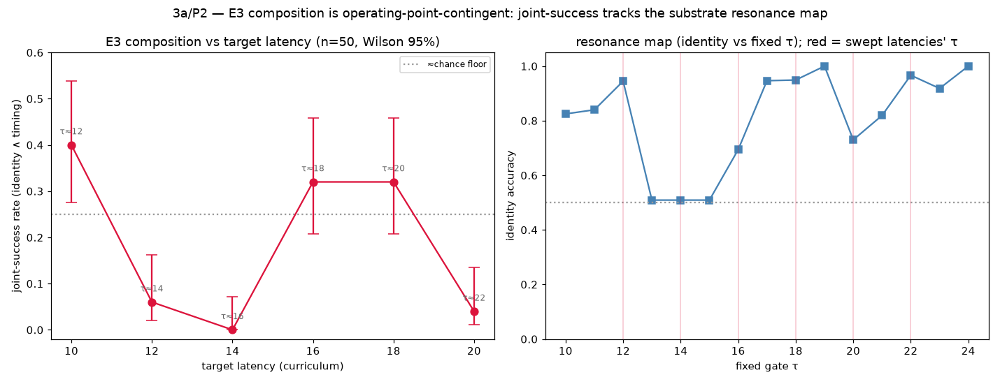
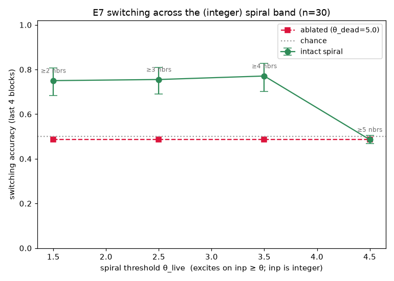
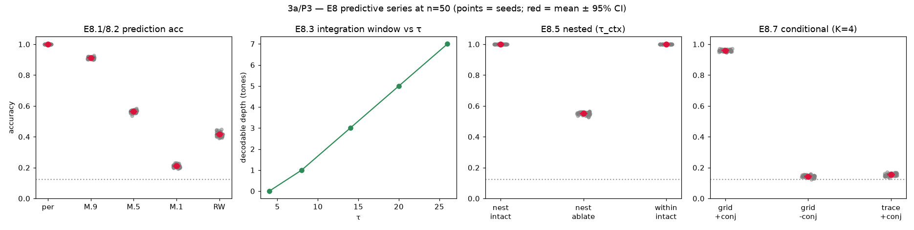

# 3a Results — Statistics & Operating-Point Sweeps

*Track 3a, Phase 1 (see [`stats_sweeps_plan.md`](stats_sweeps_plan.md)). Every
E-series headline dissociation re-run at **n=50 seeds** with bootstrap 95% CIs,
to convert "shown at n=5 at a point" into a real interval. Harness:
[`ghca_stats.py`](../ghca_stats.py); driver: `experiments/stats_seed_scaleup.py`;
figure: `experiments/stats_aggregate.py`. This does **not** alter the experiments'
committed n=5 numbers (those still reproduce bit-identically — see
[`core_review.md`](core_review.md)); it adds an independent larger-sample layer in
`result/stats/`.*

## Method

Each experiment's own per-seed run-function is called for seeds 0–49; the headline
scalar is reduced exactly as the result doc does (e.g. last-6-block mean for
switching). CIs are 10 000-sample percentile bootstraps; the E3 joint-success
*rate* uses a Wilson interval. **Distribution shape** is read from the 10-bin
histogram, not from Sarle's bimodality coefficient alone — BC flags a
ceiling-with-failure-tail as readily as a true two-mode split, so the shape column
below distinguishes `ceiling+tail`, `spread`, `bimodal`, and `unimodal` by mass.

## Master table

| headline | n | mean | 95% CI | shape |
|---|:--:|:--:|:--:|---|
| E1 conditioning — A | 50 | 0.926 | [0.893, 0.955] | ceiling+tail |
| E1 conditioning — B | 50 | 0.461 | [0.364, 0.561] | bimodal |
| E2 retention @D=200 — A | 50 | 0.000 | [0.000, 0.000] | point |
| E2 retention @D=200 — B | 50 | 1.000 | [1.000, 1.000] | point |
| E3 timed — A identity | 50 | 0.722 | [0.621, 0.818] | spread |
| E3 timed — B identity | 50 | 0.640 | [0.547, 0.730] | unimodal |
| E3 factored — curriculum identity | 50 | 0.715 | [0.626, 0.800] | spread |
| E3 factored — factored identity | 50 | 0.498 | [0.470, 0.522] | unimodal |
| **E3 factored — joint-success rate** | 50 | **0.320** | **[0.208, 0.458]** (Wilson) | 16/50 |
| E5 switching — intact | 50 | 0.833 | [0.805, 0.857] | ceiling+tail |
| E5 switching — ablate | 50 | 0.197 | [0.189, 0.206] | unimodal |
| E7 switching — intact | 50 | 0.751 | [0.704, 0.794] | ceiling+tail |
| E7 switching — ablate | 50 | 0.498 | [0.484, 0.511] | unimodal |
| E9 routing — emergent | 50 | 0.863 | [0.841, 0.885] | ceiling+tail |
| E9 routing — frozen | 50 | 0.238 | [0.229, 0.247] | unimodal |

## Verdicts

**Confirmed robust — CIs cleanly separated, tight, and unimodal on the load-bearing
arm.** These *strengthen* going from n=5 to n=50:
- **E2 working memory** — A=0.000 vs B=1.000 at D=200, both degenerate points. The
  Line-B-holds / Line-A-collapses dissociation is exact.
- **E5 executive** — switching intact 0.833 [0.805, 0.857] vs ablated 0.197
  [0.189, 0.206]; a ~0.64 gap with non-overlapping CIs. The ablation dissociation
  is rock-solid.
- **E9 emergent conjunctions** — emergent routing 0.863 [0.841, 0.885] vs the
  no-self-organisation frozen control 0.238 [0.229, 0.247]; selectivity emergent
  1.00 vs frozen 0.002. The afforded→learned result holds firmly at scale.

**Present but softened / noisier than n=5 implied** — the dissociation direction
holds (CIs separated) but the magnitude drops and a failure sub-population appears
that the 5-seed sample missed:
- **E7 switching** — intact **0.751 [0.704, 0.794]** vs ablated 0.498; the gap holds,
  but the intact headline is materially below the doc's n=5 **0.86**, with a
  low-seed tail.
- **E3 timed identity** — A 0.722 [0.621, 0.818] vs B 0.640 [0.547, 0.730]; on the
  *mean* the identity dissociation is weak (CIs overlap), because A's identity is
  bimodal — median 1.00 (28/50 at ceiling) with a ~7-seed zero-failure cluster.
  The n=5 "A=1.00 on all seeds" was a lucky-seed sample; the mechanism (A learns
  identity) holds on most seeds but not all.
- **E1 conditioning** — A 0.926 [0.893, 0.955] (ceiling with a small failure tail)
  vs B 0.461 [0.364, 0.561] (genuinely spread across the range). A≫B holds; B is
  messier than a clean "chance" label suggests.

**The marquee — E3 composition.** Joint success (identity≈1 **and** timing in
tolerance) is **16/50 = 0.320, Wilson 95% [0.208, 0.458]**. This replaces the
audit's "1 of 5 seeds" anecdote with a real interval: composition is a **partial,
unreliable capability (~1/3 of seeds)**, not the "~quadrupling" the original
headline implied and not the near-nothing the 1/5 reading implied. Curriculum
identity is `spread` (a chance cluster at ~0.5 plus a ceiling cluster), confirming
the audit's bimodality call at scale. The natural next question — does the rate
rise off the hand-picked latency=16 resonance? — is **P2**.

## Honest notes

- **The bimodality flag is a screen, not a verdict.** Sarle's BC flagged several
  ceiling-concentrated arms (E1-A, E5/E7 single-rule) that are *not* two-moded but
  ceiling-with-tail. The shape column and the strip figure are the honest read; BC
  just triggers a look.
- **n=50 means differ slightly from the committed n=5 headlines** (e.g. E5 0.89→0.833,
  E9 0.84→0.863). These are independent larger samples, not regressions — the n=5
  numbers still reproduce exactly. Where the shift is *material* (E7 switching;
  E3-timed A identity), the individual result-doc headlines should be updated — see
  below.

## Recommended headline edits (flagged, not yet applied)

Per [`process.md`](process.md), softening a published headline warrants a look
before editing the result docs. Proposed:
- **E7** (`e7_results.md`): switching intact 0.86 → **0.75 [0.70, 0.79]** at n=50,
  with a low-seed tail; gap to ablated (0.50) preserved.
- **E3** (`e3_results.md`): A-identity is bimodal at n=50 (median 1.00, mean 0.72);
  composition joint-success **32% [21%, 46%]** replaces "1/5 seeds".

## P2 — operating-point sweeps

Two sweeps around the hand-chosen operating point. Drivers:
`experiments/stats_e3_latency_sweep.py`, `experiments/stats_e7_theta_sweep.py`;
figure: `experiments/stats_p2_figures.py`.

### E3 composition IS operating-point-contingent (the audit's "lucky resonance", confirmed)

Sweeping the curriculum's target latency (which sets the required gate τ ≈
latency+2) at n=50 per point, joint-success swings **0%–40%** and tracks the
substrate's identity-vs-τ resonance map:

| target latency | required τ | resonance @τ | joint-success (Wilson 95%) |
|:--:|:--:|:--:|:--:|
| 10 | ~12 | 0.94 | **0.40 [0.28, 0.54]** |
| 12 | ~14 | 0.51 | 0.06 [0.02, 0.16] |
| 14 | ~16 | 0.69 | **0.00 [0.00, 0.07]** |
| 16 | ~18 | 0.95 | 0.32 [0.21, 0.46] |
| 18 *(default)* | ~20 | 0.73 | 0.32 [0.21, 0.46] |
| 20 | ~22 | 0.97 | 0.04 [0.01, 0.14] |

Composition is high only where the required τ lands in an identity-learnable
zone (τ≈12, τ≈18) and collapses to ≈chance in the τ13–16 dead zone. The default
target latency (18) sits near the top of the range — **a favorable operating
point, not a unique one** (latency 10 is comparable/better). This substantiates
the audit's claim: the composition result is contingent on the chosen task
landing in a substrate resonance. One honest wrinkle — latency 20 (τ≈22) has high
*identity* resonance (0.97) but low *joint*-success (4%), because timing
precision (|latency − target| ≤ 2) degrades at high τ even when identity is
learnable; joint-success needs both.

### E7 switching IS robust across the θ neighborhood

The substrate excites on `inp ≥ θ` with integer neighbour-counts, so θ is
effectively an integer threshold ⌈θ⌉. Sweeping across distinct thresholds
(n=30):

| θ_live | effective | intact switching (95% CI) | vs ablated | Cohen d |
|:--:|:--:|:--:|:--:|:--:|
| 1.5 | ≥2 nbrs | 0.750 [0.683, 0.807] | 0.486 | 2.05 |
| 2.5 | ≥3 nbrs | 0.755 [0.690, 0.810] | 0.486 | 2.13 |
| 3.5 | ≥4 nbrs *(band)* | 0.771 [0.703, 0.827] | 0.486 | 2.18 |
| 4.5 | ≥5 nbrs *(death)* | 0.486 [0.467, 0.504] | 0.486 | 0.00 |

The intact-vs-ablated switching dissociation holds firmly (d≈2.1, CIs clear of
the ablated baseline) across the excitable range ≥2…≥4, and collapses to the
ablated baseline exactly at the death threshold ≥5 (which *is* the ablation).
So the softened-but-real E7 headline (P1) is **not knife-edge on θ** — it is
robust across the operating-point neighborhood, failing only at the substrate's
death boundary. *(Caveat: below the E0 organised-spiral band the intact readout
may be driven by a less-organised excitation pattern than a clean rotating core;
characterising the mechanism off-band is deferred — the dissociation, not its
microstructure, is what this sweep establishes.)*

### P2 verdict

The two sweeps sharpen tension 2 rather than simply retiring it: **E3 composition
is genuinely operating-point-contingent** (a fragile, ~1/3-at-best capability that
depends on task–substrate resonance), while **E7 switching is genuinely robust**
across the θ neighborhood. Both are honest, and both were invisible at n=5 at a
single point.

## P3 — E8 predictive series + C-series seed/CI

Driver: `experiments/stats_p3.py`; figure: `experiments/stats_p3_figure.py`.

### E8 — the thinnest series is actually the most robust

E8 (E8.1–8.7) ran at n=3 with several deterministic ridge panels — the smallest
seed counts in the repo. Scaled to n=50, every headline reproduces with
**razor-tight CIs**, because ridge readouts on a fixed substrate are inherently
low-variance:

| E8 headline | n=50 mean | 95% CI |
|---|:--:|:--:|
| prediction — periodic | 1.000 | [1.000, 1.000] |
| prediction — Markov α=0.9 / 0.5 / 0.1 | 0.913 / 0.564 / 0.211 | ±0.002 |
| prediction — random-walk | 0.416 | [0.413, 0.420] |
| integration window vs τ=4/8/14/20/26 | 0 / 1 / 3 / 5 / 7 tones | zero variance |
| nested intact (τ_ctx=70) vs ablate (6) | 1.000 vs 0.551 | [0.549, 0.553] |
| conditional grid+conj vs controls | 0.960 vs 0.143 / 0.155 | [0.958, 0.962] |

**Verdict:** the low seed count was adequate — E8's variance is genuinely tiny —
so the narrow-evidence concern for E8 is retired rather than sharpened. (This is
the opposite of E3, where more seeds exposed hidden bimodality.)

### C-series (n=30, normal-approx CIs)

C-series headlines are heavier spiral sims; C5 and C6 expose an `n_seeds`
argument and return a SEM, so these are mean ± 1.96·SEM.

| C headline | intact / target | control | 95% CI (target) |
|---|:--:|:--:|:--:|
| **C5** routing fat-hand — tracked reader | 0.790 | center 0.550 | [0.758, 0.822] |
| **C6** necessity — switching | 0.730 | ablate 0.512 | [0.662, 0.798] |
| **C6** necessity — single-rule (spared) | 0.787 | ablate 0.800 | [0.718, 0.857] |

- **C5** confirms the behavioural fat-hand with CIs: the fixed-centre readout
  collapses to ≈chance (0.55) while the topology-tracking reader holds (0.79),
  CIs cleanly separated — the readout-locality result is robust.
- **C6** reuses E7's `run_switching` verbatim, so it is the E7 dissociation under
  C6's windowing, **not an independent result** — reported for completeness; it
  tracks the E7 P1/P2 numbers (switching ≈0.73 vs ablate ≈0.51, single-rule
  spared). The σ-band headlines (C2/C3 `do(W)` vs `do(θ)`, C7 outcome matrix) are
  a different statistical object (achievable-range spreads, not dissociation
  means) and are deferred to P3b.

## Next

- **P3b** — C2/C3/C7 σ-band headlines (need a per-seed refactor of the band code).
- **Substrate τ axis** for E7/E5 and a θ×τ grid for E3 (τ is learned, not set —
  a harder handle).
- **P4** — fold these tables into the result docs and apply the flagged E3/E7
  headline edits (pending review).
