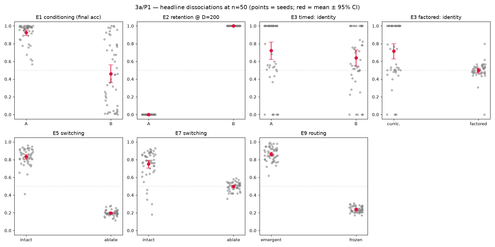

# 3a Results — Statistics & Operating-Point Sweeps

*Track 3a, Phase 1 (see [`stats_sweeps_plan.md`](stats_sweeps_plan.md)). Every
E-series headline dissociation re-run at **n=50 seeds** with bootstrap 95% CIs,
to convert "shown at n=5 at a point" into a real interval. Harness:
[`ghca_stats.py`](../ghca_stats.py); driver: `experiments/stats_seed_scaleup.py`;
figure: `experiments/stats_aggregate.py`. This does **not** alter the experiments'
committed n=5 numbers (those still reproduce bit-identically — see
[`core_review.md`](core_review.md)); it adds an independent larger-sample layer in
`result/stats/`.*

## Method

Each experiment's own per-seed run-function is called for seeds 0–49; the headline
scalar is reduced exactly as the result doc does (e.g. last-6-block mean for
switching). CIs are 10 000-sample percentile bootstraps; the E3 joint-success
*rate* uses a Wilson interval. **Distribution shape** is read from the 10-bin
histogram, not from Sarle's bimodality coefficient alone — BC flags a
ceiling-with-failure-tail as readily as a true two-mode split, so the shape column
below distinguishes `ceiling+tail`, `spread`, `bimodal`, and `unimodal` by mass.

## Master table

| headline | n | mean | 95% CI | shape |
|---|:--:|:--:|:--:|---|
| E1 conditioning — A | 50 | 0.926 | [0.893, 0.955] | ceiling+tail |
| E1 conditioning — B | 50 | 0.461 | [0.364, 0.561] | bimodal |
| E2 retention @D=200 — A | 50 | 0.000 | [0.000, 0.000] | point |
| E2 retention @D=200 — B | 50 | 1.000 | [1.000, 1.000] | point |
| E3 timed — A identity | 50 | 0.722 | [0.621, 0.818] | spread |
| E3 timed — B identity | 50 | 0.640 | [0.547, 0.730] | unimodal |
| E3 factored — curriculum identity | 50 | 0.715 | [0.626, 0.800] | spread |
| E3 factored — factored identity | 50 | 0.498 | [0.470, 0.522] | unimodal |
| **E3 factored — joint-success rate** | 50 | **0.320** | **[0.208, 0.458]** (Wilson) | 16/50 |
| E5 switching — intact | 50 | 0.833 | [0.805, 0.857] | ceiling+tail |
| E5 switching — ablate | 50 | 0.197 | [0.189, 0.206] | unimodal |
| E7 switching — intact | 50 | 0.751 | [0.704, 0.794] | ceiling+tail |
| E7 switching — ablate | 50 | 0.498 | [0.484, 0.511] | unimodal |
| E9 routing — emergent | 50 | 0.863 | [0.841, 0.885] | ceiling+tail |
| E9 routing — frozen | 50 | 0.238 | [0.229, 0.247] | unimodal |

## Verdicts

**Confirmed robust — CIs cleanly separated, tight, and unimodal on the load-bearing
arm.** These *strengthen* going from n=5 to n=50:
- **E2 working memory** — A=0.000 vs B=1.000 at D=200, both degenerate points. The
  Line-B-holds / Line-A-collapses dissociation is exact.
- **E5 executive** — switching intact 0.833 [0.805, 0.857] vs ablated 0.197
  [0.189, 0.206]; a ~0.64 gap with non-overlapping CIs. The ablation dissociation
  is rock-solid.
- **E9 emergent conjunctions** — emergent routing 0.863 [0.841, 0.885] vs the
  no-self-organisation frozen control 0.238 [0.229, 0.247]; selectivity emergent
  1.00 vs frozen 0.002. The afforded→learned result holds firmly at scale.

**Present but softened / noisier than n=5 implied** — the dissociation direction
holds (CIs separated) but the magnitude drops and a failure sub-population appears
that the 5-seed sample missed:
- **E7 switching** — intact **0.751 [0.704, 0.794]** vs ablated 0.498; the gap holds,
  but the intact headline is materially below the doc's n=5 **0.86**, with a
  low-seed tail.
- **E3 timed identity** — A 0.722 [0.621, 0.818] vs B 0.640 [0.547, 0.730]; on the
  *mean* the identity dissociation is weak (CIs overlap), because A's identity is
  bimodal — median 1.00 (28/50 at ceiling) with a ~7-seed zero-failure cluster.
  The n=5 "A=1.00 on all seeds" was a lucky-seed sample; the mechanism (A learns
  identity) holds on most seeds but not all.
- **E1 conditioning** — A 0.926 [0.893, 0.955] (ceiling with a small failure tail)
  vs B 0.461 [0.364, 0.561] (genuinely spread across the range). A≫B holds; B is
  messier than a clean "chance" label suggests.

**The marquee — E3 composition.** Joint success (identity≈1 **and** timing in
tolerance) is **16/50 = 0.320, Wilson 95% [0.208, 0.458]**. This replaces the
audit's "1 of 5 seeds" anecdote with a real interval: composition is a **partial,
unreliable capability (~1/3 of seeds)**, not the "~quadrupling" the original
headline implied and not the near-nothing the 1/5 reading implied. Curriculum
identity is `spread` (a chance cluster at ~0.5 plus a ceiling cluster), confirming
the audit's bimodality call at scale. The natural next question — does the rate
rise off the hand-picked latency=16 resonance? — is **P2**.

## Honest notes

- **The bimodality flag is a screen, not a verdict.** Sarle's BC flagged several
  ceiling-concentrated arms (E1-A, E5/E7 single-rule) that are *not* two-moded but
  ceiling-with-tail. The shape column and the strip figure are the honest read; BC
  just triggers a look.
- **n=50 means differ slightly from the committed n=5 headlines** (e.g. E5 0.89→0.833,
  E9 0.84→0.863). These are independent larger samples, not regressions — the n=5
  numbers still reproduce exactly. Where the shift is *material* (E7 switching;
  E3-timed A identity), the individual result-doc headlines should be updated — see
  below.

## Recommended headline edits (flagged, not yet applied)

Per [`process.md`](process.md), softening a published headline warrants a look
before editing the result docs. Proposed:
- **E7** (`e7_results.md`): switching intact 0.86 → **0.75 [0.70, 0.79]** at n=50,
  with a low-seed tail; gap to ablated (0.50) preserved.
- **E3** (`e3_results.md`): A-identity is bimodal at n=50 (median 1.00, mean 0.72);
  composition joint-success **32% [21%, 46%]** replaces "1/5 seeds".

## Next (P2)

- **E3 composition across target latency / gate τ** — does joint-success rise off
  the latency=16 resonance, or is ~1/3 the ceiling?
- **Substrate θ/τ neighborhood** — re-run E5/E7/E3 across θ∈{3.5,4,4.5}, τ∈{10…18}.
