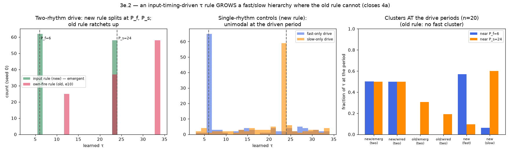

# An emergent fast/slow timescale hierarchy (Track 4a, via 3e.2)

**Closes the Track 4a blocker.** 4a asked whether, under a two-rhythm drive, per-node
timescales `τ` self-organise into a fast/slow **hierarchy** — a bimodal `τ`
distribution with clusters at the two drive periods. `docs/e10_notes.md` found the
existing Line B rule structurally **cannot**, and paused the track. This experiment
implements the fix that 3d-emergent validated for delays, applies it to periods, and
grows the hierarchy — including fully self-organised (no hand-assigned channels).

## The blocker, and the fix

The old rule `τ ← τ + η(interfire − τ)` updates from a node's **own** inter-fire
interval. Once `τ` overshoots the drive period the node skips pulses, so its observed
interval is a *multiple* of the period, which pulls `τ` up further — a one-way ratchet
to the ceiling. No fast (small-`τ`) population can form (e10 diagnostic 3, decisive).

The fix: update `τ` from the interval between **input arrivals** the node senses —
presynaptic drive, registered *regardless of the node's own refractory state*. The
overshoot that corrupted the old signal is invisible to this one, so `τ` locks to the
true drive period and can move *down* as well as up. (Same principle as 3d-emergent's
delay rule: teach from external input timing, not self-timing.)

Two channel-assignment modes:
- **wired** — first half of the pool fed only the fast source, second half only the
  slow (e10's diagnostic-3 setup). Isolates the *rule*.
- **emergent** — every node fans in from *both* sources; a competitive Hebbian rule
  with a population **conscience** splits the pool ~50/50 and each group's `τ` locks to
  its channel. The conscience is the fix for e10 diagnostic 2, where the more frequent
  fast rhythm otherwise swamps the slow and every node commits fast.

## Results (P_f = 6, P_s = 24, pool = 120, n = 20 seeds)

| rule | channel | drive | near P_f | near P_s | BC |
|---|---|---|:--:|:--:|:--:|
| **input (new)** | **emergent** | two | **0.50** | **0.50** | 0.93 |
| input (new) | wired | two | 0.50 | 0.50 | 0.93 |
| own (old, e10) | emergent | two | 0.00 | 0.31 | 0.69 |
| own (old, e10) | wired | two | 0.00 | 0.19 | 0.81 |
| input (new) | emergent | fast-only | 0.57 | 0.10 | 0.78 |
| input (new) | emergent | slow-only | 0.06 | 0.60 | 0.59 |

**A fast/slow hierarchy self-organises.** With the input rule and two-rhythm drive,
half the pool's `τ` locks to P_f = 6 and half to P_s = 24 (near-period fractions
0.50 / 0.50) — a genuine bimodal hierarchy, and it forms **fully emergently**: nodes
fan in from both sources and a conscience-balanced competition splits them ~50/50 with
each group locking to its channel's period. The hand-wired and emergent modes give the
same split, so the *rule* and the *self-organised grouping* both work.

**The old rule cannot — read the near-period fractions, not BC.** The old
self-referential rule scores a high BC too (0.69–0.81, above the 5/9 threshold), but
that is misleading: its `τ` is split at *high* values (a cluster ratcheted up plus one
railed at the ceiling), with **no fast cluster at all** (near P_f = 0.00). The Sarle
coefficient only asks "is the distribution split?"; the honest question is "are the
clusters *at the two drive periods*?", and only the input rule answers yes. This is
exactly e10's decisive negative reproduced, and overturned by the new rule.

**Single-rhythm controls confirm the clusters are driven.** Fast-only drive produces a
P_f cluster and no P_s cluster (0.57 / 0.10); slow-only the reverse (0.06 / 0.60). The
two clusters in the two-rhythm case are the two rhythms, not an artifact of the rule.

## Honest caveats

- **No cross-frequency coupling (yet).** 4a's full statement included theta–gamma-style
  *coupling* between the fast and slow populations. This pool has no inter-population
  connections, so none is expected or claimed — the hierarchy (bimodal `τ`) is
  delivered; the *coupling* needs an added inter-population pathway (the E8.5
  nested-waves direction) and is deferred.
- **Single-rhythm controls carry background spread.** The conscience forces ~50/50
  channel commitment even when one source is silent, so the silent-committed half keep
  their random-init `τ` — adding a low background to the control histograms (visible in
  the figure). The near-period fractions still separate cleanly; a cleaner control would
  disable the conscience under single-rhythm drive.
- **`act` fixed.** Per the 4a diagnosis, only `τ` is learned; `act` is not gradient-
  tuned. Channel-conditioned `act` (the PR-#42 ingredient) is a further lever for
  balancing channel *activity* but was not needed here — the population conscience
  sufficed to balance channel *commitment*.
- Substrate/analysis boundary: this is a driven pool with a plastic timescale rule; the
  hierarchy is a property of the learned `τ` distribution, measured directly (not via a
  downstream readout).

## What it closes

The mechanism 4a was paused on — a timescale-learning rule that can build a fast/slow
hierarchy rather than ratchet to the ceiling — **works**, and the hierarchy
self-organises. Combined with 3d (timescale diversity is a continual-learning capacity
axis) and 3e.1 (the plastic basis re-tiles), the timescale axis is now a *learned,
adaptive, and hierarchically-structured* part of the substrate. Remaining for a full 4a
close: adding inter-population coupling to test for cross-frequency (theta–gamma)
nesting.
