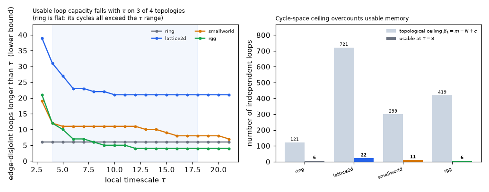

# Topology — cycle-space bound on reentrant-loop capacity

*Run of `experiments/topology_cycle_capacity.py`. A **topology analysis**, not a
dynamical experiment: it bounds how many independent reentrant loops a substrate
admits, complementing [`e2_results.md`](e2_results.md), which fixes the
*duration* of one loop. Method is standard algebraic graph theory (graph
Laplacians / circuit rank; see Gallier & Quaintance, "Algebra, Topology,
Differential Calculus, and Optimization Theory for CS and ML", Ch 20–21).*

> ## ⚠ Superseded in part — read this first
>
> The packing routine behind every `K_dyn` on this page selects, at each greedy
> step, the **longest** cycle exceeding τ (`found = max(longer, key=len)`) when
> the objective is to maximise the **count**. Every `K_dyn` here is therefore a
> loose lower bound, low by **1.4×–7.5×**. See
> [`topology_cycle_packing_exact.md`](topology_cycle_packing_exact.md).
>
> Specifically, on this page:
>
> - **Finding 3 ("the ring is flat") is false.** Ring capacity is not constant at
>   6; it falls **45 → 36 → 30 → 25** across τ=3–6, and all four values are
>   *certified optimal* (at τ=3 the optimum uses all 180 of 180 edges).
> - **Finding 1's collapse ratio is overstated.** The corrected lattice2d figure
>   at τ=3 is 721 → 183 (3.9×), not 721 → 39 (18×).
>   *Scope caveat:* the "20–70×" above is quoted **at τ=8**, whereas the exact
>   solve sweeps only **τ ∈ [3, 6]** (enumeration cost). No corrected value
>   exists at τ=8, so "20–70× is really 3.9–20×" is **not** a like-for-like
>   replacement.
> - **Finding 2 survives.** Best-known `K` is still monotone decreasing in τ on
>   all four topologies, so the capacity/duration tradeoff stands — but any
>   *quantitative* version of it must be recomputed, and its threshold moves by
>   up to 7.5×.
> - Only **4 of 16** cells are certified. Elsewhere the optimum is bracketed and
>   the gap is unquantified (e.g. lattice2d at τ=3 is only `183 ≤ K_opt ≤ 216`).
>
> The text below is left unedited as the historical record.

## The question E2 leaves open

E2 establishes that memory is a circulating pulse on a directed ring and that
its duration is τ-controlled: the loop sustains while `tau < L` (transit length)
and dies in ~`L` steps once `tau >= L`. That is a statement about **one** loop.
It does not say how many independent loops a given topology can hold at once —
which is what bounds multi-item working memory (E2's K rings are hand-built, one
per stimulus).

## Substrate / analysis boundary

This is an **analysis of the `W` matrices** from `ghca_net`, not a dynamical run.
`beta_1` and `K_dyn` are properties of the graph. The only dynamical claim is
E2's sustain gate, which is re-verified here on the repo's own
`ghca_net.Network` so that the length criterion the packing uses is grounded in
the actual dynamics:

| τ | τ < L (L=24) | observed |
|---|---|---|
| 6, 10, 14, 18, 22 | yes | persists |
| 24 | no (τ = L exactly) | persists — marginal boundary case |
| 26, 30 | no | dies |

τ=24 sitting on the boundary is the same marginality
[`e2_results.md`](e2_results.md) already flags: the resonance rule drives τ
toward the loop period, i.e. toward this death boundary.

**A note on the ring test.** A bare pulse on a *bidirectional* ring propagates
both ways and the two fronts annihilate head-on, so it never circulates for any
τ. E2's `two_ring()` uses **directed** rings; any reentry check must too.

## The bound

For the graph Laplacian `L = D − A` with oriented incidence matrix `B`
(`L = B Bᵀ`), the cycle space has dimension the **circuit rank**

    beta_1 = m − N + c        (m edges, N nodes, c components)

equivalently `m − rank(L)` or `m − rank(B)`. The experiment asserts all three
agree. This is a purely topological ceiling on independent reentrant loops,
computed with no dynamics.

That ceiling **massively overcounts** what the dynamics can use, for two reasons
taken from E2: a loop must be longer than τ to sustain, and two simultaneous
circulating waves cannot share an edge (they collide in the refractory tail).
The usable count is therefore the largest set of **edge-disjoint cycles longer
than τ**; the experiment reports a greedy packing, a **lower** bound on that
maximum.

## Results

Computed on the repo's own constructors (`ring`, `lattice2d`, `smallworld`,
`rgg`), seeded via `default_rng(0)`.

| topology | N | m | c | β₁ (ceiling) | K at τ=3 | τ=8 | τ=21 |
|---|---|---|---|---|---|---|---|
| `ring(60, k=3)` | 60 | 180 | 1 | 121 | 6 | 6 | 6 |
| `lattice2d(12, r=2)` | 144 | 864 | 1 | 721 | 39 | 22 | 21 |
| `smallworld(120, k=6, β=0.1)` | 120 | 418 | 1 | 299 | 19 | 11 | 7 |
| `rgg(150, radius=0.14)` | 150 | 566 | 3 | 419 | 21 | 6 | 4 |

1. **The topological ceiling is not a capacity estimate.** At τ=8 the usable
   count is **20–70× smaller** than β₁ (ring 121 → 6, lattice 721 → 22,
   small-world 299 → 11, RGG 419 → 6). Most of the cycle space is short cycles —
   triangles and quadrilaterals — that cannot carry a circulating wave at any
   usable τ. Quoting β₁ as "memory capacity" would overstate it by well over an
   order of magnitude; across every τ and topology swept here the ratio never
   falls below ~16×.
2. **Usable capacity falls with τ, giving a capacity/duration tradeoff.** On the
   lattice, small-world and RGG substrates `K_dyn(τ)` decreases (lattice 39 → 21,
   RGG 21 → 4 across τ=3–21). Read together with E2 — where *longer* τ means
   *longer* retention — this is a tradeoff the substrate imposes on any
   Line-B timescale policy: τ buys duration and spends simultaneous capacity.
3. **The ring is flat, and that is the informative exception.** `ring(60, k=3)`
   holds 6 loops at every τ tested. Not because it has no short cycles — its
   girth is 3 — but because the cycles the greedy packing *accepts* are long
   (lengths 29, 29, 30, 30, 30, 32), so every one of them still exceeds the
   largest τ swept (21) and none is ever disqualified. The gate bites only once
   τ reaches the length distribution of the *packed* cycles, so the tradeoff is
   a property of the *interaction* between τ and topology, not of τ alone.

## Caveats

- **K_dyn is a bound, not a measured count.** Nothing here simulates several
  loops coexisting. Whether a learner can *find and hold* K loops is a separate
  (and harder) question; capacity is necessary, not sufficient.
- **Greedy packing is a lower bound.** Maximum edge-disjoint cycle packing is
  NP-hard; the greedy result may undercount. β₁ is exact.
- **Edge-disjointness is a modelling choice.** It encodes "two waves on a shared
  edge annihilate". Loops sharing only *nodes* may also interfere via the
  refractory state; if so, the true capacity is below this bound.
- **Different sense of "capacity" from 3c/P4.**
  [`continual_learning_results.md`](continual_learning_results.md) measures
  *representational* capacity of a shared readout. This is topological loop
  capacity. They are complementary, not competing.
- **No learning here.** The bound is on the substrate, and says nothing about
  whether the E-series credit rules can exploit it.
