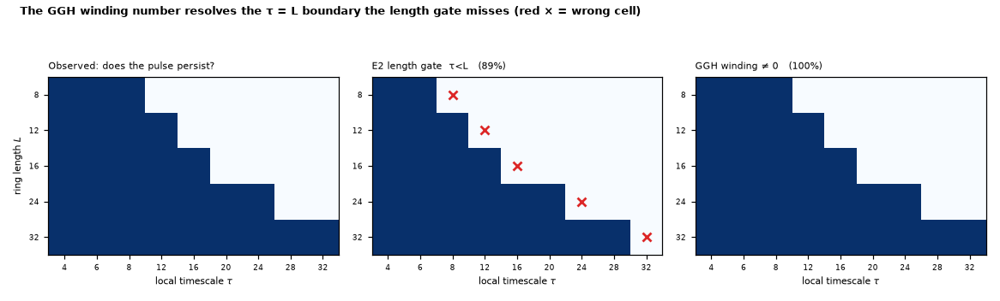

# Topology — the GGH winding number as the sustain criterion

*Run of `experiments/topology_winding_capacity.py`. A refinement of
[`topology_cycle_capacity.md`](topology_cycle_capacity.md): it calibrates the
length gate that bound relies on, against the exact criterion from the
combinatorial companion to the GH model itself.*

## Where this comes from

[`topology_cycle_capacity.md`](topology_cycle_capacity.md) counts how many
reentrant loops a topology admits, and uses E2's **length gate** (`tau < L`) to
decide which cycles can carry a circulating wave. The adversarial review of that
work ([`extensions_review.md`](extensions_review.md), 2026-07-26 addendum) noted
the gate's strict `>` filter "correctly excludes the τ = L death boundary … —
consistent and conservative." Conservative is the operative word: the gate is an
approximation, and it is approximating something exact.

The exact criterion is older than the E-series and comes from the combinatorial
companion to the GH model:

> Greenberg, Greene & Hastings, *A combinatorial problem arising in the study of
> reaction-diffusion equations*, SIAM J. Alg. Disc. Meth. **1**(1), 1980.

GGH characterise which initial conditions lead to two-dimensional periodic
patterns by introducing **the winding number of a continuous cycle**: walk once
around a closed path summing the phase increments; if the total is a nonzero
multiple of 2π, that cycle carries a rotating wave.

The repo already implements this construction — `ghca_net.count_phase_singularities`
sums exactly this quantity around 2×2 lattice plaquettes. This experiment lifts
it to an **arbitrary cycle in the graph**, which is what the capacity packing
needs, since that packing works on general cycles rather than plaquettes.

## Substrate / analysis boundary

This is the important difference from the cycle-space bound, and it cuts against
the refinement:

- `topology_cycle_capacity.py` is **pure graph analysis** — β₁ and `K_dyn` are
  properties of the `W` matrix, computable with no dynamics.
- The winding number is a **dynamical** quantity. It is read off a phase
  configuration, so obtaining it requires *running the substrate*.

So winding cannot simply replace the length gate inside a pre-dynamical
topological bound — that would destroy the property that makes the bound useful.
What it can do, and what it does here, is **calibrate** the gate: quantify
exactly where the cheap topological proxy is wrong.

## Result

Directed rings (matching `e2_delayed_response.two_ring()`; a bare pulse on a
bidirectional ring splits and self-annihilates), one seeded pulse, `L × τ` grid,
`n = 45` cells, `default_rng` unused — the dynamics here are deterministic
(`p_s = 0`) and seeded via `Network(seed=0)`.

| criterion | accuracy | misses |
|---|---|---|
| E2 length gate (`tau < L`) | **40/45 = 0.889** | (8,8), (12,12), (16,16), (24,24), (32,32) |
| GGH winding ≠ 0, steady state | **45/45 = 1.000** | — |
| GGH winding ≠ 0, read early (t=5) | 35/45 = 0.778 | — |

1. **The invariant behaves exactly as GGH predict.** On a sustaining directed
   ring the winding is a nonzero constant (−1 for the seeded direction); on a
   dead ring it is 0.
2. **Winding is an exact sustain predictor; the length gate is not.** And the
   gate's error is not scattered — **every one of its five misses is the case
   `tau == L`**, the death boundary [`e2_results.md`](e2_results.md) flags as
   marginal. The length gate calls those dead; they persist. Winding gets all
   five right. The cheap proxy is therefore wrong in exactly one place, and that
   place is now characterised rather than sidestepped.
3. **Read timing is a real caveat, not a footnote.** Measured too early (t=5)
   winding scores **0.778 — worse than the length gate**, because a slow pulse
   has not yet wrapped enough of the ring to register a full turn. This is a
   property of the measurement, not of the invariant, and it is why the
   criterion here is applied to settled dynamics.

## What this means for the capacity bound

The length-gate packing in
[`topology_cycle_capacity.md`](topology_cycle_capacity.md) **undercounts by
exactly the `tau == L` cycles**. A cycle of length exactly τ should count toward
capacity; the strict `>` filter drops it.

> **⚠ Correction.** This section previously concluded that `K_dyn` was therefore
> "conservative in a specific, characterised way rather than an unknown one."
> **That characterisation is wrong.** The `tau == L` boundary is *not* the
> dominant source of undercount — the greedy pick rule is. It selects the
> **longest** cycle exceeding τ where the objective wants the **shortest**,
> which alone costs up to 4.7×, and up to 7.5× against an exact set-packing
> solve. So the undercount was *not* characterised; its magnitude was unknown
> and large. The direction is still safe (these remain lower bounds), but
> nothing here licensed treating them as tight. See
> [`topology_cycle_packing_exact.md`](topology_cycle_packing_exact.md).

Whether to change the filter is a judgement call this experiment does not make:
τ = L is a marginal, boundary-stable state (the resonance rule drives τ *toward*
it, per `e2_results.md`), so counting it may be optimistic in noisier settings
than these deterministic rings.

## Caveats

- **Directed rings only.** Every cell here is a single cycle in isolation. The
  claim is about the *sustain criterion*, not about packing several loops, and
  it does not re-derive `K_dyn` for any topology.
- **Winding requires dynamics**, so it does not yield a pre-dynamical bound. It
  calibrates one.
- **GGH's setting is the 2D lattice.** Their winding number is defined for
  continuous cycles on a planar grid; applying it to cycles in an arbitrary
  weighted graph (small-world, RGG) is a generalisation this experiment
  exercises only on rings. That extension is untested here.
- **Deterministic regime.** `p_s = 0`, single seed per cell, threshold 1. The
  perfect 45/45 should not be read as robustness to noise or to `theta > 1`.
- **No learning.** Nothing here says whether Line B can find or use these loops.
